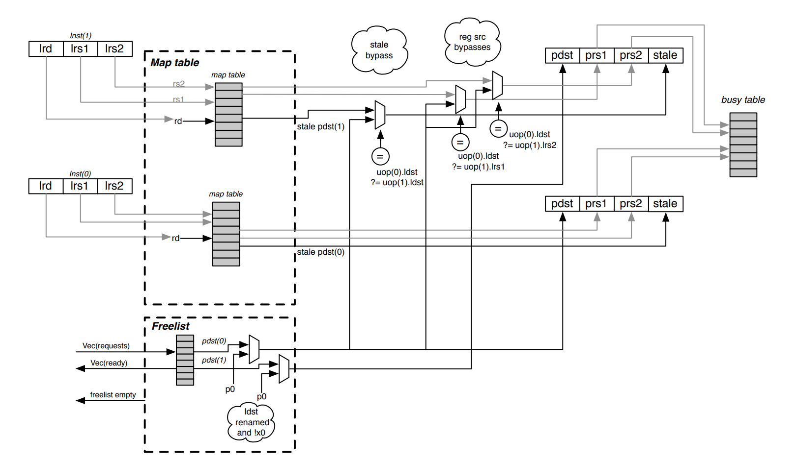

# 乱序CPU的寄存器重命名(Register Renaming)机制

在乱序CPU中，寄存器重命名是非常重要的一个机制，它在CPU乱序执行时，主要有两个作用

- 消除指令之间的反向依赖问题（读后写依赖（WAR）和写后写依赖（WAW））
- 当指令执行发生异常或分支预测错误而取消后面的指令时可以保证现场还原的准确

实现思路就是执行指令时不直接操作架构寄存器，而是先操作一个与架构寄存器有映射关系的中间寄存器，当这条指令提交的时候再写到架构寄存器中。
当然，这个思路的描述不一定准确，因为随着乱序CPU的发展，Register Renaming的实现方式也在发展。
不同的CPU，其内部的Register Renaming实现可能会存在差异，有的物理寄存器和指令集寄存器是独立的，有的是合并成一个寄存器堆。还有一些分类中
分为显式重命名机制和隐式重命名机制。这些需要我们具体的CPU架构具体分析。

总结一下，就是在不增加指令集寄存器的前提下（可以理解为软件无感），用更多的寄存器来解决乱序执行时的寄存器反向依赖问题。

## 工作原理

### 物理寄存器与ISA寄存器

要区分物理寄存器和逻辑寄存器，逻辑寄存器又可以称为ISA寄存器。ISA寄存器是对程序员可见的，
但物理寄存器是不可见的，它是逻辑寄存器的一种具体实现。

### 反向依赖

#### WAR反向依赖

假如我们有如下代码

```asm
lw x2, 0(x1);
add x3, x2, x4;
sub x2, x4, x5;
```

如果乱序CPU没有寄存器重命名机制，那么当lw发生cache未命中时，add指令会因为x2寄存器被锁住而无法执行，此时，sub指令因为x4和x5已经准备好，所以可以执行，但sub指令一旦执行完成之后，就会改写x2寄存器，后续再执行add指令时，就会因为乱序执行导致结果x3错误。如下图所示，这就是所谓的WAR反相关。

#### WAW反向依赖

```asm
lw x3, 0(x1);
add x2, x3, x4;
mul x2, x6, x4;
```

如果乱序CPU没有寄存器重命名机制，那么当lw发生cache未命中时，add指令会因为x3寄存器被锁住而无法执行，此时，mul指令因为x6和x4已经准备好，所以可以执行，但mul指令和add指令执行完成后都会改写x2寄存器，如果mul先执行完成，add后执行完成，那么x2寄存器就不再时mul的结果，而是add的结果。程序就会因此出错。这就是所谓的WAW反向依赖。

### 重命名过程

这里按照一个常用的处理机制来分析，处理逻辑如下：

1. 将每条指令的源ISA寄存器映射为该ISA寄存器最近映射到的那个物理寄存器
2. 将每条指令的目的ISA寄存器映射到新的物理寄存器

而且要保证第一步要先执行，不然如果遇到源寄存器和目的寄存器是同一个的情况时，就会发生错误。

执行如下指令流，我们可以看到经过寄存器重命名，add指令和sub指令已经不存在依赖关系，
消除了WAR反向依赖。

```text


x2 ----> R2
x3 ----> R3
x4 ----> R4
x5 ----> R5
x6 ----> R6
                   |x1|x2|x3|x4|x5|x6|
             ------------------------------
    重命名前        |R1|R2|R3|R4|R5|R6|    重命名后
1. lw x2, 0(x1)    |  |R7|  |  |  |  |  lw  R7, 0(R1)
    数据相关        |  |  |  |  |  |  |    数据相关
2. add x3, x2, x4  |  |  |R8|  |  |  |  add R8, R7, R4
     反向依赖       |  |  |  |  |  |  |     不相关
3. sub x2, x4, x5  |  |R9|  |  |  |  |  sub R9, R4, R5
     数据相关       |  |  |  |  |  |  |     数据相关
4. mul x6, x2, x4  |  |  |  |  |  |R10|  mul R10, R9, R4
```

因此sub指令可以在lw和add等待资源的情况下先执行完成。
问题在于物理寄存器的释放时机，在上面的例子中，在mul指令rename的时候，R7可用吗？

### 寄存器的释放问题



如上图，可以用作rename的寄存器可以通过一个freelist索引到， rename的时候，rename关系存放在Map table中， 按照上面描述的寄存器重命名原理，我们很容易能够理清上面图中描述的过程，但有一个问题，物理寄存器不是无限的，势必要有一个回收的机制，必然是在指令commit时才有可能回收这些用过的寄存器，那么在回收的时候，必须要保证整个CPU的flow中没有对这个寄存器的引用。

如何来保证呢？假设在一条指令提交之后就回收该寄存器，那么显然可能会引入错误的WAR难道我们要去记录谁引用了rename之后的寄存器吗？怎么才能记录呢？实际上，设计者采用了一个非常巧妙的做法，使用很简单的方式就解决了这个问题。

我们看下面的测试程序

```asm
OP1 r1, r1, r3
OP2 r5, r5, r1
OP3 r2, r1, r2
OP4 r1, r1, r4
OP5 r6, r1, r3
OP6 r7, r4, r1
OP7 r1, r8, r9
```

我们尝试去rename这段代码：

```asm
OP1 r16, r1, r3        # r1 -> r16
OP2 r17, r5, r16       # r5 -> r17
OP3 r18, r16, r2       # r2 -> r18
OP4 r19, r16, r4       # r1 -> r19
OP5 r20, r19, r3       # r6 -> r20
OP6 r21, r4, r19       # r7 -> r21
OP7 r???, r8, r9       # r1 -> r???
```

我们看r1的rename链， r1 -> r16 -> r19 -> r???, 假如现在commit到了OP4。最后一条指令OP7在rename时能不能使用r19?能不能使用r16?
很显然，假如使用r19, 因为乱序执行，那么有可能OP7要比OP5和OP6先执行，那么就会导致OP5和OP6的计算结果出错。因此不能使用r19， 那么能不能使用r16呢？是可以的，因为OP4的提交，意味着所有对r16的引用肯定是结束了(属于充分不必要条件)，因为后面都改姓r19了。所以按照这种方式去释放寄存器，肯定是简单(不用去考虑哪条指令引用了这个寄存器的问题)又能保证正确，还不至于过度浪费。

我们看gem5中O3CPU的实现，这也是alpha21264CPU的实现。在rename的时候，不单记录了当前arch寄存器被rename的物理寄存器，还记录了上一次被rename的物理寄存器。在指令提交时，调用removeFromHistory函数，这时候释放的是记录的上一次rename的物理寄存器(prevPhysReg)。

```c++
SimpleRenameMap::RenameInfo
SimpleRenameMap::rename(const RegId& arch_reg)
{
  PhysRegIdPtr renamed_reg;
  // Record the current physical register that is renamed to the
  // requested architected register.
  PhysRegIdPtr prev_reg = map[arch_reg.flatIndex()];
  renamed_reg = freeList->getReg();
  map[arch_reg.flatIndex()] = renamed_reg;
  return RenameInfo(renamed_reg, prev_reg);
}

template<class Impl>
void
DefaultRename<Impl>::removeFromHistory(InstSeqNum inst_seq_num, ThreadID tid)
{
  // Commit all the renames up until (and including) the committed sequence
  // number. Some or even all of the committed instructions may not have
  // rename histories if they did not have destination registers that were
  // renamed.
  while (!historyBuffer[tid].empty() &&
          hb_it != historyBuffer[tid].end() &&
          hb_it->instSeqNum <= inst_seq_num) {

      // Don't free special phys regs like misc and zero regs, which
      // can be recognized because the new mapping is the same as
      // the old one.
      if (hb_it->newPhysReg != hb_it->prevPhysReg) {
          freeList->addReg(hb_it->prevPhysReg);
      }
  }
}
```


## gem5 O3 CPU的重命名机制

参考gem5章节
