# 超标量处理器设计

本文是对《超标量处理器设计》的个人总结

## 什么是超标量处理器

如果一个处理器在每个cycle可以取出多于一条指令送到流水线中，并且使用硬件来对指令进行调度，那么这个处理器就可以被成为超标量处理器。超标量处理器可以是顺序执行的也可以是乱序执行的。
这里重点讨论乱序(发射和执行可以乱序)执行的超标量处理器。首先应该明白，超标量处理器没有一套固定的设计原则，更多的时候，需要根据实际的场景，结合对性能，功耗，能效比，单核还是多核，成本等各种因素进行有针对性的设计。

现代的超标量处理器一般包含下面几个步骤, 后续针对每一个步骤会展开讨论

```text
        -----------
        | icache  |
        -----------
             |
             |
             V
           fetch
             |
             |
             V
           decode
             |
             |
             V
        register rename
             |
             |
             V
          dispatch
             |
             |
             V
           issue
             |
             |
             V
      register file read
             |
             |
             V
          execute
             |
             |
             V
          write back
             |
             |
             V
           commit
```

---

## cache

我觉得随着硬件技术的进步，我们可能不再需要cache， DRAM的性能能够接近甚至达到cache水平。但在未来的一段时间，cache仍然是解决CPU与DRAM之间速度的唯一手段。
当然，最重要的还是cache的思维，在计算机领域，通过增加一层来解决问题的思维。

这里不讨论Cache原理，重点讨论Cache的实现。
ICache只有读操作，相对简单，对于DCache, 它需要有多端口设计。这就牵扯到Cache的多端口设计下的，容量和面积以及速度的关系。

多路组相联的Cache因为要按照一定顺序比较多个Tag, 因此延迟要比直接映射Cache的延迟大。甚至为了保证时序，还需要拆解成多级流水。

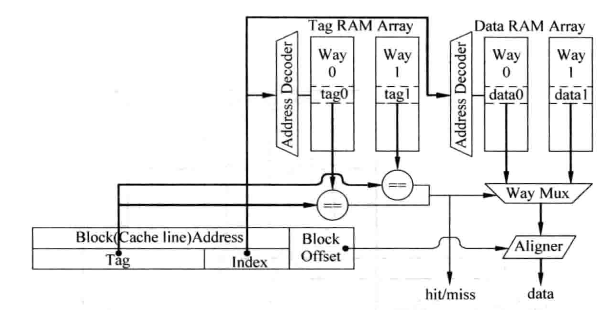
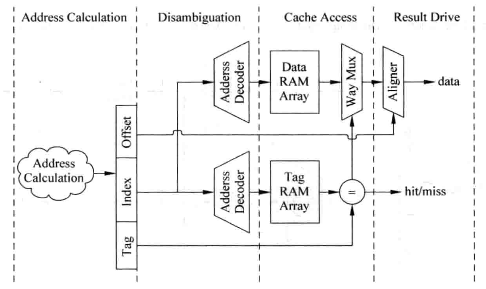

cache的tag与data的串行访问还是并行访问也会对性能和功耗有影响，并行访问会导致主频上不去，功耗大，但访问cache的周期能够缩短。

全相联cache没有index，需要用到CAM(Content Address Memory), 在整个Cache中进行Tag比较。这种有着最大的灵活度，不容易出现miss, 但延迟也是最大的。

注意区分write back and write allocate 与 write through and no-Write allocate.

### cache line的替换策略

- LRU(Least Recently Used)方法, 2选一就用1bit寄存器来标识。伪LRU就使用分级的多级二选一进行选择。
- 随机替换(Random Replacement),当cache容量较大时，miss率和LRU差不多。一般采用时钟算法来实现近似随机，本质上是计数器，宽度等于cahce的way的个数，硬件复杂度低。

### cache性能优化

- Write buffer: 被替换的 dirty cache line 先写入write buffer， 择机写入下级存储器。这会增加cache的复杂度，当发生cache miss的时候，不仅需要从下级存储器查找数据，还需要从write buffer中查找，并且write buffer中的数据优先。
- pipline: 往往为了保证设计主频，需要对cache访问进行流水化。尤其是在写操作时，必须保证先比较完tag再写数据。常见的可以将tag SRAM的读取和比较放在一个周期，写Data Sram放在下一个周期。一旦分流水，那么就会产生读的数据正好在写流水线中的情况。这就又需要将load指令携带的地址和store指令的流水线寄存器进行比较。
- 多级结构。这里又分了Inclusive和Exclusive。即L2 Cache是否包含L1 Cache中的内容。虽然Exclusive类型的cache策略可以提高容量利用，但现代大多数处理器都采用Inclusive的Cache.
- Victim Cache. 保存最近被踢出的cache数据。[^1]
- Filter Cache. 先过滤掉偶然访问的数据，避免这类数据进入cache占资源
- 预取。可以提前取数据进入cache，但为了避免cache污染，可以将预取的放到一个单独的缓存中。当然预取就有成功率，就会因为判断错误而浪费功耗和带宽。[^2]
- 多端口Cache. Data SRAM一般采用multi-banking的组织方式。影响这种方式性能的关键因素就是bank conflict。可以通过更多的bank来降低冲突概率。[^3]

AMD Opteron 双端口D-Cache设计实例

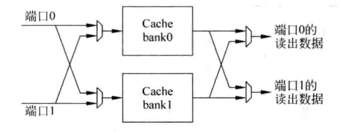
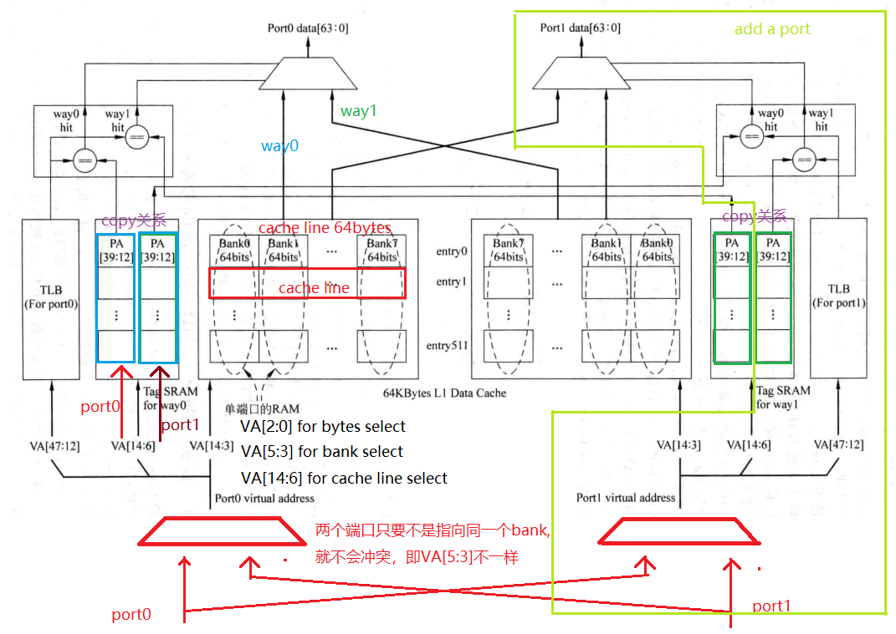

---

## MMU

使用虚拟地址的好处

- 解决了程序空间比实际内存空间大，需要认为拆解的问题
- 解决了运行多个程序的问题
- 提供了内存保护和共享机制

页大小：

- 太小的页，造成了页表占用空间大，TLB需要容量大的问题，效率低下
- 太大的页，造成了页利用率降低，需要swap的数据更多，Page Fault的处理时间也更长

为了更加灵活，现代处理器普遍支持大小可变的页。

TLB的替换算法：

随机替换就比较合适，可以使用简单的时钟算法来实现近似的随机。

操作系统需要对TLB进行干预的原因：

- 当进程结束时，需要无效掉它所使用的页表，此时应该保证存在于TLB中的相同页表被无效掉
- 当进程占用物理内存过大时，也需要将这个进程中不常用的页进行swap

MMU提供的TLB管理手段：

- 能够flush整个TLB
- 能够flush掉ASID对应的entry
- 能够flush掉某个VPN对应的entry

## Cache

物理cache与虚拟cache

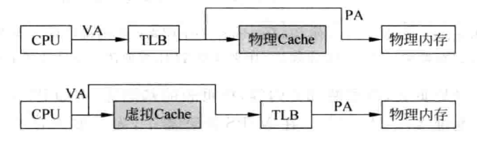

物理cache逻辑简单，但分支预测失败或者异常跳转的处罚也更大；虚拟cache的效率高，但会引入同名和同义的问题。

同义问题：可以使用多bank的方法来解决cache的同义问题，但随着cache容量的增大，硬件复杂度和功耗都会增加很多。
同名问题：通过ASID和G标识来解决，可以增加一级表来解决引入ASID带来的查找问题

## 分支预测

分支预测要解决两个方面的预测：

- 分支方向
- 跳转地址

分支预测的最好时机就是在当前周期得到取指令地址的时候，再取指令的同时进行分支预测，这样在下一个周期就可以根据预测结果继续取指。
主流处理器更广泛的采用基于两位饱和计数器的分支预测器，并以此为基础进行延申。两位饱和计数器的核心理念就是当一条分支指令连续两次执行方向都一样时，
那么该分支指令在第三次执行时也会有同样的方向，如果一条分支指令只是偶尔发生了方向的改变，那么分支预测结果不会立马跟着改变，也就是滤波。

PHT(Pattern History Table)由于容量的限制，只能对应PC值中的一部分，因此会产生别名的问题。可以通过hash来降低别名发生的概率。

### 局部历史分支预测

局部历史分支预测，通过记录过去几次分支执行的情况，来预测未来分支执行的情况，以PC值为索引，通过将PC值进行hash来降低别名问题，hash后的PC值用来寻址分支历史表(BHT),为了降低因为BHR中的值相同引起的重名问题，将BHR的值和PC值的一部分进行操作(或操作，组合操作)后，寻址饱和计数器表

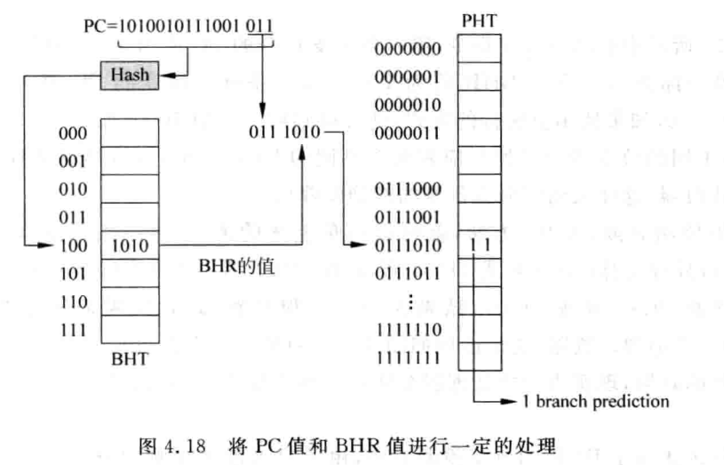

### 全局历史分支预测

通过分支之间的关系来进行预测，GHR不按照PC来进行，所有的分支都被记录到GHR,hash后的PC和GHR中的值进行XOR操作后，来索引PHT。

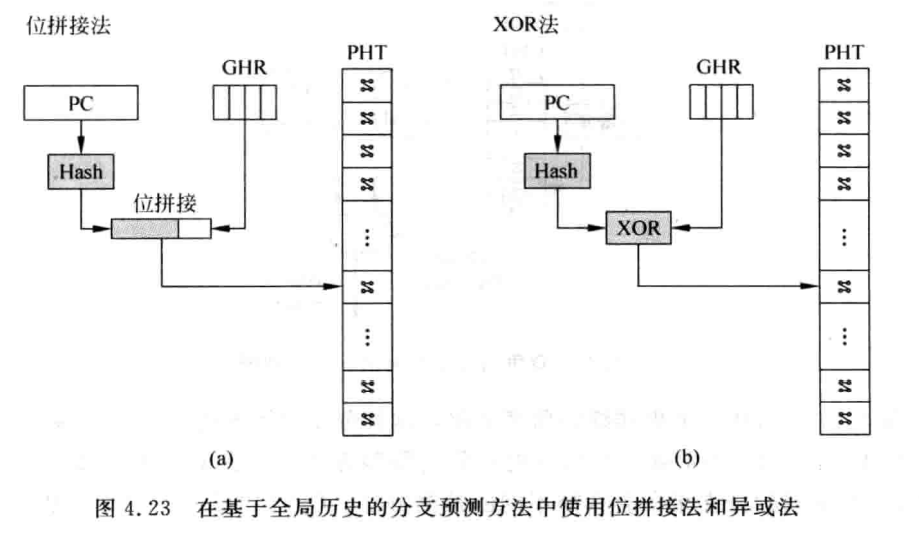

### 竞争的分支预测

局部历史和全局历史都有局限性，因此，如果把这两个都包含进去，在适当的时机进行切换，应该会得到更好的效果。通过Choice PHT来进行选择，寻址Choise PHT时，使用了查找全局分支的PHT的index。

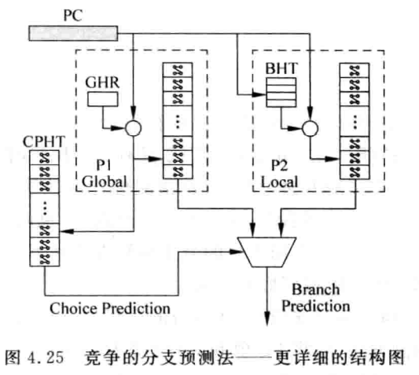

### 分支预测器的更新

GHR在取指令阶段更新会比较好，可以使后续的分支指令使用到最新的GHR。在取指令阶段更新GHR是推测的，在预测失败的时候需要有一种机制对GHR进行修复，使GHR能够恢复到正确值。
可以使用checkpoint方法来将GHR进行恢复,将每次要修复成的值(取非操作)填入一个GHR栈。

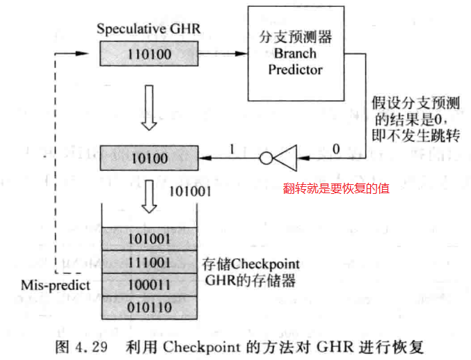

对于BHR的更新，可以在分支指令retire的时候，这样可以简化设计，也不会对性能产生太大的负面影响。
对于饱和计数器，一般都是在分支指令retire的时候对PHT中的饱和计数器进行更新。

### 直接跳转的地址预测

对于一条特定的直接跳转指令来说，它的目标地址是固定的，指令又与PC相关，因此使用一个PC寻址的cache来缓存这些指令的跳转地址，就能进行地址预测了，这就是BTB。一般可以采用组相联cache来实现BTB。

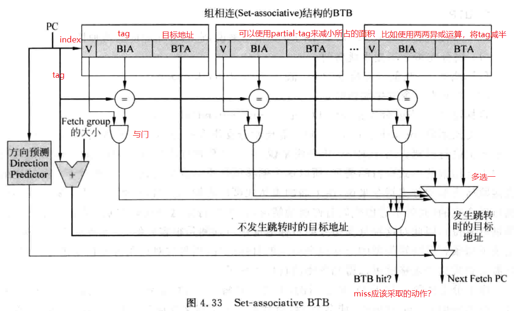

如果BTB发生miss,那么可以阻塞流水线，停止执行，这样能够节省功耗，但效率可能会低一些。也可以继续执行，一旦发现最终计算出来的跳转地址和speculative执行的地址不一样，再进行flush，这样有可能会蒙对，但功耗相对高一些。

### 间接跳转的分支预测

其实大多数间接跳转都是CALL/Return指令，CALL指令的地址也是固定的，因此BTB就能进行预测。Return指令虽然地址是不固定的，但CALL与Return一般是成对出现，return的地址总是等于最近一次执行的CALL指令的下一条指令的地址。使用RAS能够很好的对Return指令的跳转地址进行预测。

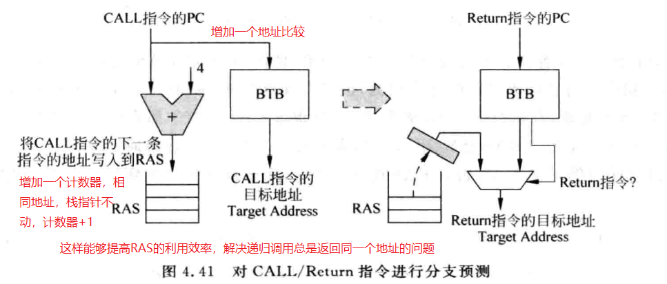

对于不是CALL/Return的间接跳转，也有方法能够进行地址预测。因为具有正常功能的代码，分支跳转的地址总是有限的，比如switch，case。那么可以借鉴局部历史的分支预测，将BHT替换成target-Cache就能比较好的进行分支预测。

### 一个完整的分支预测

一个完整的分支预测，结合上面所述的各个部分

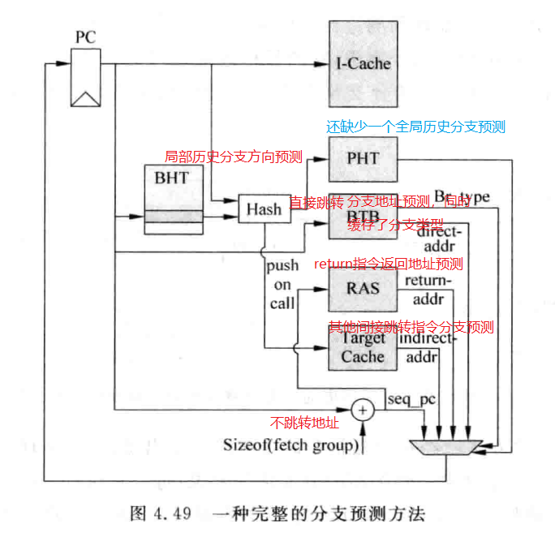

### 预测失败的恢复

可以在下面几个时间点对指令的分支预测结果进行检查

- 解码阶段。对一部分直接跳转指令进行分支预测检查，比如无条件跳转指令。
- 读取寄存器阶段。获取到寄存器值就能知道目标地址，对于一部分间接跳转就能进行预测检查
- 执行阶段。penalty最大。可以利用ROB或者checkpoint进行预测失败恢复。利用ROB实现起来相对简单，使用checkpoint会使用更多的硬件资源。


[^1]: 这是一种备份思想，虽然给每个人分配了晚餐，但也不想每个人都给足够的食物，就多备了几份，给那些饭量大的人
[^2]: 如果CPU能够有类似AI的学习机制，有比较大的空间能够用来学习数据地址的规律，在预取时能够保证比较高的准确率，那么效率一定能提高不少
[^3]: 想象一下极限情况，如果每个数据都有一个端口，那么必然也不会存在端口冲突，但是代价也是巨大的，需要无数根线来连接。
