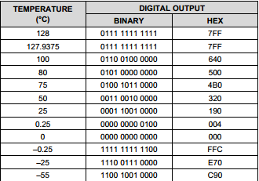
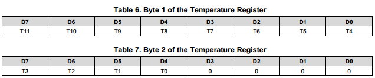

# 补码经典案例

[TOC]

## 案例

在审核下属提交的代码的时候，发现有这样一条修改, 修改内容为下面参考代码的带+号的两行， 代码仅是参考， 从我们的工程代码中截取了部分

```c

static inline int LM75_TEMP_FROM_REG(u16 reg)
{
    /* use integer division instead of equivalent right shift to 
       guarantee arithmetic shift and preserve the sign */
    return ((s16)reg / 128) * 500;

}

int tmp75_temp_get(struct i2c_client *client)
{
    struct lm75_data *data = lm75_unpdate_device(&client->dev);
    int temp = LM75_TEMP_FROM_REG(data->temp[0]) / 1000;

+    if (temp | 0x80)
+        temp = -(256 - temp);

    return temp;
}
```

那么 data->temp[0] 是从tmp75 中读取的16位寄存器值，

具体温度与值的对应关系参考下表



16bit寄存器定义参考下表




那么我们可以看到内核在处理这个寄存器值到温度值转换的时候， 处理的非常简洁，LM75_TEMP_FROM_REG 没有任何判定，仅仅是通过一个强制转换就完成了由寄存器值到温度的转换， 不得不佩服高手就是高手

那么再看我们的队员， 没有理解内核这样做的原理， 还觉得仅仅一个LM75_TEMP_FROM_REG 没能完成温度转换， 在温度负值的时候会出问题， 结果加上了两行判断， 把正确的改错了。

## 补码相关基础总结

todo...
