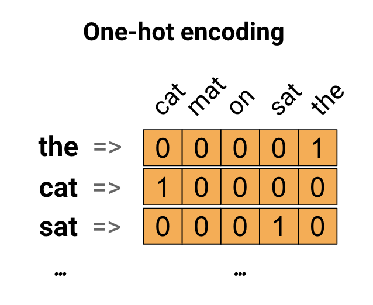

# one-hot

[TOC]

## 概述

> As a first idea, we might "one-hot" encode each word in our vocabulary. Consider the sentence "The cat sat on the mat". The vocabulary (or unique words) in this sentence is (cat, mat, on, sat, the). To represent each word, we will create a zero vector with length equal to the vocabulary, then place a one in the index that corresponds to the word. This approach is shown in the following diagram.
To create a vector that contains the encoding of the sentence, we could then concatenate the one-hot vectors for each word.
Key Point: This approach is inefficient. A one-hot encoded vector is sparse (meaning, most indices are zero). Imagine we have 10,000 words in the vocabulary. To one-hot encode each word, we would create a vector where 99.99% of the elements are zero.



from [tensorflow_one-hot](https://www.tensorflow.org/tutorials/text/word_embeddings#one-hot_encodings)

## 详解

> Returns a one-hot tensor.
The locations represented by indices in indices take value on_value, while all other locations take value off_value.
If the input indices is rank N, the output will have rank N+1, The new axis is created at dimension axis (default: the new axis is appended at the end).
If indices is a scalar the output shape will be a vector of length depth.
If indices is a vector of length features, the output shape will be:

```txt
features x depth if axis == -1
depth x features if axis == 0
```

> If indices is a matrix (batch) with shape [batch, features], the output shape will be:

```txt
batch x features x depth if axis == -1
batch x depth x features if axis == 1
depth x batch x features if axis == 0
```

Suppose that

```txt
indices = [0, 2, -1, 1]
depth = 3
on_value = 5.0
off_value = 0.0
axis = -1
Then output is [4 x 3]:

output =
  [5.0 0.0 0.0]  // one_hot(0)
  [0.0 0.0 5.0]  // one_hot(2)
  [0.0 0.0 0.0]  // one_hot(-1)
  [0.0 5.0 0.0]  // one_hot(1)
```

Suppose that

```txt
indices = [0, 2, -1, 1]
depth = 3
on_value = 0.0
off_value = 3.0
axis = 0
Then output is [3 x 4]:

output =
  [0.0 3.0 3.0 3.0]
  [3.0 3.0 3.0 0.0]
  [3.0 0.0 3.0 3.0]
```

Suppose that

```txt
indices = [[0, 2], [1, -1]]
depth = 3
on_value = 1.0
off_value = 0.0
axis = -1
Then output is [2 x 2 x 3]:

output =
  [
    [1.0, 0.0, 0.0]  // one_hot(0)
    [0.0, 0.0, 1.0]  // one_hot(2)
  ][
    [0.0, 1.0, 0.0]  // one_hot(1)
    [0.0, 0.0, 0.0]  // one_hot(-1)
  ]
```

**Note**: from **netron** documentation

## 实践

```python3
import tensorflow as tf
import numpy as np
from tensorflow.python.framework import graph_util

graph = tf.Graph()

with graph.as_default():

    # session = tf.InteractiveSession()

    labels  = tf.placeholder(tf.int32, shape=[11,], name = "labels")
    classes = 10
    out = tf.one_hot(labels, depth = classes, on_value=1.0, off_value=0.0, name="out")
    print("labels:", labels.shape)
    print("out:", out.shape,out.dtype)


with tf.Session(graph=graph) as session:
    #训练完成后，将网络中的权值转化为常量，形成常量graph
    x = np.array([1, 3, 4, 8, 7, 5, 2, 9, 0, 8, 7], dtype=np.int32)
    print("out", session.run(out, feed_dict={labels: x}))
    constant_graph = graph_util.convert_variables_to_constants(sess=session,
                                                            input_graph_def=graph.as_graph_def(None, True),
                                                            output_node_names=['out'])
    #将带权值的graph序列化，写成pb文件存储起来
    with tf.gfile.GFile("./one-hot.pb", mode='wb') as f:
        f.write(constant_graph.SerializeToString())
        # tf.import_graph_def(graph_def, name='')
        tf.train.write_graph(constant_graph, "./","one-hot.pbtxt", as_text=True)
```

## 总结

one-hot就是一种编码方法，当然这种方法挺浪费空间的。one-hot同时带来了数据维度上的扩展，
扩展取决于axis和depth。axis默认为-1,即depth扩展的是横向。扩展的维度的长度即depth。如果深度不够，那么就有可能使得编码空间不够，不足以把所有的labels都进行编码。
