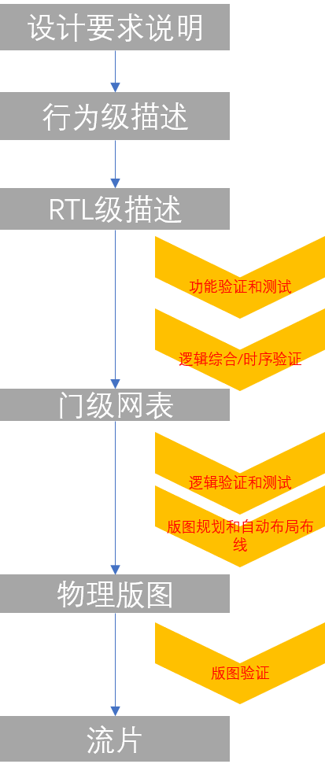

# IC设计与开发流程

学习verilog，重点不在于verilog语言本身，大家一致同意verilog比C语言简单。关键在于verilog代表了一个领域的跨越，实际上是从软件领域到IC领域的跨越。所以在此之前需要先了解目前芯片行业IC设计与开发的流程

## IC开发流程

IC设计是一个自上而下的设计，这个很好理解，IC设计的整个周期长，很精细，如果需求不明确，那么后期很难修改。有点儿像盖房子，和现在的
互联网软件开发有比较明显的区别。



目前来讲，行为级描述向RTL级的描述仍然是全手工完成的，RTL描述到门级网表可以使用综合工具来实现，再有自动布局布线工具来实现最终的物理版图。现在也有行为级能直接转换为RTL级的工具，虽然不成熟，但这是一种趋势。个人认为这种趋势是必然的，就像由机器码到汇编再到C语言以及更高级的语言。当然，在追求性能时，高级语言嵌入汇编也是必不可少的，HDL也应该具备这种能够嵌入的能力。

目前大家普遍采用 VCS + Verdi + UVM 的开发验证方案

```text
            |--------------------------------------------------------------------------------------
            |                                                                                     |
    |-----------------| input  ***************                                                    |
    |   RTL xxxx.v    | ------>*             *                                                    V
    |-----------------|        *             *                                           **********************
                               *     VCS     *                                           *                    *
    |-----------------| input  *             *    output   |--------------|    input     *                    *
    |   testbech.v    | ------>*   compile   * ----------->|  xxxx.fsdb   | ------------>*        Verdi       *
    |-----------------|        *             *             |--------------|              *                    *
                               *             *                                           *                    *
    |-----------------| input  *             *                                           **********************
    |   filelist.f    | ------>*             *                                                     ^
    |-----------------|        ***************                                                     |
            |                                                                                      |
            |---------------------------------------------------------------------------------------
```

### 功能仿真（前仿真）

对建模文件进行编译，对模型电路进行功能上的仿真验证，查找设计的错误并修正。

此时的仿真验证并没有考虑到信号的延迟等一些 timing 因素，只是验证逻辑上的正确性。

### 逻辑综合

综合（synthesize），就是在标准单元库和特定的设计约束的基础上，将设计的高层次描述（Verilog 建模）转换为门级网表的过程。逻辑综合的目的是产生物理电路门级结构，并在逻辑、时序上进行一定程度的优化，寻求逻辑、面积、功耗的平衡，增强电路的可测试性。

但不是所有的 Verilog 语句都是可以综合成逻辑单元的，例如时延语句。

### 布局布线

根据逻辑综合出的网表与约束文件，利用厂家提供的各种基本标准单元库，对门级电路进行布局布线。至此，已经将 Verilog 设计的数字电路，设计成由标准单元库组成的数字电路。

### 时序仿真（后仿真）

布局布线后，电路模型中已经包含了时延信息。利用在布局布线中获得的精确参数，用仿真软件验证电路的时序。单元器件的不同、布局布线方案都会给电路的时序造成影响，严重时会出现错误。出错后可能就需要重新修改 RTL（寄存器传输级描述，即 Verilog 初版描述），重复后面的步骤。这样的过程可能反复多次，直至错误完全排除

## IC基础

### Wafer和Die

wafer是成品的晶圆，是原始的硅锭，经过溶解光刻胶，蚀刻，离子注入，电镀，铜层生长等操作之后的成品，将wafer切开，得到一个个CPU的核心，Die. CPU会内置很多gate,在binning阶段，封测发现问题就会封闭出现错误的部件。CPU的成本一个重要的参考量是每个wafer能制造多少个Die,Die的大小会影响Wafer的浪费比例，也会影响Die的良率(yield).

### 频率和电压

频率能够提高CPU的性能，但因为门延迟的问题存在，组成CPU的FET充放电都需要一定的时间，频率高于这个时间，CPU就会运行错误。提高电压能够提高FET的充放电速度，因此，频率的提高一般需要伴随着电压的提高。
光速大概是每秒30w公里，我们可以计算一下在固定频率下，电信号的传播距离。比如10GHz, 那么就是30w/10GHz = 30mm,假设一个die的宽度是10mm, 那么CPU的主频理论上不会超过30GHz。

### 老化(burn-in)


### 片间互联

一个package封装多个独立的Die
