# PCIE

[TOC]

PCIe是一个高性能的广泛用于不同的计算和通信平台的通用IO互联协议。

它具有以下特点：

- 串行全双工
- 数据以包(packet)的形式传输
- 采用差分信号提高稳定性
- 嵌入式时钟(embedded clock)技术，发送端不需要向接收端发送时钟，接收端能够通过编码从数据lane中恢复

PCIe定义了三个逻辑层：
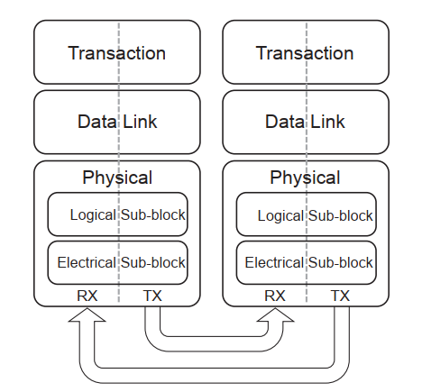

- 业务层(Transaction Layer)
  - 主要负责TLP(transaction layer packet)的组包和解包，TLP是用来业务通信的，包括读写和一些特定类型的事件。业务层也负责TLP的credit-based流控。
  - 业务层支持四种地址空间，三个PCI地址空间(memory,I/O,configuration)和message空间。
  - message空间用来支持所有的前边带信号，比如中断，电源管理请求等。
- 数据链路层(Data Link Layer)
  - 数据链路层负责链路管理和数据完整性，包含错误检查和校正。数据链路层接收接收业务层打包的TLP,计算并添加数据保护码和TLP序列号，将他们提交到物理层以进行链路传播。同时，数据链路层的接收部分负责检查接收到的TLP的完整性并且把他们提交到业务层做其他的处理。一但检测到TLP错误，这一层会负责请求重新传输TLP直到接收正确或者链路被认定为有错误。
  - 数据链路层也会产生或处理用于链路管理的数据包。DLLP(data link layer packet)将会在的时候使用
- 物理层(Physical Layer)
  - 将来总线速度，编码技术或者通信介质可能只会影响物理层

每个层分为两个部分，一个是处理outbound信息，一个处理inbound信息

如下图所示，每一层在发送的时候都会给数据包添加一些必要的信息
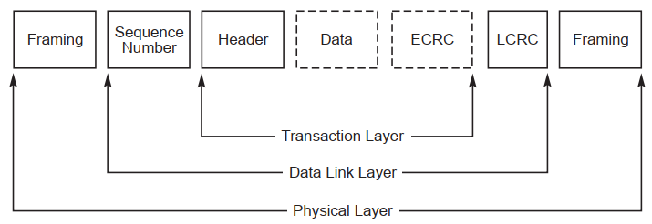

## 缩写

Multi-Function Device (MFD)
Alternative Routing-ID Interpretation (ARI)
Steering Tag (ST)
Processing Hint (PH)
Read Completion Boundary (RCB)
Non-Posted Request (NPR)
Virtual Channel (VC)
Multi-Function Virtual Channel (MFVC)
Traffic Class (TC)
Flow Control (FC)

## 拓扑

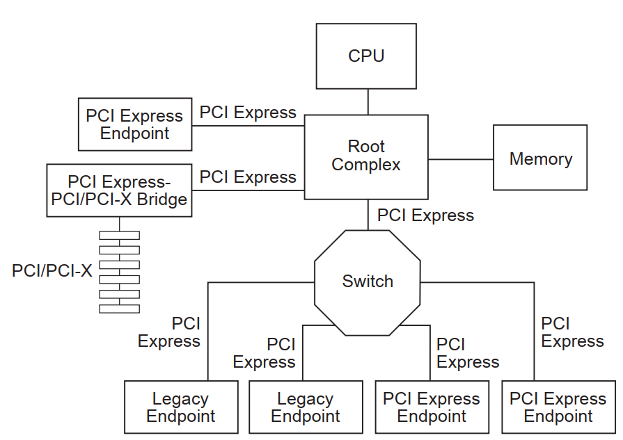

### RC(root complex)

- RC表示IO层级结构的根，连接了cpu及内存子系统
- RC可以支持一个或多个PCIe ports.每一个接口定义一个独立的hierarchy domain.每一个hierarchy domain可以组成一个EP或者一个包含一个或多个switch和EP的子层级
- RC必须支持生成配置请求
- RC允许支持IO请求的生成

### Endpoints

EP代表的功能类型可以是请求者也可以是完成者。分为三种：

- Legacy Endpoint
- PCIe Endpoint
- Root Complex Integrated Endpoint

### switch

switch是多个PCI-to-PCI桥设备的逻辑组装

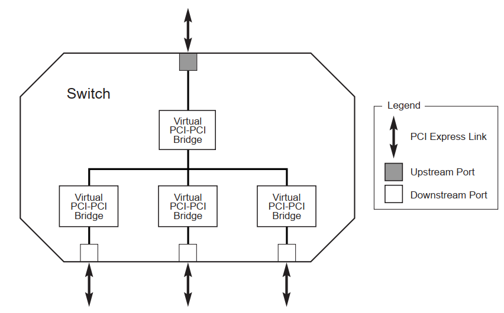

- 在配置软件看来，PCIe Switch是两到多个逻辑PCI-to-PCI桥
- 除非另有说明，switch必须在任意的端口上支持所有的TLP类型的转发
- switch不能支持数据包的拆分

## 业务层

### 概述

业务层在处理生成和接收TLP的时候，和对端的业务层交换流控信息。也负责软件和硬件初始化电源管理。

初始化和配置功能需要业务层：

- 存储处理器或管理设备生成的链路配置信息
- 存储物理层硬件协商的数据宽度和频率链路能力

一个TLP的生成和处理服务需要做：

- 基于设备请求生成TLP
- 将接收到的TLP请求转换成设备请求
- 将接收到的完成包转换为可交付给核心的有效载荷或状态信息
- 检测不支持的TLP,委托适当的机制去处理
- 如果支持端到端的数据完整性，生成端到端的数据完整性CRC并更新到TLP头中

流控服务：

- 业务层跟踪流控credits
- 通过数据链路层的传输服务将credit状态周期性地发送到远端业务层
- 远端流控信息用于控制TLP传输的开度(throttle)

电源管理服务：

- 软件控制的电源管理机制，由系统软件决定的
- 硬件控制的自主电源管理可在电源全开状态下最大限度地降低功率

虚拟通道和流量类型(traffic class)：

- 提供虚拟通道机制和流量类型识别的组合，用来进行差异化服务和支持特定应用类型的QoS
- 流量类型是TLP的标签。在每一个服务点，流量类型被应用于适当的服务机制。每一个流量类型标签定义了一个唯一的顺序域，拥有不同流量类型标签的数据包没有先后顺序的仲裁

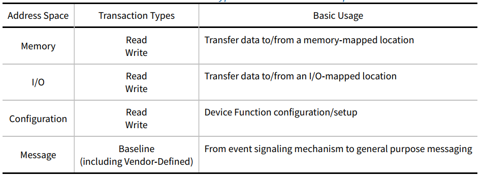

业务通过requests和completions来完成。completions只有在需要的时候使用，例如返回读的数据，或者应答IO和写配置的完成。completions通过包头中的业务ID来关联对应的requests.

TLP中保留的字段都需要填0.接收端必须忽略这些保留字段，switch必须原封不动的转发。

### 包格式

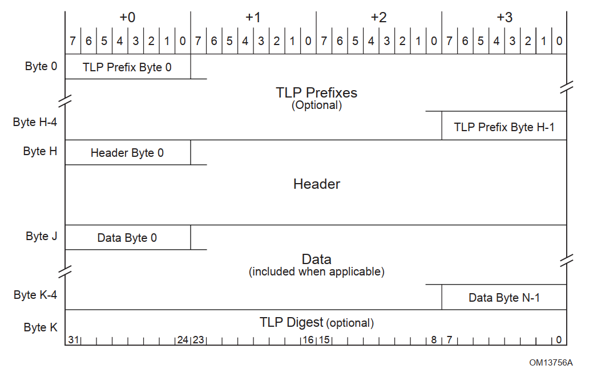

PCIe是以串行的字节流来传输信息的，从字节的层面上，先传头。
如图所示，TLP Prefix, TLP Header, TLP Digest 画在了左边。TLP Header的组织形式进行了性能优化，将最要紧的信息放在最头上，以保证先进行传输。比如说将地址域放在头上，这样能够较早的进行地址解码。

TLP头主要包含如下字段：

- Format of the packet
- Type of the packet
- Length for any associated data
- Transaction Descriptor, including
  - Transaction ID
  - Attributes
  - Traffic Class
- Address/routing information
- Byte Enables
- Message encoding
- Completion status

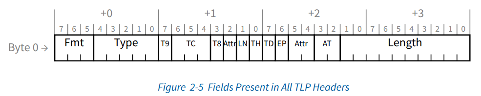
所有的TLP的前缀和头都包含上面图中的字段，Fmt字段指示一个或多个TLP前缀的存在，Type字段指示TLP前缀类型。
Fmt和type字段提供了TLP头部剩余部分大小和是否包含数据域的信息。type字段也决定了switch如何进行路由

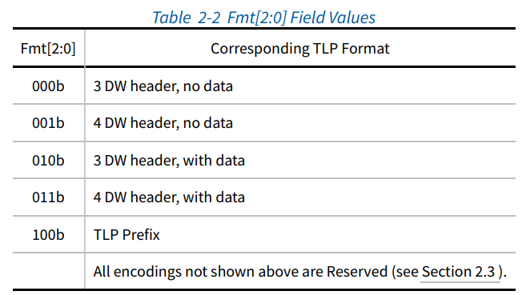

fmt和type的组合，实现了多种命令,如下图所示
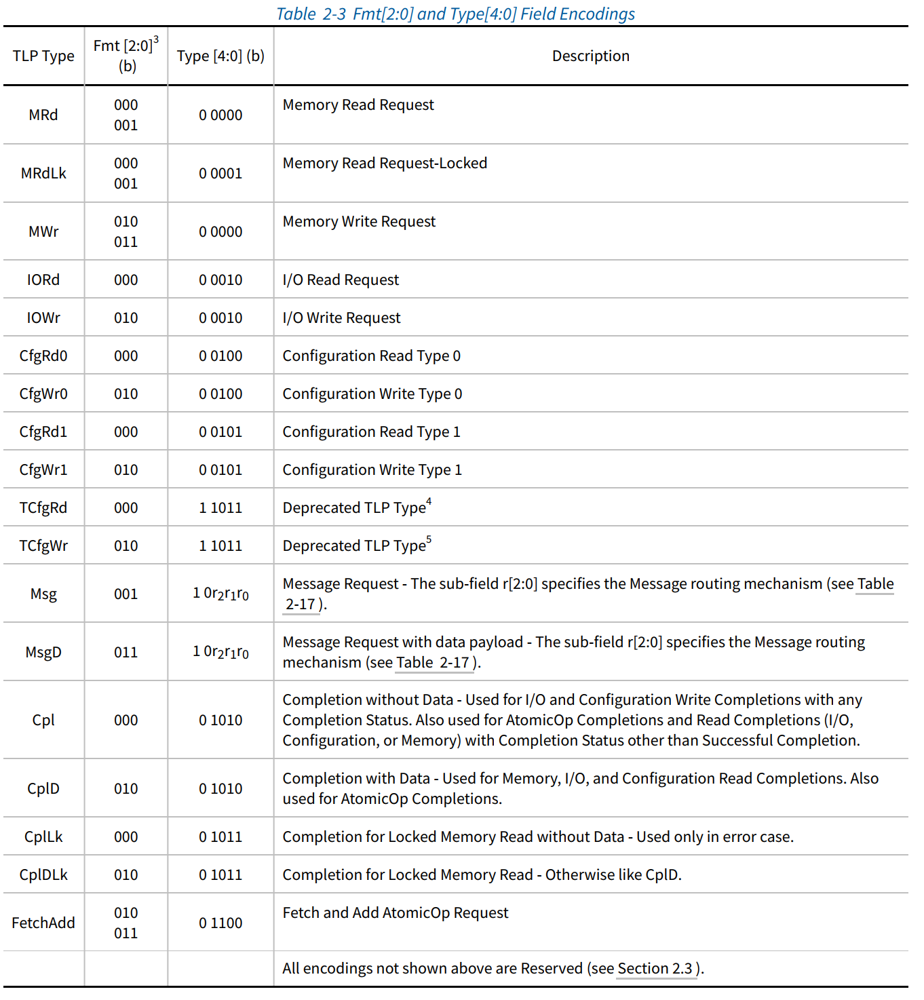

数据长度编码如下图所示
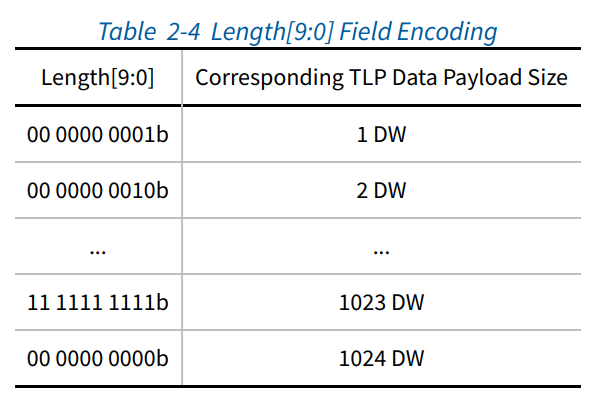

数据长度是以DW为单位，有Max_Payload_Size限制，不同的设备的最大长度限制不同。Max_Payload_Size只对携带数据的TLP起作用。内存读请求不受限制，是通过length域来控制的。

#### 路由和地址规则

一共有三种路由规则

- address
- ID
- implicit(只有在message请求的时候用到)

##### 地址路由规则

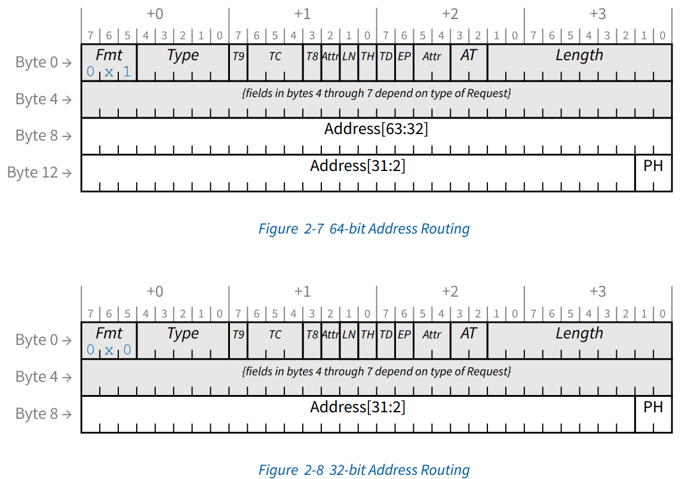

- 地址路由用来实现内存和IO请求，有两种格式，64-bit格式使用4DW头，32-bit使用3DW头。
- 读内存，写内存，原子操作请求可以使用任意的格式。但对于低于4GB的地址，必须使用32-bit格式。使用64bit格式请求一个4GB内的地址的行为不做定义。
- I/O读写请求使用32-bit格式

##### ID路由规则

- 配置请求使用ID路由
- ID路由使用bus,device,function numbers指定一个TLP目标

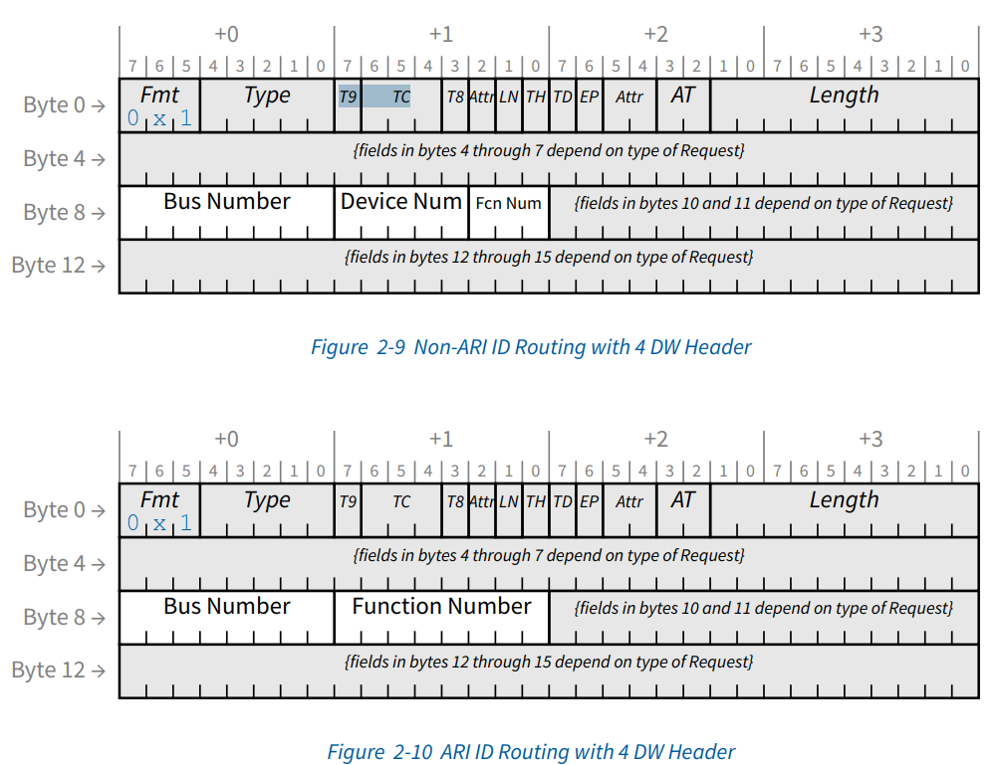
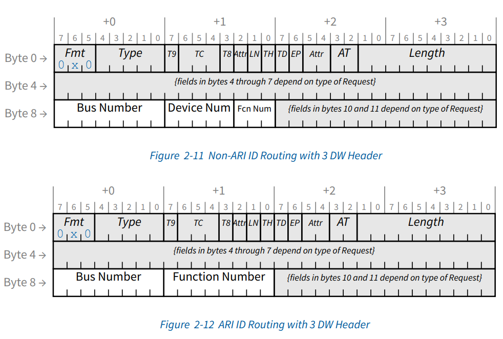

#### first/last DW byte

干啥用的？

#### transaction descriptor

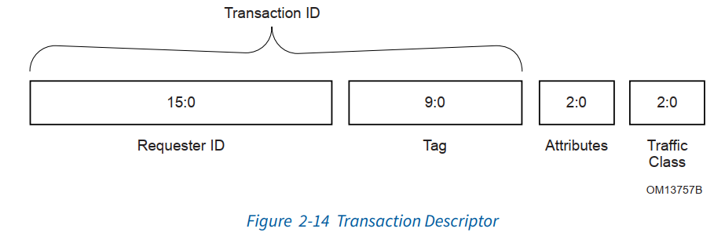

业务描述符是承载业务信息的一种机制，包含三个域：

- Transaction ID 标识，由requester ID和 Tag共同组成
- Attributes field 指定特性，主要负责保序和硬件一致性管理(snoop)
- Traffic Class (TC) 请求服务的类型,3bit，实现8种类型，配合虚拟通道，实现流控

#### 内存/IO/配置请求

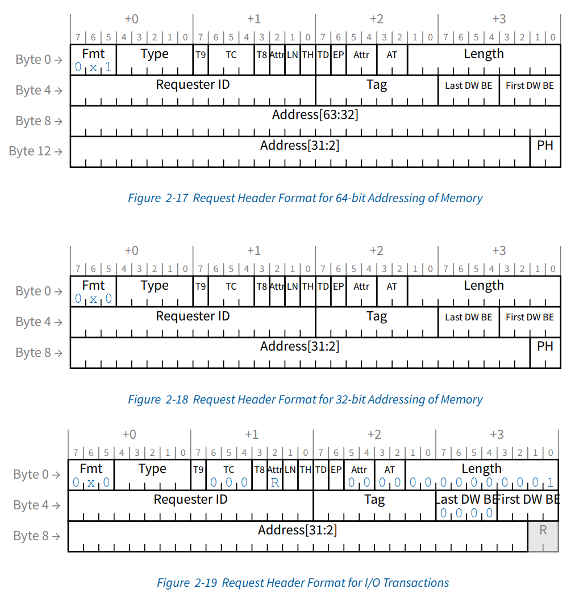

#### 消息请求

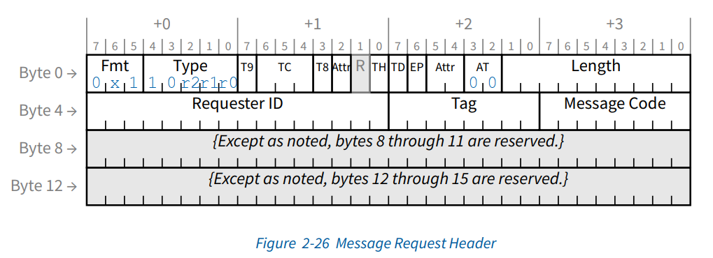
其中type域的r[2:0]定义了路由规则

#### completion规则

所有的读，non-posted写，原子操作都需要completion。completion包含头，有些会包含一些数据

> A posted write is a computer bus write transaction that does not wait for a write completion response to indicate success or failure of the write transaction. For a posted write, the CPU assumes that the write cycle will complete with zero wait states, and so doesn't wait for the done. This speeds up writes considerably. For starters, it doesn't have to wait for the done response, but it also allows for better pipelining of the datapath without much performance penalty. A non-posted write requires that a bus transaction responds with a write completion response to indicate success or failure of the transaction, and is naturally much slower than a posted write since it requires a round trip delay similar to read bus transactions.

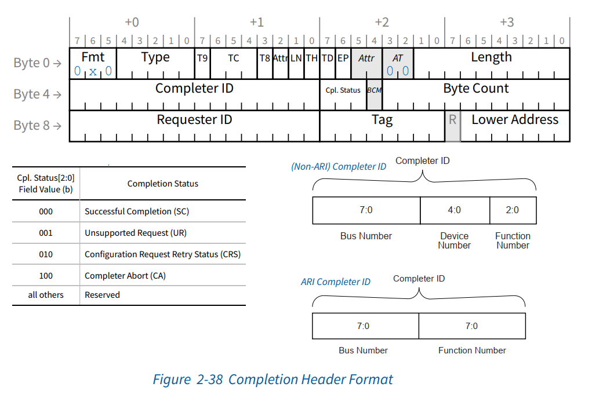

### 接收TLP的处理

- RCB决定了将一个读请求转换为多个completions的地址分割边界,对RC来讲，RCB是64或128字节，可以在链路控制寄存器中设置。

### 顺序规则

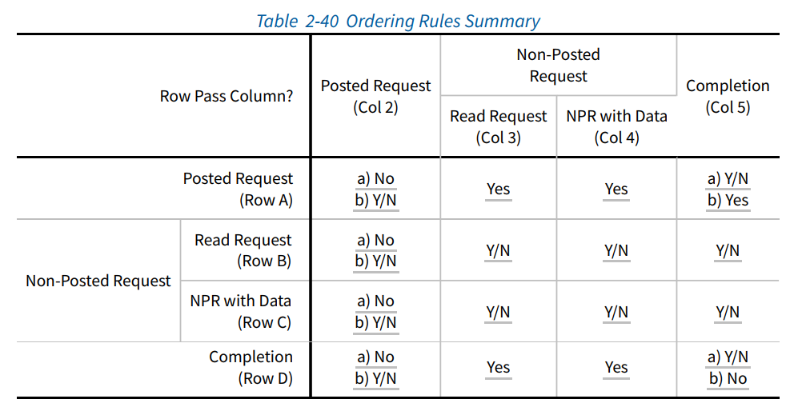
如图2-40所示，列是第一个发送的TLP，行是第二个发送的TLP，表中描述了第一个发送的TLP和第二个发送的TLP的顺序规则。

其中简写含义如下：

- Yes 必须允许超车
- Y/N 怎么都行
- No 必须保序，不能超车

请求类型有如下解释：

- Posted Request 内存写请求或者消息请求
- Read Request 配置读请求，IO读请求，内存读请求
- NPR with data 配置写请求，IO写请求，原子操作请求

### 虚拟通道机制

每一个TC必须映射到一个VC上，TC0到VC0的映射是固定的，除此之外的映射是系统软件定义的。但是，要符合如下规则：

- 多个TC可以映射到同一个VC，但一个TC不能映射到多个VC
- 链路两端的TC/VC映射必须保持一致

DLLP包含了做流控计数的VC ID信息， TLP不包含。TLP通过VC/TC映射关系来对应到VC ID

下面是一个TC/VC映射举例
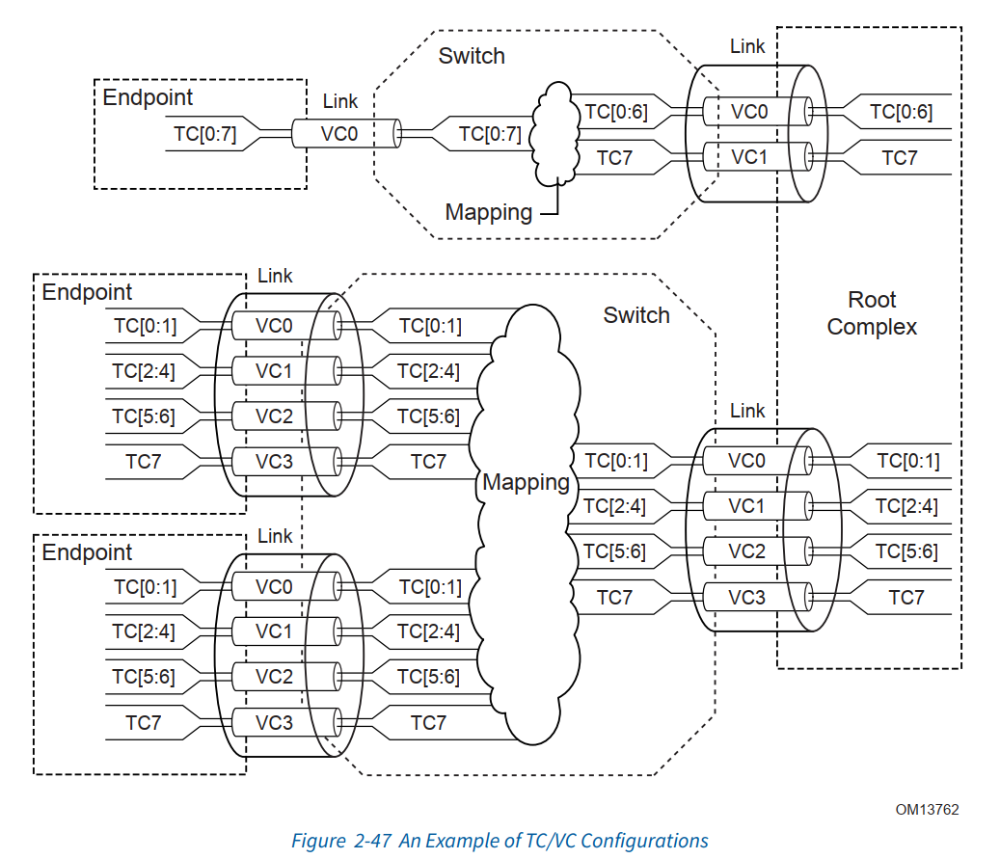

### 流控

- 每一个虚拟通道都有一个独立的credit池
- 流控信息通过流控包FCPs(Flow Control Packets)在链路两端传播，FCPs是一种DLLPs
- 流控是业务层和数据链路层配合进行处理的

### 完成超时机制

## 数据链路层

数据链路层负责和对端的数据链路层可信的交换信息。

初始化和电源管理服务：

- 接受来自业务层的电源状态请求，传送到物理层
- 向业务层传送active/reset/disconnected/power managed state

数据保护，错误检查，重发服务：

- 生成CRC
- 为数据链路级的重试存储TLP
- 错误检查
- TLP确认和重试消息
- 错误报告和日志记录的错误指示

## 中断

PCIe中断模型支持两种机制：

- INTx 模拟
- message signaled interrupt(MSI/MSI-X)

为了向前兼容，PCIe提供了INTx模拟机制。它通过带内信号机制虚拟化了PCI物理中断信号。
如果实现的设备支持中断，那么要求必须至少实现MSI或MSI-X的一种。基于INTx的实现是可选的。
switch需要支持转发INTx中断模拟信息。

系统软件通过读取多个消息能力域来决定请求向量的数量。MSI支持每个功能最多32个向量。系统软件写多个消息使能域去申请所有的或者一部分请求向量。但请求的向量数比如是2的指数倍。

EP(end point)
RP(root point)
BDF(Bus, Device, Function)
