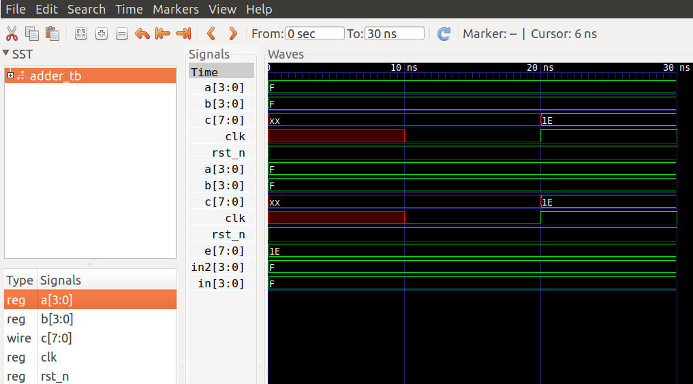

# verilog第一篇

入门verilog的第一篇，打算以多篇章的形式记录一下学习过程

## 开发环境的选择

我觉得这是首要的，先了解一下verilog开发的套路。代码编辑首先考虑vscode，发现里面也有支持verilog的插件，具体体验如何现在不好评价，暂定这个。
按照通常理解，写好的verilog代码想要看到效果应该需要一个运行环境。

在C语言开发中，我们写好一个C的应用，需要经过编译器编译链接成可执行文件，然后需要一个运行环境来执行。不同平台的编译器能编译出不同平台的目标可执行
文件，然后不需要不同平台的运行环境来执行。verilog可以类比C语言，vivado(xilinx公司)，quartus2(altera公司),vcs(synopsys公司)可以认为是工具链(实际上
不仅仅是工具链，编译只是其功能的一小部分，这些可以理解成Keil这种IDE)。当然，其实没有一个gcc这样的框架与之对应，似乎各大公司都是各写各的，只在语言层面上进行统一，
而不会想gcc或者clang这样做成一个工具链平台。

verilog编译后生成的是bitfile，C当然是elf（exe）。那么需要一个运行环境，比如编x86代码可以直接在pc上运行，编riscv代码就需要riscv模拟器或者真实硬件。对于bitfile，
当然如果有各个厂家对应的真实硬件，那么可以在真实硬件上运行，除此之外可以在Modelsim这种通用仿真平台上进行。那么modelsim就类似于一个支持多厂家bitfile的模拟器，而且
能够提供一些调试手段。

综合看下来，整个IC的开发和软件开发的套路类似，但目前感觉平台性不如软件

所以目前看下来，大家用的比较多的，比如quartus2 + modelsim是一个不错的选择，当然需要windows平台。

作为一个linux开发者，显然更喜欢linux的开发环境，windows使用起来还是有些麻烦，所以发现大家基于linux的系统开发环境普遍是iverilog和gtkwave。初步了解，iverilog(Icarus Verilog)号称“全球第四大”数字芯片仿真器。因为开源，广受欢迎。GTKWave是波形文件察看工具，也是开源。

好吧，工具之争就告一段落，本着拥抱开源的思路，iverilog+gtkwave搞起。
朋友推荐了夏宇闻老师的verilog相关书籍，特此记录。

## 环境搭建

[iverilog官网的源码安装指导](https://iverilog.fandom.com/wiki/Installation_Guide#Compiling_on_Linux.2FUnix)

采用源码安装的方式（尽管要源码目前也不会去研究）,从github上获取源码

[iverilog](https://github.com/steveicarus/iverilog.git)

```shell
git clone https://github.com/steveicarus/iverilog.git
```

选择最新稳定分支

```shell
chsgcxy@chsgcxy-TM1703:~/workspace/iverilog$ git branch -a
remotes/origin/v0_9-branch
remotes/origin/v10-branch
remotes/origin/v11-branch
chsgcxy@chsgcxy-TM1703:~/workspace/iverilog$ git checkout -b br11 origin/v11-branch
```

安装依赖， 这些依赖我都安装过了( g++ and gcc也需要)

```shell
chsgcxy@chsgcxy-TM1703:~/workspace/iverilog$ sudo apt-get install bison flex autoconf gperf
```

生成makefile

```shell
chsgcxy@chsgcxy-TM1703:~/workspace/iverilog$ chmod +x autoconf.sh
chsgcxy@chsgcxy-TM1703:~/workspace/iverilog$ ./autoconf.sh
chsgcxy@chsgcxy-TM1703:~/workspace/iverilog$ ./configure --prefix=/home/chsgcxy/opt/iverilog/
chsgcxy@chsgcxy-TM1703:~/workspace/iverilog$ make -j4
chsgcxy@chsgcxy-TM1703:~/workspace/iverilog$ make install
```

最后别忘了把安装路径加入到PATH中，用iverilog -h试一下是不是安装成功

直接使用apt来按照gtkwave

```shell
chsgcxy@chsgcxy-TM1703:~/workspace/iverilog$ sudo apt-get install gtkwave
```

这里给出gtkwave的资料

https://iverilog.fandom.com/wiki/GTKWave

http://gtkwave.sourceforge.net/

## 尝试运行现有demo

还是那个原则，有枣没枣先打三杆，虽然还不熟悉verilog，但先运行一个demo看看，把运行流程和调试方法熟悉起来。

抄的一个加法器的实现（看起来写一个a+b也就是写一个a+b）

```verilog
module adder(clk, rst_n, a, b, c);
    input [3:0] a;
    input [3:0] b;
    output [7:0] c;
    input clk, rst_n;

    wire [3:0] a;
    wire [3:0] b;
    reg [7:0] c;

    always @(posedge clk or negedge rst_n) begin
        if (rst_n == 1'b0)
            c <= 8'b0;
        else
            c <= a+b;
    end
endmodule
```

抄的一个测试case

```verilog
`timescale 1ns/1ns
module adder_tb();
    reg [3:0] a;
    reg [3:0] b;
    wire [7:0] c;

    reg clk,rst_n;

    adder DUT (
        .clk(clk),
        .rst_n(rst_n),
        .a(a),
        .b(b),
        .c(c)
    );

    always begin
        #10 clk = 0;
        #10 clk = 1;
    end

    initial begin
        rst_n = 1;
        test(4'b1111, 4'b1111, 5'b11110);
        $finish;
    end

    task test;
        input [3:0] in;
        input [3:0] in2;
        input [7:0] e;
        begin
            a = in;
            b = in2;
            @(posedge clk);
            @(negedge clk);
            if (c == e) begin
                $display("It works");
            end else begin
                $display("opps %d + %d ~= %d, expect %d", in, in2, c, e);
            end
        end
    endtask

    initial begin
        $dumpfile("wave.vcd"); // 指定用作dumpfile的文件
        $dumpvars; // dump all vars
    end
endmodule
```

像C一样也进行编译，iverilog编译后生成的是一个vpp格式的中间文件，默认也是a.out

```shell
chsgcxy@chsgcxy-TM1703:~/workspace/misc$ iverilog test.v tb.v
chsgcxy@chsgcxy-TM1703:~/workspace/misc$ file a.out
a.out: a /home/chsgcxy/opt/iverilog/bin/vvp script, ASCII text executable
```

使用gtkwave查看波形
 $dumpfile("wave.vcd"); $dumpvars; 完成了dump波形文件的动作

```shell
chsgcxy@chsgcxy-TM1703:~/workspace/misc$ gtkwave wave.vcd
```



开篇就是这样，有了一个大致的了解。接下来就该尝试根据别人的更高级一些的代码进一步熟悉这套语言和环境了。

## 后记

iverilog的设计思想跟软件的工具链很像，它使用vpp这种IR来实现它的功能，通过一个中间语言来实现一些功能的思维
其实在很多地方都能看到，比如传统编译器，tvm, java等等，大家都是这种思路，值得学习。

gtkwave是一个波形文件查看工具，他支持的文件格式有VCD和EVCD。那么实际上我们可以用它做更多，比如说让
gem5来支持将指令流信息转换成VCD文件，那么指令流就可以通过gtkwave来查看了。这对于性能分析有很大帮助。
当然，类似的软件应该还有很多，也有可能有更简单方便的工具能完成这个功能。
