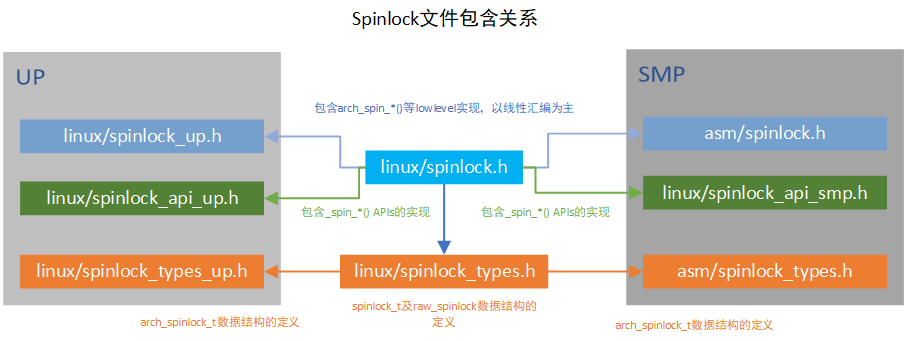

# Linux的同步和互斥机制

在面对需要同步和互斥机制的场景时，只有熟练掌握linux提供的同步和互斥机制，才能灵活运用，举一反三。

- 自旋锁(spin lock)
- 读写锁(read-write lock)
- 信号量(semaphore)
- 互斥量(mutex)
- RCU

当然宝华老师和一众内核大神已经对这些做了非常详细的总结，包括使用场景，注意事项，实现原理等。
大家的总结普遍针对arm架构，此篇总结我会针对riscv架构来展开，争取做到有一点儿特色。但最关键的还是
借此机会巩固基础，梳理思想。

所有代码基于linux5.11

## 自旋锁

在驱动开发中，经常会用到自旋锁。自旋锁在等锁的时候，会一直轮询，而不会睡眠当前线程，所以它经常用在
需要在中断上下文(不能进行sleep)进行数据保护的场景。所谓自旋，就是轮询，会持续占有CPU，因此临界区的处理
应该越简洁越好。只要等待的代价低于调度的代价，那就赚了。

代码结构上，横向来看，spinlock的实现分为SMP和UP两个大分支，每个分支下根据是否是debug又有所不同。纵向来看，
包含架构无关的API层以及架构相关的arch层。



arm的spinlock宝华老师以及众多网友已经分析的很透彻了，这里插入相关文档，以供自己后续回顾

https://blog.csdn.net/zhoutaopower/article/details/86598839

https://blog.csdn.net/21cnbao/article/details/108091149

因为近期RISCV接触的比较多，所以干脆分析一下RISCV的spinlock实现吧

riscv的smp对于arch_spin_lock的定义如下，并没有arm那样的owner和next，只有一个lock。

```c
typedef struct {
    volatile unsigned int lock;
} arch_spinlock_t;
```

在 arch/riscv/include/asm/spinlock.h 中实现了底层的spinlock方法

```c
//代码基于linux5.11版本
static inline int arch_spin_trylock(arch_spinlock_t *lock)
{
    int tmp = 1, busy;

    __asm__ __volatile__ (
        "   amoswap.w %0, %2, %1\n"
        RISCV_ACQUIRE_BARRIER
        : "=r" (busy), "+A" (lock->lock)
        : "r" (tmp)
        : "memory");

    return !busy;
}

static inline void arch_spin_lock(arch_spinlock_t *lock)
{
    while (1) {
        if (arch_spin_is_locked(lock))
            continue;

        if (arch_spin_trylock(lock))
            break;
    }
}
```

在riscv原子指令集扩展一篇中，已经熟悉了amoswap.w是原子内存操作指令,其中指令格式为amoswap.w rd, rs2, (rs1),
实际上通过原子交换操作来确保lock标志完整写入内存。

好的东西总是值得推敲，linux的命名策略比配上一万行文档都好，何况其注释也非常到位。arch开头的明显是架构相关的函数，应该去对应arch目录下文件中找，文件命名清晰明了。

## 读写锁

为了解决多个读线程无法并行的问题，在spinlock基础上实现了读写锁。

这里可以参考https://blog.csdn.net/zhoutaopower/article/details/86605987

来看代码实现，在分析spinlock的时候就已经看到，spinlock.h中还引用了读写锁的头文件rwlock.h
同样的，spinlock_types.h中也包含了rwlock数据类型的定义的头文件rwlock_types.h，按照spinlock的头文件
结构，每个文件中都包含了rwlock相关的头文件。

以writelock来分析封装关系

```text
// include/linux/rwlock.h
#define write_lock(lock)    _raw_write_lock(lock)

// 分smp和up两种实现，这里只分析smp
// kernel/locking/spinlock.c
void __lockfunc _raw_write_lock(rwlock_t *lock)
{
    __raw_write_lock(lock);
}
EXPORT_SYMBOL(_raw_write_lock);

// include/linux/rwlock_api_smp.h
static inline void __raw_write_lock(rwlock_t *lock)
{
    preempt_disable();
    rwlock_acquire(&lock->dep_map, 0, 0, _RET_IP_);
    LOCK_CONTENDED(lock, do_raw_write_trylock, do_raw_write_lock);
}

// include/linux/rwlock.h
# define do_raw_write_lock(rwlock)	do {__acquire(lock); arch_write_lock(&(rwlock)->raw_lock); } while (0)

// arch/riscv/include/asm/spinlock.h
static inline void arch_write_lock(arch_rwlock_t *lock)
{
    int tmp;

    __asm__ __volatile__(
        "1: lr.w    %1, %0\n"
        "   bnez    %1, 1b\n"
        "   li  %1, -1\n"
        "   sc.w    %1, %1, %0\n"
        "   bnez    %1, 1b\n"
        RISCV_ACQUIRE_BARRIER
        : "+A" (lock->lock), "=&r" (tmp)
        :: "memory");
}
```

还记得lr.w和sc.w吗？在riscv的A扩展中分析过，riscv的原子操作有两种形式，spinlock用了原子内存操作指令，rwlock用了Load-Reserved/Store-Conditional 指令。
将lock中的lock字段读取到tmp中，并判断是否为0,不是0就会一直读，直到为0, 如果是0,tmp变为-1, 再把tmp写到lock中，并且判断是否保序成功，如果不成功，则要
重新执行这段指令。

这里再结合读的实现，就更清晰为什么要用lr,sc实现了

```c
static inline int arch_read_trylock(arch_rwlock_t *lock)
{
    int busy;

    __asm__ __volatile__(
        "1: lr.w    %1, %0\n"
        "   bltz    %1, 1f\n"
        "   addi    %1, %1, 1\n"
        "   sc.w    %1, %1, %0\n"
        "   bnez    %1, 1b\n"
        RISCV_ACQUIRE_BARRIER
        "1:\n"
        : "+A" (lock->lock), "=&r" (busy)
        :: "memory");

    return !busy;
}
```

读的时候通过一个busy计数来实现多线程读操作并行，这就知道为什么写的时候要赋值为-1了。

不得不再次感慨，**学习知识一开始总是点的学习，但学着学着就成了面，积累着积累着就形成了自己的知识图**

## 信号量

## 互斥量

内核代码的注释质量真的是榜样，我们看include/linux/mutex.h中的描述Simple, straightforward mutexes with strict semantics
点明了mutex的特点，简单直接严谨的锁
互斥体是一种睡眠锁，也就是如果无法加锁，则会睡眠，引发调度。显然这不能用在中断上下文中。显然这可以应对
临界区比较复杂的场景，因为等待锁的时候可以调度出去，让别人先走。

include/linux/mutex.h中包含了mutex数据结构的定义以及相应API的声明

```c
struct mutex {
    atomic_long_t       owner;
    spinlock_t     wait_lock;
#ifdef CONFIG_MUTEX_SPIN_ON_OWNER
    struct optimistic_spin_queue osq; /* Spinner MCS lock */
#endif
    struct list_head    wait_list;
};
```

从mutex的定义能够看出来，mutex是在spinlock的基础上进行实现的，具体的mutex的实现还是挺复杂的，这里不进行展开，值得一提的是现在的互斥锁已经可以支持自旋等待了，可以通过CONFIG_MUTEX_SPIN_ON_OWNER使能MCS锁机制。

引用宝华老师的分析如下

>自旋等待机制的核心原理是当发现持有者正在临界区执行并且没有其他优先级高的进程要被调度（need_resched）时，那么mutex当前所在进程认为该持有者很快会离开临界区并释放锁，此时mutex选择自旋等待，短时间的自旋等待显然比睡眠-唤醒开销小一些。在实现上MCS保证了同一时间只有一个进程自旋等待持有者释放锁。MCS 的实现较为复杂，具体可参考一些内核书籍。MCS保证了不会存在多个cpu争用锁的情况，从而避免了多个CPU的cacheline颠簸从而降低系统性能的问题。经过改进后，mutex的性能有了相当大的提高，相对信号量的实现要高效得多。因此我们尽量选用mutex

在阅读上面这段解释的时候，我有一个近期的感悟，随着芯片的发展，linux kernel经典的机制不断的面临新的挑战，与此同时，linux kernel在不断与时俱进，linux kernel早已进入5.0版本时代，在当下，当我们再去分析内核机制的时候，应该在参考经典解读的同时，自己去分析最新的kernel代码，在发现新特性的时候，要查找资料去了解它的应用场景，及时跟上时代的步伐。
