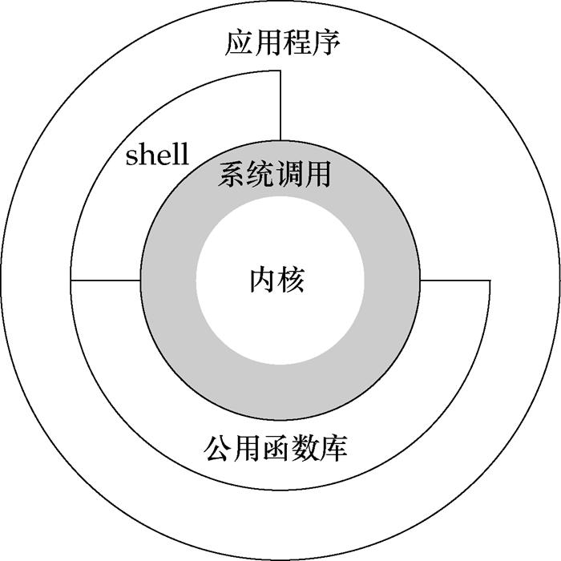

# linux系统调用

## 背景介绍

最近基于gem5调试了RandomX, 在调试过程中使用了gem5的syscall模式，于是顺手看了一下linux系统调用相关的资料，在这里做一个总结。当然，总结分为三大部分

[linux系统调用简析](syscall.md)
[RandomX总结](syscall.md)
[gem5的syscall模式](syscall.md)

这里主要针对linux系统以及RISCV架构实现做一些简要分析。

## 机制简介

想必上图在很多经典书籍文档中都能被看到。用户程序实际上完全依赖于系统调用。公共库和shell提供了一些系统调用的封装，使得用户更方便的使用系统调用。这很明显是一种‘守’的设计方式，操作系统仅提供系统调用给应用程序，这样就能最大限度的保证系统的安全，因为它可以对有限的系统调用做检查，并且完全管理这些系统调用的行为。

这张图片能够清楚的看到函数库和系统调用的区别，库函数基于系统调用之上，对系统调用进行了封装，当然这仅仅是其功能之一。当然，对于应用程序开发者而言，大家都熟悉open，malloc等函数，轻易接触不到直接进行系统调用。

那么很显然，系统调用就是内核提供的一系列接口，既然是接口，那么就有两个主要问题

- 怎么使用
- 接口列表

### 如何使用

我们可以通过库函数简介的使用系统调用，也可以通过syscall函数来显式的使用

### 接口列表

谈到接口列表，就要谈到系统调用的标准。我们能够想到，不同的操作系统可能会提供不同的系统调用，如果大家都统一了，那么软件就简单了，但现实肯定是不只有一个标准的。

这里引用知乎的文章[Linux系统调用](https://zhuanlan.zhihu.com/p/94778760)中的描述

> 在所有类型的 UNIX 操作系统中，系统调用都是特别重要的。系统调用的作用范围、速度、高效实现是影响系统性能的一个主要因素。Linux 中系统调用的实现非常高效而且种类繁多。在 UNIX 大家庭中，有很多的标准，这些标准使得不同系统的接口具有一致性。这样上层应用程序就可以在多个 UNIX 系统中兼容。
> POSIX标准(这是Portable Operating System Interface for UNIX)已经成为该领域的主导标准。Linux 和 C 标准库尽力遵循 POSIX 标准。从20世纪80年代末POSIX第一个版本发布以来，该标准涵盖的范围急速扩展，现在许多程序员认为它已经太长也太复杂。
> 除了POSIX之外，还有其他标准，这些不是由某个委员会制定的，而是来源于 UNIX 和类 UNIX 操作系统的开发。在 UNIX 的历史中，两条开发主线产生了两个独立的系统，一个是SystemV(直接起源于AT&T的原始代码)，另一个是BSD (Berkeley Software Distribution，在加州大学开发，现在市场上的 NetBSD、 FreeBSD、 OpenBSD 都是基于 BSD 的，还有基于BSD的商业系统，如 MacOS。Linux 提供的系统调用汲取自所有上述 3 个来源

## 实现
