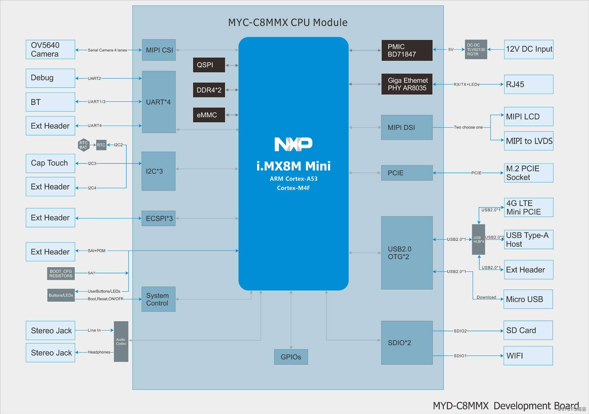
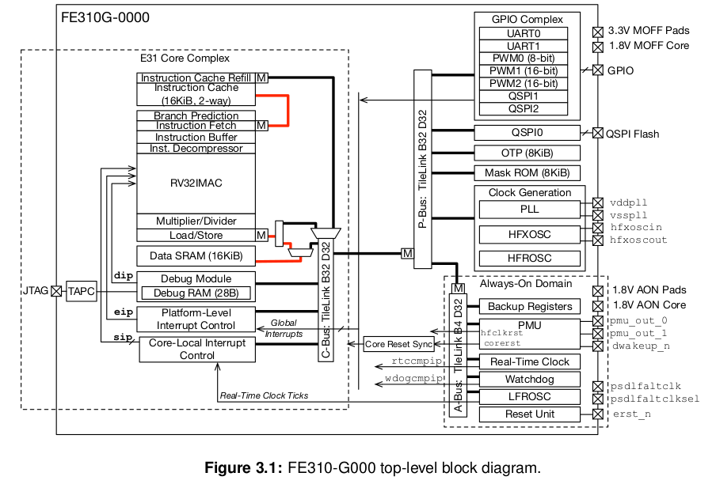
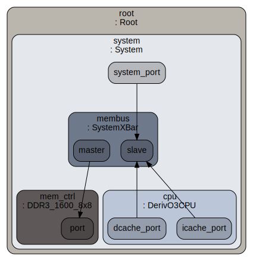
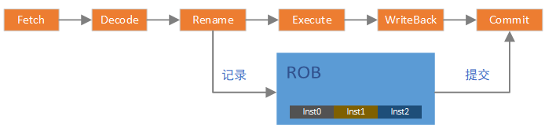
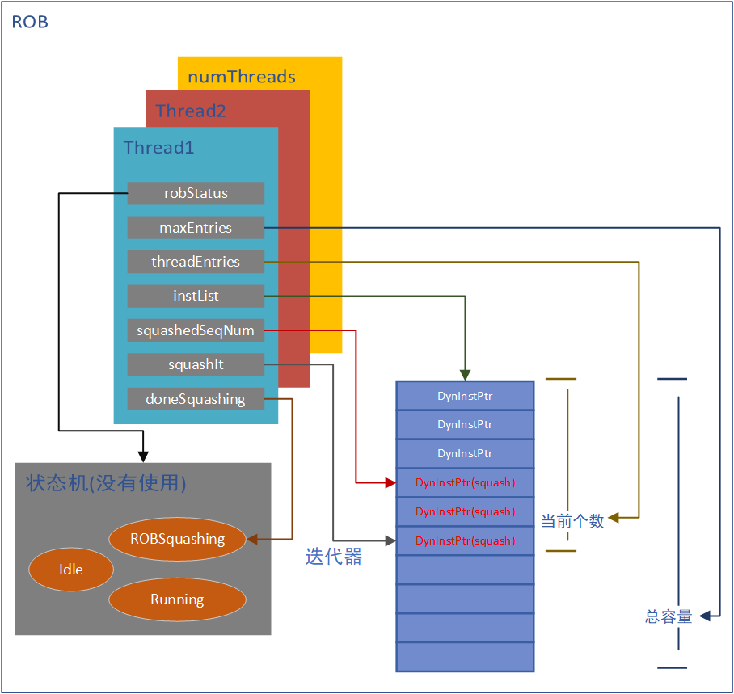
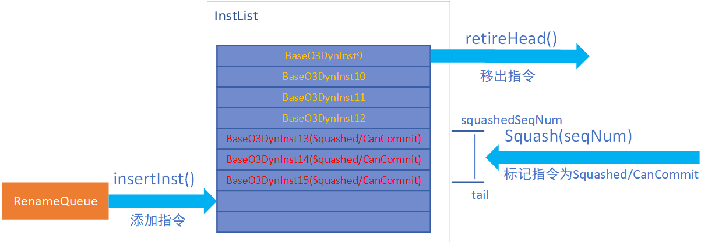
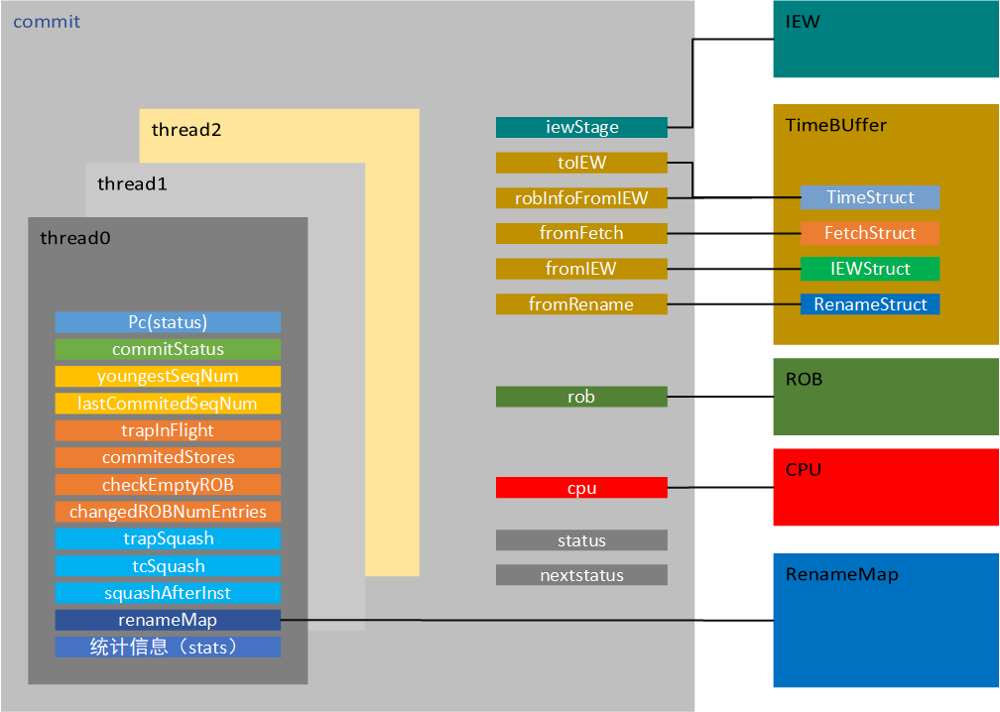
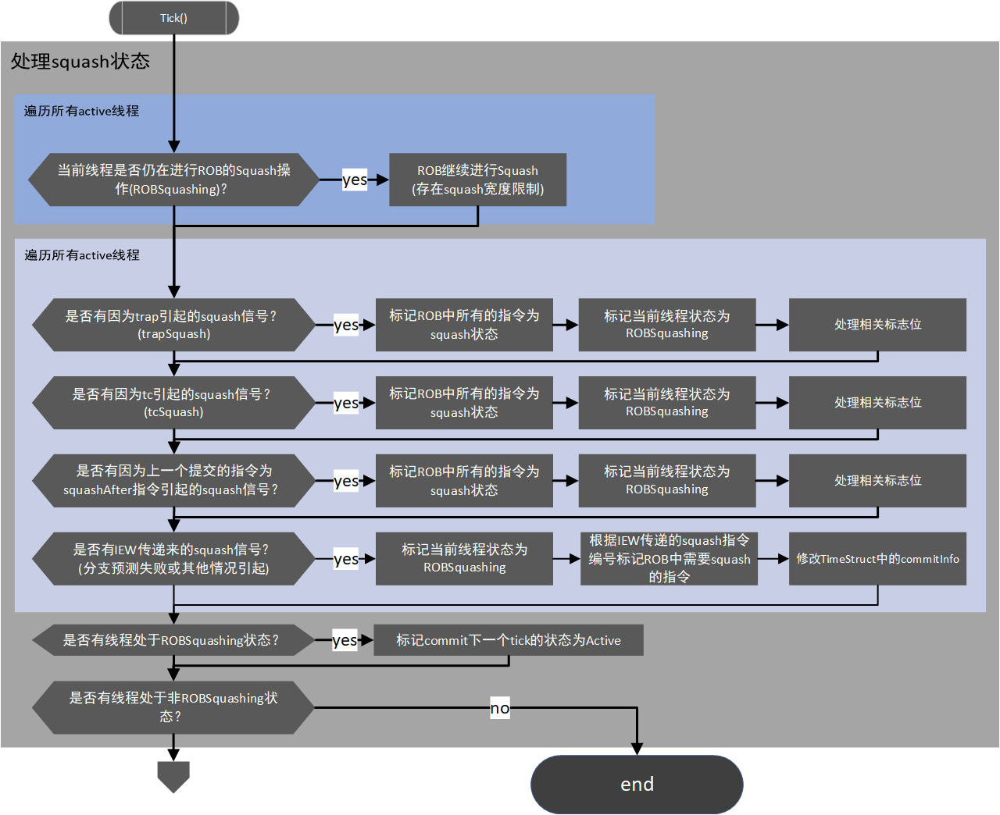
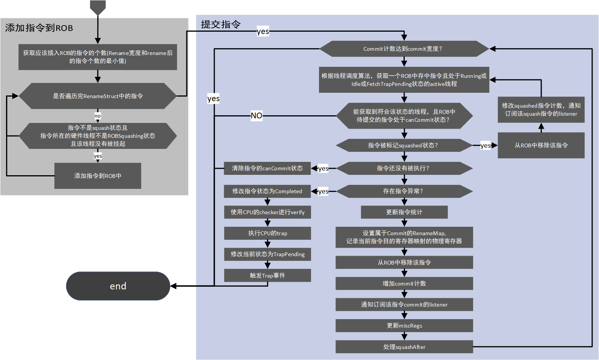

# GEM5 设计与实现分析

[TOC]

## 前言

gem5是一款可以实现时钟精确仿真的SOC模拟器。它本身的目的并不是帮助产品开发，它更偏向于教育和架构探索。
但是研究它仍然是有意义的，它的意义在于能够让你学习到一款时钟级模拟器的构建思路。

官网：http://www.gem5.org
学习指导：http://www.gem5.org/documentation/learning_gem5/introduction

## 分析点

- 单元的设计思路
- 如何解决寄存器冲突
- 流水线的实现方式
- 时钟如何统一
- 多核设计
- 总线，端口的抽象
- debug如何支持
- 地址映射的处理方法

## 简介

> gem5是一个模块化的计算机系统（computer-system）模拟器,最初用于计算机架构以及微处理器架构探索，当然在研究行业，教学行业也有推广。
但总体来讲，gem5是偏向于学术的一款模块化模拟器平台。
gem5目前还在发展，支持的CPU类型有：Alpha, ARM, MIPS, Power, SPARC, RISC-V 以及 64 bit x86。

如上是对于gem5官网描述的概括，其中最关键的应该就是模块化。gem5可以做到时钟精确，当然也可以利用它的模块化，忽略掉一些模块的latency。本文主要侧重的是RISC-V架构。对于RISC-V, 目前gem5主线还不支持vector扩展，但amf扩展都已经支持。

gem5能够模拟出一块具体的板卡，包含由各个模块组成的SOC、DDR以及部分外设的具体板卡，但它模拟的核心仍在于SOC内部。

## 理解gem5的模块化

linux系统提供了设备树，让开发者通过组合系统硬件的一系列模块，从而匹配自己的板卡。gem5也是一样的，它有很多模块都有多种实现，你可以指定具体的某一种实现来组合出你想模拟的系统。

gem5的核心内容（各个模块和机制的具体实现）使用c++编写，内部集成了python2.7解析器。这些模块实现完成之后就像linux内核中实现的一个个device，比如：cpu,cache,memory,power,process,tlb等等。python解析器会解析外部输入的配置文件（python脚本)，这个脚本就像设备树一样，描述了整个系统是如何由这些device组合起来的，并且定义了这些device的一些必不可少的参数。在系统初始化的时候，根据配置文件的描述，对相应的c++类进行实例化，这样就实现了一个具体的系统。

有些模块是通过静态编译绑定系统的，有些模块是通过解析配置脚本动态绑定的。比如ARCH相关的就是通过静态编译绑定的，在编译的时候我们需要指定要编译的ARCH，而cpu类型我们可以在
配置脚本中指定。

当然了，就像乐高玩具一样，空有一堆零件，没有图纸，也很难做出来像样的玩具（天才可能除外）。如果让我们从0开始组合这些模块，是很困难的一件事情，但好在gem5提供了一些demo的config文件，并且tests中也提供了一些config文件，我们可以模改这些文件实现自己的系统。

社区正在开发基于图形拖拽就能生成config文件的功能，这会使它的config文件写起来更直观。

## 理解gem5事件机制

gem5官网文档中已经包含了如何添加一个具体事件的详细说明。对此不再赘述，我们从设计者的角度来理解一下。

所谓的事件机制，实际上就是我们能够在事件应该被执行的时候执行该事件，并且能够动态的添加一些事件。
而且事件应该还有一个优先级的逻辑。

分析代码，首先需要一部分代码来处理事件

```c++
doSimLoop(EventQueue *eventq)
{
    while (1) {
        Event *exit_event = eventq->serviceOne();
        if (exit_event != NULL) {
            return exit_event;
        }
    }
}
```

```c++
class EventQueue
{
  private:
    std::string objName;
    Event *head;
    Tick _curTick;

    void insert(Event *event);
    void remove(Event *event);
    void schedule(Event *event, Tick when, bool global = false);
    void deschedule(Event *event);
    void reschedule(Event *event, Tick when, bool always = false);

    Tick nextTick() const { return head->when(); }
    void setCurTick(Tick newVal) { _curTick = newVal; }
    Tick getCurTick() const { return _curTick; }
    Event *getHead() const { return head; }

    Event *serviceOne();
}
```

初始化完成，一切就绪就绪之后，就会进入doSimLoop的while循环，然后会一直从一个event队列中挑选一个event来执行

```c++
Event *
EventQueue::serviceOne()
{
    Event *event = head;

    setCurTick(event->when());
    event->process();

    return NULL;
}
```

## TimeBuffer 机制

### 机制介绍

TimeBuffer是gem5实现的一个循环buffer，这个循环buffer可以按照tick来推进，每advance()一次，buffer的指针就前进一个。
TimeBuffer通过模板参数可以用来存放任何想要存放的数据，特别适合在流水前后传递数据，能够体现出流水的延时。

TimeBuffer提供了一个past和future的概念。

past/future| past2 | past1 | past0 | current | future0 | future1
---|---|---|---|---|---|---
data | 0 | 1 | 2 | 3 | 4 | 5
index | 0 | 1 | 2 | 3 | 4 | 5

从时间(tick)的角度,基于当前，往前推，有多个tick的延迟，就可以设置past值为多少。比如当前是fetch阶段,下一阶段为decode阶段，指令从fetch流到decode需要一个tick，那么就需要至少设置past为1。同理future。

循环buffer会从future0开始被刷新，随着每次advance(), 从future0开始，data中的数据会被析构并重新构造。与此同时，内部名为base的数据指针也会循环增加。

假设我们实例了一个TimeBuffer, past=3, future=3,那么随着tick的进行，大致会有如下的关系

TimeBuffer 提供了wire来实现对Buffer数据的间接访问。在实现这个访问接口的时候，需要提供一个index，这个index是一个tick的概念。比如我们实例两个wire，wire0的index为0, wire1的index为-2, 那么就意味着wire0改写的buffer单元在两个tick之后，wire1才能访问到。

tick | 0 | 1 | 2 | 3 | 4 | 5 | 6 | 7 | 8 | 9 |
---|---|---|---|---|---|---|---|---|---|---
base | 0 | 1 | 2 | 3 | 4 | 5 | 6 | 0 | 1 | 2 |
ptr | | 4 | 5 | 6 | 0 | 1 | 2 | 3 | 4 | 5 | 
wire0 | 0 | 1 | 2 | 3 | 4 | 5 | 6 | 0 | 1 | 2 
wire1 | 5 | 6 | 0 | 1 | 2 | 3 | 4 | 5 | 6 | 0

如上图所示，在tick0时，wire0可以访问data0, wire1可以访问data5。当t系统tick走到1时，调用advance(), 此时TimeBuffer内部指针base变为1,
TimeBuffer重构了ptr所指向的data4（ptr = future + base)，此时wire0能够访问data1, wire1能够访问data6。

加入在tick2, wire0更新了data2, 那么在tick4, wire1才能拿到更新后的data2, 体现出了延迟2个tick。

### 代码分析

```c++
template <class T>
class TimeBuffer
{
  protected:
    int past;
    int future;
    unsigned size;

    char *data;
    std::vector<char *> index;
    unsigned base;

  public:
    TimeBuffer(int p, int f)
        : past(p), future(f), size(past + future + 1),
          data(new char[size * sizeof(T)]), index(size), base(0)
    {
        assert(past >= 0 && future >= 0);
        char *ptr = data;
        for (unsigned i = 0; i < size; i++) {
            index[i] = ptr;
            std::memset(ptr, 0, sizeof(T));
            new (ptr) T;
            ptr += sizeof(T);
        }
    }
```

TimeBuffer通过new char[size * sizeof(T)]一次性的为所有元素开辟存储空间。通过palcement new来实现在已经开辟的空间上对buffer对象的构造。同时，为了访问的方便，提供了一个index的指针向量指向buffer中的每一个元素。

```c++
    void
    advance()
    {
        if (++base >= size)
            base = 0;

        int ptr = base + future;
        if (ptr >= (int)size)
            ptr -= size;
        (reinterpret_cast<T *>(index[ptr]))->~T();
        std::memset(index[ptr], 0, sizeof(T));
        new (index[ptr]) T;
    }
```

每次advance都去更新base， base通过size控制来实现循环，进而实现循环buffer。每次advance都会析构并重构当前base对应的future数据。

```c++
class wire
{
    TimeBuffer<T> *buffer;
    int index;

    wire(TimeBuffer<T> *buf, int i)
        : buffer(buf), index(i)
    { }

    T &operator*() const { return *buffer->access(index); }
    T *operator->() const { return buffer->access(index); }
}

class TimeBuffer
{
    inline int calculateVectorIndex(int idx) const
    {
        int vector_index = idx + base;
        if (vector_index >= (int)size) {
            vector_index -= size;
        } else if (vector_index < 0) {
            vector_index += size;
        }

        return vector_index;
    }

    T *access(int idx)
    {
        int vector_index = calculateVectorIndex(idx);

        return reinterpret_cast<T *>(index[vector_index]);
    }
}
```

wire通过不同的index来实现对timebuffer中不同的元素的访问，其中calculateVectorIndex仍然是为了实现循环buffer。当然，wire的字段index的命名容易引发歧义，或许可以用一个更不容易混淆的名字。

### TimerBuffer总结

尽管TimeBuffer的核心是一个固定的数组，数据在buffer中实际上是不动的。但它通过base及一些辅助计数，实现了一个类似队列的功能，而且，数据移出队列就会消失。
我们可以认为其中的数据是按照tick进行流动的，而且通过wire访问的方式，实现了信号传递及数据流动的延迟。

## misc

gem5能够模拟一块板卡


上图是一个较为复杂的开发板系统框图，从图中可以看到，soc通过它的外部接口连接了板上的各个外设。比如通过DDR4接口连接外部DDR,通过PCIE接口连接外部PCIE设备，通过USB接口链接4G模块等等。

gem5能够模拟出类似上图的一块板卡，包括SOC以及部分外设。但是，有两点需要注意

- gem5的核心任务还是模拟SOC内部行为，目前实现的外设比较少
- gem5的外设功能是在控制器侧做的。

假如我们要做一个模拟器，要实现SOC访问外部TMP75温度传感器的模拟。假如我们的重点是在SOC内部，那我们可能会想着去实现这个TMP75传感器，并且实现这个总线连接。

但这样存在的问题是，会让实现很复杂，同时会让工作的重心从CPU转到了外设上，已经脱离了作为一款CPU模拟器最核心的东西。这很没有性价比。gem5的实现是在控制器上做文章，比如同样要实现通过I2C访问TMP75传感器，它会直接在I2C控制器上实现TMP75传感器的功能，并且只需要设置好数据返回的latency，就完全可以实现这个过程的模拟，并且保证一定的时钟精确。（当然这个例子在gem5中没有实现）

gem5的内存系统支持DDR，同样的，gem5在DDR控制器上做文章，只需要设置DDR控制器的一些Latency参数，就可以在DDR访问的性能方面做到类似真实的DDR，而不需要真实的去模拟出来一个DDR芯片并且再设计DDR总线连接SOC和DDR芯片。

参考gem5官网的文档，大致有下面几个核心机制需要理解

- gem5是基于事件驱动模型而设计的，那么事件驱动模型是如何实现与运行的？
- 大多数模块的基类都是SimObject，gem5是如何管理这些SimObject的，这些SimObject又是如何组成系统的？
- gem5的isa实现可以理解为自创了一套语法，并且实现了isa_parser的解析器。解析器解析固定语法的ias描述文件，生成isa实现的c++代码，并参与编译。
- gem5如何实现内存系统

上述这些，都可以在gem5官网中找到蛛丝马迹。
但换一个角度，从更高的层面来看gem5。gem5是如何抽象板卡（board）, soc, cpu子系统的？
似乎这个问题在官网中并无法直接找到答案，然而这恰恰是我认为理解gem5最重要的部分。
对于上面提到的几点，我们稍后再分析。首先我们**站在gem5设计者的角度，分别从board,soc,cpu微架构三个层面来理解它的设计**

### 从board层面理解gem5


### 从soc层面理解gem5


上图是SiFive的RISCV架构FE310_G000 SOC，可以看到它有一个E31核，虚线框是核内微架构，它是一个比较简单的MCU核。
E31核通过P-Bus总线连接一些外设控制器。理论上，使用gem5可以实现一个与上图几乎一样的SOC模型。

不关注CPU内部微架构，从大的模块上来讲，我们需要实现CPU核，总线，外设控制器。并且让他们能够连接起来组成一个SOC。那么gem5是如何实现这些的呢？


上图是通过graphviz依据config.ini文件生成的一个简单系统框图，它足以说明gem5的设计思路。
system抽象了整个SOC系统，system中包含一系列的基于SimObject的模块，当然root和system本身也是一个SimObject。DerivO3CPU, membus, memctrl这三大模块都是SimObject。涉及到数据传输的模块都有port，分为master和slave两种类型，master和slave可以进行连接。从而使得模块相连。

要想将这种连接方式做的通用，就需要把port设计的通用

```c++


```


### 从cpu微架构层面理解gem5

### 事件驱动模型

### simobject

### isa定制语法

### 内存系统


### memory & port

所有内存对象都是通过port连接起来的，port实现了三种不同的内存模式

- atomic
- timing
- functional

timing模式是唯一一个能产生正确的仿真结果的模式; atomic模式是一个快速仿真模式; functional模式是一个debug模式，支持从host端读入内存数据

port包含master ports 和 slave ports两种，port传递的是packets,

## Python与C++的参数传递

gem5官网Documentation的作者认为，gem5的python接口的亮点在于能够向C++传递参数。（tvm也能够实现C++与Python的数据互传，这一点我觉得可以对比着分析两者的实现）

### 添加参数的方法

1. 在src的.py文件中添加python参数的定义，这个参数可以在config文件中赋值
2. 在src的.cc文件中，在类中添加参数字段
3. 在src的.cc文件中，在类的构造函数中添加参数字段的赋值，参数由python传入
4. 在config文件中添加必要的参数赋值

## 添加简单SimObject

1. 在src目录中添加demo.py, demo.cc, demo.hh
2. 在demo.py中添加Demo类
3. 在demo.hh中添加Demo类
4. 在demo.cc中添加Demo类构造函数，必要方法，构造函数需要有默认参数DemoParams
5. 在src目录下的Sconscript中添加文件编译和必要的debug flag
6. 在config文件中使用新添加的Demo实例

## 添加event

1. 添加EventFunctionWrapper类型的event字段到Demo类中
2. 添加processEvent 方法用来做event回调函数
3. 在构造函数中，初始化event为processEvent
4. 创建startup方法，在该方法中添加event的schedule，用于在启动时触发event

## 关于编译

gem5使用Scons来组织编译，Scons类似于make。
Scons需要使用名为SConstruct的文件来组织编译, Scons还提供了一系列的API，用于在SConstruct中方便的定制构建规则。
我们可以认为，Scons是make的升级版，它能更简单，更容易的实现make实现的功能，Scons使用Python脚本来组织构建,有良好的跨平台性。

## O3 CPU的ROB模块分析

### ROB作用机制

 在乱序CPU中，指令在流水线中执行的时候是乱序的。但从程序员的角度，是不允许这种乱序发生的，在程序员看来，指令一定要顺序的执行。因此产生了ROB模块，ROB使得在流水线中乱序执行的指令在程序员看来是顺序的，即将乱序的指令结果“重排序”。

 显然，ROB模块必须有一个指令顺序的记录功能，在乱序执行之前应该做顺序记录，乱序执行后，应该按照记录的顺序完成指令的最终提交。只有这样，才能保证在程序员看来，指令仍然是顺序执行的。



如上图，在乱序CPU的pipeline中，Rename及以前的流水都可以认为是顺序的，尽管它实际上可以在一个周期处理多条指令，但多条仍然是顺序的。但在Execute阶段就开始乱序了，所以，要在Rename之后，将指令顺序记录在ROB中。WriteBack阶段完成后，我们基本可以认为指令已经执行完成，那么在Commit阶段，就需要按照ROB中记录的指令的顺序来提交指令，这样就既加速了指令的运行，提高了流水线的利用率，又保证指令的顺序是正确的。
**在gem5的实现中，是在commit的代码中将指令添加到ROB，乍看起来有些费解，但实际上仍然是基于Rename传递的指令队列，对整体效果没有影响**

### ROB代码结构分析

ROB的实现支持多硬线程(代码中应该把硬线程做抽象)。从硬件线程的角度来分析，ROB结构就比较好理解



代码实现的核心是对list\<DynInstPtr>的访问， 猜测robStatus的本意是ROB中当前硬件线程的状态机，但实际上用doneSquashing来表示了。也就是说，实际上ROB只有两个状态，Squashing(因为Squashing操作有宽度限制，可能不能在一个tick完成)和running。通常来讲，当ROB的指令list满了之后，也应该有一个状态，不过，ROB代码的实现将这个状态的判断交给了ROB使用者。Rename模块需要通过maxEntries和threadEntries来判定ROB是否已经满了，不能再填入。这看起来有些奇怪。**实质上，ROB模块在gem5中的实现就是对一个双向链表的封装**

### ROB操作

ROB的代码实质是双向链表，对于ROB的操作，全部在Commit代码中完成，但这并不意味着它硬件对ROB的操作都是在Commit阶段完成的。软件只需要保证最终效果基本一致即可。**这是模拟器实现和真实硬件逻辑的区别**



#### 指令加入ROB

如上图所示，ROB指令来源为Rename之后的指令，gem5中实现为一个名为RenameQueue的TimeBuffer，并且默认Rename的下一个tick即可拿到Rename后的指令。
RenameQueue中的指令在Commit->tick()中加入到ROB(通过insertInst()加入到InstList的尾部)，这虽然不符合硬件逻辑，但Rename模块操作RenameQueue是通过wire(0), Commit模块操作RenameQueue是通过Wire(-1)。所以，在Commit中调用insertInst()并不影响流水线效果，这也简化了软件的实现。这是指令加入ROB的唯一方式。

#### 指令移出ROB

在Commit阶段，通过调用retireHead()来将指令移出ROB并完成提交。当然，是否能够移出的判断逻辑是在Commit中做的，具体逻辑可以在Commit章节中看到。这是指令移出ROB的唯一方式。

#### squash的操作

如果发生中断、异常或分支预测失败，那么ROB中的记录当然也需要被刷新。这个过程被成为squash（这似乎是一个业界通用术语）。ROB提供了squash()方法来支持这个功能，值得注意的是**squash()操作只是对指令状态进行标记，将指令标记为Squashed且CanCommit。真正的移出操作仍然是Commit阶段通过判断指令状态调用retireHead()来完成的**。

由于没有基于真实硬件做分析，个人认为，这只是软件的一个讨巧的操作。因为在代码的实现逻辑中，标记指令状态时，由于有squash宽度的限制，可能在一个tick无法完成squash操作，就需要标记ROB为squashing状态，当ROB处于squashing状态时，图中指令9是不会被commit的。

squash()的参数squash_num实际上是指令的一个唯一的seqNum(gem5中通过一个顺序增长的uint64变量为每一条指令分配一个号码，真实硬件也有类似实现吗？)这个seqNum被记录在squashedSeqNum中，这个number标识的指令及其之后加入ROB的指令都会被标记为Squash/CanCommit。

```c++
template <class Impl>
void
ROB<Impl>::squash(InstSeqNum squash_num, ThreadID tid)
{
    doneSquashing[tid] = false;

    squashedSeqNum[tid] = squash_num;

    if (!instList[tid].empty()) {
        InstIt tail_thread = instList[tid].end();
        tail_thread--;

        squashIt[tid] = tail_thread;

        doSquash(tid);
    }
}


template <class Impl>
void
ROB<Impl>::doSquash(ThreadID tid)
{
    for (int numSquashed = 0;
         numSquashed < squashWidth &&
         squashIt[tid] != instList[tid].end() &&
         (*squashIt[tid])->seqNum > squashedSeqNum[tid];
         ++numSquashed)
    {
        (*squashIt[tid])->setSquashed();

        (*squashIt[tid])->setCanCommit();

    }
}
```

如上为截取squash()处理，这里squashIt用来控制squash进度。那么这里有一个疑问，当已经有一个squash发生，但在一个tick中squash没有完成，那么下一个tick会调用doSquash继续进行squash操作。此时如果有新的squash()调用，那么可能上一个tick中的squash操作就浪费掉了，doSquash又会重新进行squash标记。可能会导致squash的周期数与实际硬件不一致，但真是硬件的处理逻辑是怎样的呢？

## O3CPU的Commit阶段分析

当已经了解TimeBuffer机制，Rename机制及ROB机制之后，再来理解O3CPU的Commit阶段就相对容易了

Commit阶段主要是完成可以提交的指令，从程序员的角度，这表示指令执行的最终完成。

### commit阶段数据结构



commit内部仍然支持多硬件线程。每个硬件线程都有自己的一些运行状态与计数，commit根据硬件线程调度策略来执行相应的硬件线程，当然，很多时候，硬件线程是并行运行的。

对于单个硬件线程来讲，它包含了trapSquash，tcSquash这样的squash标记，当收到这样的信号之后，会驱动ROB及自身进行squashing操作。

commitStatus标识了该线程在commit阶段的状态，同时通过pc来保存及传递系统pc状态。同时自身还拥有status及nextstatus状态，用来标识自身运行状态。

youngestSeqNum计数和lastCommitedSeqNum计数用来辅助控制ROB的squash操作及提交操作。

同时，还有大量的统计信息用来查看及debug。

commit需要iew阶段的一些状态，通过保留的iewStage指针实现。多个TimeBuffer的wire接口，用来实现与其他模块的数据交互。

ROB模块在commit的控制下运行。

### commit阶段流程

为了更方便排版，将commit的流程分为了两大部分，一部分包含对squash状态的处理，另一部分包含指令添加到ROB以及指令的提交


接上


上面的流程图涉及了commit阶段的绝大部分内容，但对于一些微小细节，比如对于store指令的特殊处理，硬件线程的调度策略等，没有涉及。
store指令的提交实际上在LSQ中实现，这会在IEW及LSQ的章节中详细描述。

另外，关于trap的处理，是比较值得关注的细节。为了保持主体流程图能够清晰易懂，这部分细节没有添加到流程图中，这部分更合适在了解
主体流程之后单独理解。下面的几个引用的代码都做了或多或少的特殊处理，包含一些对理解流程更方便的展开、拼凑和删除处理。但完全可以在源代码中找到下面的对应。

```c++
DefaultCommit<Impl>::commit()
{
    if (cpu->checkInterrupts(cpu->tcBase(0))) {
        if (commitStatus[0] == TrapPending || interrupt || trapSquash[0] ||
                tcSquash[0] || drainImminent)
            return;

        interrupt = cpu->getInterrupts();

        if (interrupt != NoFault)
            toIEW->commitInfo[0].interruptPending = true;
        }
    }
}
```

或许将判断中断状态放在commit函数中让人费解，但不必较真。interrupt 保存了更新的中断状态。中断状态的类型是Fault，这也能解释的通，或许他们认为中断可以理解成正常流程中的错误。如果有中断，那么就会通过TimeStruct传递出去。

```c++
DefaultCommit<Impl>::getInsts()
{
    if (!inst->isSquashed() &&
        commitStatus[tid] != ROBSquashing &&
        commitStatus[tid] != TrapPending) {
            rob->insertInst(inst);
    }
}
```

一但产生TrapPending状态，便不会再向ROB中添加指令，这是挂起的含义之一。那么必然存在一个由interrupt到TrapPending转换,看下面的代码，
在提交指令的处理中，首先对interrupt进行了处理，转换成了TrapPending，并且发送了一个包含 trapSquash[tid] = true的schedule, 延迟为trapLatency，这也就意味着在延迟trapLatency个cycle后，trapSquash被置位，此时再结合前面流程图中讲述的squash处理流程，就能完全理解对于trap是如何进行处理的。当然，提交指令的操作也会被挂起，这也是挂起的含义之一。当然，这部分代码是在可提交线程的查找中处理的。

```c++
DefaultCommit<Impl>::commitInsts()
{
    // 发送trap
    if (interrupt != NoFault) {
        commitStatus[0] = TrapPending;
            EventFunctionWrapper *trap = new EventFunctionWrapper(
        [this, tid]{ trapSquash[tid] = true; },
        "Trap", true, Event::CPU_Tick_Pri);

        cpu->schedule(trap, cpu->clockEdge(trapLatency));
    }

    // 挂起也不会再提交指令
    if (!rob->isEmpty(tid) &&
        (commitStatus[tid] == Running ||
            commitStatus[tid] == Idle ||
            commitStatus[tid] == FetchTrapPending)) {
        bool commit_success = commitHead(head_inst, num_committed);
    }
}
```

tcSquash也是类似的处理，这里不再赘述。
