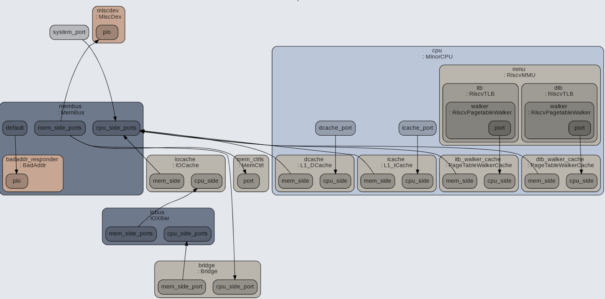

# 单核双发射5级流水CPU的IPC性能分析

## 分析结论

单核双发射5级流水的CPU， 跑随机指令的IPC 大约为0.06

## CPU模型说明

Cpu模型采用gem5中的minorCPU, RISCV64架构。这是一个顺序五级流水的双发射CPU。
整个仿真系统主要由CPU，Icache, Dcache, itlb, dtlb, membus, memctrls, DDR3 构成。

重点参数如下：

- L1 Dcache : 256KB缓存，8路组相联，cache line 64字节
- BPU： 静态非token分支预测器
- FU: IntFU x 2, IntMulFU x 1, IntDivFU x 1, FloatSimdFU x 1, PredFU x 1, MemFU x 1

## 测试case说明

根据RandomX算法的说明, 参考RandomX specs文档，有如下统计

指令类型 | 条数占比 | 比例
---|---|---
Integer instructions | 120/256 | 46%
Floating point instructions | 92/256 | 36%
Control instructions | 26/256 | 10%
Store instruction | 16/256 | 6%

测试case使用随机指令生成器根据XMR特性进行生成。配置随机指令发生器，使其产生的case中各种指令的比重接近于RandomX 的各种指令占比。
测试case中的指令有如下特点：

- 访存物理地址范围大小为4MB
- 指令类型所占比例与RandomX差距不大，但细分类型有出入（从详细统计中能够看出）

## 测试结果

根据gem5的统计，**指令共计1873条,花费29392个cycle**, case中各种指令比例如下：

统计类 | 统计值 | 比例
---|---|---
Integer | 840 | 44.84%
Floating | 611 | 32.62%
control | 215 | 11.48%
memory | 204  | 10.89%

如下为详细统计：

具体类型 | 条数 | 比例
---|---|---
system.cpu.numCycles              |              29392 | |
system.cpu.numInsts               |               1873 | |
system.cpu.numOps                 |               1873 | |
system.cpu.numDiscardedOps        |                231 | |
system.cpu.numFetchSuspends       |                  0 | |
system.cpu.cpi                    |          15.692472 | |
system.cpu.ipc                    |           0.063725 | |
system.cpu.committedInstType_0::No_OpClass   |         3  |    0.16%  
system.cpu.committedInstType_0::IntAlu   |        1055|     56.33%
system.cpu.committedInstType_0::IntMult   |          0 |     0.00%
system.cpu.committedInstType_0::IntDiv   |           0|      0.00%
system.cpu.committedInstType_0::FloatAdd   |       108  |    5.77%
system.cpu.committedInstType_0::FloatCmp   |       128  |    6.83%
system.cpu.committedInstType_0::FloatCvt   |         0  |    0.00%
system.cpu.committedInstType_0::FloatMult   |        49  |    2.62%  
system.cpu.committedInstType_0::FloatMultAcc   |       225  |   12.01%  
system.cpu.committedInstType_0::FloatDiv   |        52  |    2.78%  
system.cpu.committedInstType_0::FloatMisc   |         0  |    0.00%
system.cpu.committedInstType_0::FloatSqrt   |        49  |    2.62%
system.cpu.committedInstType_0::SimdAdd   |          0 |     0.00%  
system.cpu.committedInstType_0::SimdAddAcc   |         0  |    0.00%
system.cpu.committedInstType_0::SimdAlu   |          0 |     0.00%  
system.cpu.committedInstType_0::SimdCmp   |          0 |     0.00%  
system.cpu.committedInstType_0::SimdCvt   |          0 |     0.00%  
system.cpu.committedInstType_0::SimdMisc   |         0  |    0.00%  
system.cpu.committedInstType_0::SimdMult   |         0  |    0.00%  
system.cpu.committedInstType_0::SimdMultAcc   |         0  |    0.00%  
system.cpu.committedInstType_0::SimdShift   |         0  |    0.00%
system.cpu.committedInstType_0::SimdShiftAcc   |         0  |    0.00%  
system.cpu.committedInstType_0::SimdDiv   |          0 |     0.00%
system.cpu.committedInstType_0::SimdSqrt   |         0  |    0.00%
system.cpu.committedInstType_0::SimdFloatAdd   |         0  |    0.00%  
system.cpu.committedInstType_0::SimdFloatAlu   |         0  |    0.00%  
system.cpu.committedInstType_0::SimdFloatCmp   |         0  |    0.00%  
system.cpu.committedInstType_0::SimdFloatCvt   |         0  |    0.00%  
system.cpu.committedInstType_0::SimdFloatDiv   |         0  |    0.00%  
system.cpu.committedInstType_0::SimdFloatMisc   |         0  |    0.00%  
system.cpu.committedInstType_0::SimdFloatMult   |         0  |    0.00%  
system.cpu.committedInstType_0::SimdFloatMultAcc   |         0  |    0.00%  
system.cpu.committedInstType_0::SimdFloatSqrt   |         0  |    0.00%  
system.cpu.committedInstType_0::SimdReduceAdd   |         0  |    0.00%  
system.cpu.committedInstType_0::SimdReduceAlu   |         0  |    0.00%  
system.cpu.committedInstType_0::SimdReduceCmp   |         0  |    0.00%  
system.cpu.committedInstType_0::SimdFloatReduceAdd   |         0  |    0.00%
system.cpu.committedInstType_0::SimdFloatReduceCmp   |         0  |    0.00%
system.cpu.committedInstType_0::SimdAes   |          0 |     0.00%
system.cpu.committedInstType_0::SimdAesMix   |         0  |    0.00%
system.cpu.committedInstType_0::SimdSha1Hash   |         0  |    0.00%  
system.cpu.committedInstType_0::SimdSha1Hash2   |         0  |    0.00%  
system.cpu.committedInstType_0::SimdSha256Hash   |         0  |    0.00%  
system.cpu.committedInstType_0::SimdSha256Hash2   |         0  |    0.00%  
system.cpu.committedInstType_0::SimdShaSigma2   |         0  |    0.00%  
system.cpu.committedInstType_0::SimdShaSigma3   |         0  |    0.00%  
system.cpu.committedInstType_0::SimdPredAlu   |         0  |    0.00%  
system.cpu.committedInstType_0::MemRead   |        165 |     8.81%
system.cpu.committedInstType_0::MemWrite   |        39  |    2.08%
system.cpu.committedInstType_0::FloatMemRead   |         0  |    0.00%  
system.cpu.committedInstType_0::FloatMemWrite   |         0  |    0.00%  
