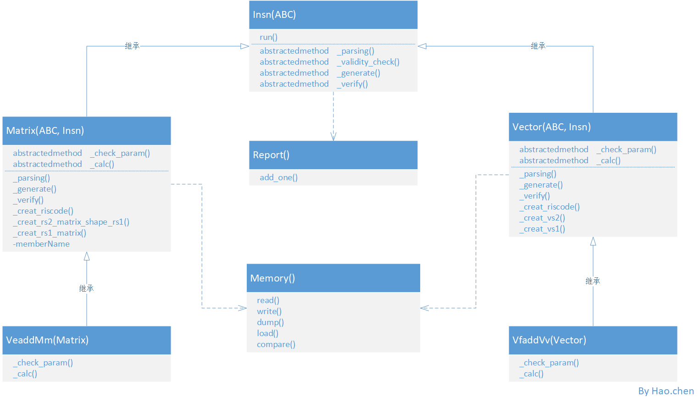

# pytest测试框架

正式大量使用python已经两年多了，之前也听说过pytest框架，但一直没有时间具体看怎么使用。最近在看公司目前有的测试框架的时候，
发现它已经繁琐到不忍心去添加测试case,一想到添加case这件事就头疼。所以决心看一下pytest的用法，构思如果现在让我来设计一个测试框架，
我会如何设计。

在讲现在我如何设计之前，我先讲一下之前(不熟悉pytest)我如何设计，这个设计是一个已经有实际应用的设计，但处于一些不可描述的原因，被废弃，实际上我一直认为它要比我们现在使用的这套好的多。

测试工具是围绕指令集测试展开。我就想，可以用python来产生指令需要的输入与输出数据，然后通过一些封装继承手段来缩减增加一个指令的工作量，同时可以将一些测试条件做成配置文件，于是有了如下设计

## NCbet(Neural Core bugs eliminate tools)

This is an auto test tools for Neural Core. Aims to eliminate Neural core's bugs.

Features:

- Auto collect insns from './insns/' directory and auto new insns object
- Support config file type of '.json' or '.xls'
- Auto combine configs of cases that splited by ','
- Report file can be used as config file directly
- Support output file type of '.dat' and '.bin'
- Auto creat riscv code file according to 'func' in config
- a global color log support, and default level is debug
- Flexible and scalable, easy to expend
- Support force acu to all Insn

### Class Diagram

As a quick start reference, you can read class_diagram.png



### How To Add Instruction

You must add instruction under 'insns' directory.
File name and class name must follow the naming rules.

#### Example

```json
    config file : {"func": "xxxx.mm (rd),(rs1),(rs2)", "rs1": "0x20000", ......}
    insn file   : xxxx.mm.py
    class name  : XxxxxXx
```

### How To Add Config File

There support two kind of config file, .json and .xls (.json same with .xls).
Both json files and xls files have common rules.

#### Rules

- each config must has a field named "func", this contains instruction name and parameter descriptions.For example, you can find string "veadd.mm (rd),(rs1),(rs2)" in Neural Core ISA Specification, and you just need copy 'vfadd.vv vd, vs2, vs1, vm' to fill field named "func" directly.
- When combine config, ncbet will replace ',' to ' ' with string in field "func", so just copy ISA descriptions from Neural Core ISA Specification.
- if you want to enable the combline function, you should split every optional parameter by ','. example "rd":"0x20000,0x20002,0x20004"
- each field in config must be a string. field like "rs1": 0x20000 is invalid, this should be "rs1": "0x20000"

#### Json config file

file must contain a json list, otherwise, an exception will be thrown.

example:

```json
[
    {
        "func": "xxxx.vv vd,vs2,vs1,vm",
        "vd_or_rd": "0x0",
        "vs2": "0x20",
        "vs1_or_rs1": "0x40",
        "vm": "0",
        "v0": "0x60",
        "vl": "10",
        "vsew": "1",
        "vstart": "0"
    }
]
```

#### Xls config file

the first row of xls file must be title, and each config must in one row.

example:

func | rs1 | rs2
--|--|--
xxxx.mm (rd),(rs1),(rs2) | 0x20000 | 0x20100
xxxx.mv (rd),(rs1),(rs2),dim0 | 0x20000,0x20002 | 0x40000

### How to run

you can read the code in run.py to get the available command line arguments, you can run like this:

```shell
    ./run.py -e spike -c veadd.json
```

report file support run as config file, so you can run like this

```shell
    ./run.py -e spike -c output/reports/fail/report0.xls
```

Warning: you must run a config file that all cases have same type

### About Docker image

I hope anyone gets this can do test directly, and no need to waste time building in the environment,
so, a docker image is effect.
