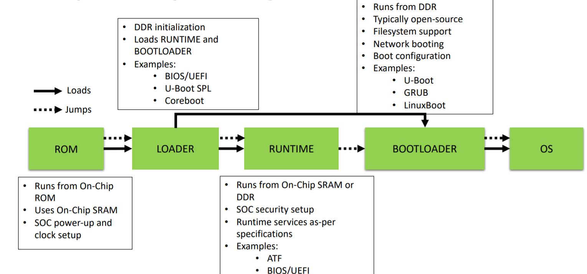
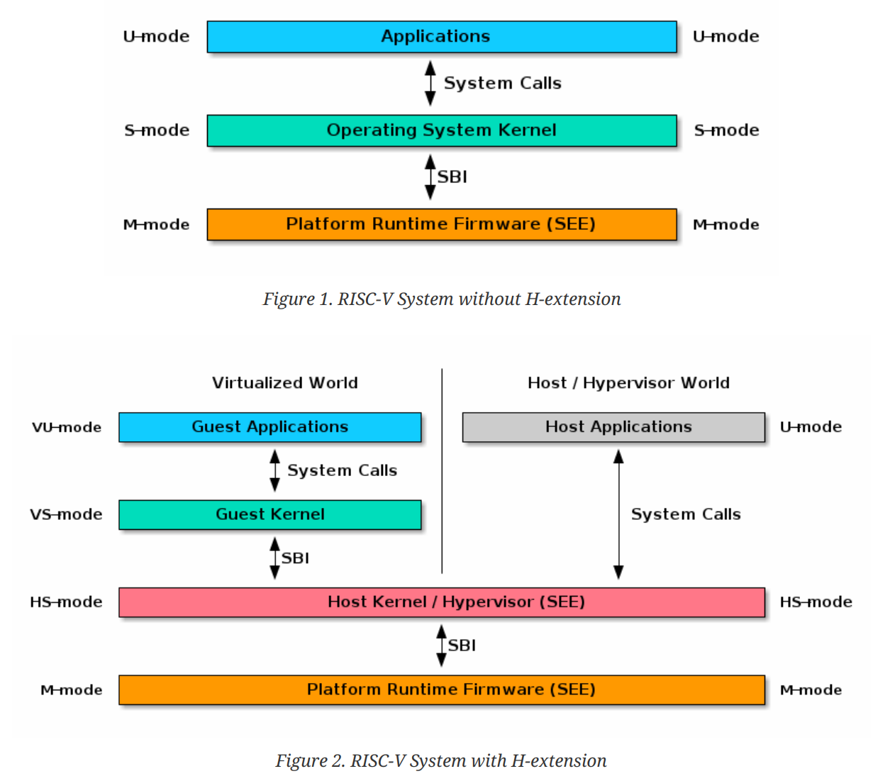

# OpenSBI

首先应该了解RISCV的SBI，然后再深入了解它的实现之一OpenSBI

## what is OpenSBI

OpenSBI是开源的，是RISC-V [Supervisor Binary Interface](https://github.com/riscv-non-isa/riscv-sbi-doc) 参考实现。也就是说，它是一个运行在更高特权等级，用来初始化硬件，并且允许操作系统等低特权等级软件调用它来实现设备重启或CPU核管理等操作的固件。它有点儿像ARM体系中的ATF(Arm Trusted Firmware),甚至像pc领域的BIOS/UEFI。

我们先看下图所示的多级启动模型,CPU上电执行ROM中的代码，ROM加载SPL到内部SRAM，SPL加载RUNTIME，RUNTIME再加载BOOTLOADER，最后由BOOTLOADER加载OS



## SBI

> The SBI allows supervisor-mode (S-mode or VS-mode) software to be portable across all RISC-V
> implementations by defining an abstraction for platform (or hypervisor) specific functionality.



对于非虚拟化的系统，用户空间代码运行在U-Mode，内核运行在S-Mode，SBI运行在M-Mode。他们都使用system call来实现调用。[^1]

### why it's needed

那么想当然的来看，这个不应该是U-boot或者linux系统该做的事情吗？为什么还要抽象一个sbi出来？它的实际意义到底有多大？
我们来看一下linux内核5.13.0中的代码

```c
struct sbiret sbi_ecall(int ext, int fid, unsigned long arg0,
   unsigned long arg1, unsigned long arg2,
   unsigned long arg3, unsigned long arg4,
   unsigned long arg5)
{
 struct sbiret ret;

 register uintptr_t a0 asm ("a0") = (uintptr_t)(arg0);
 register uintptr_t a1 asm ("a1") = (uintptr_t)(arg1);
 register uintptr_t a2 asm ("a2") = (uintptr_t)(arg2);
 register uintptr_t a3 asm ("a3") = (uintptr_t)(arg3);
 register uintptr_t a4 asm ("a4") = (uintptr_t)(arg4);
 register uintptr_t a5 asm ("a5") = (uintptr_t)(arg5);
 register uintptr_t a6 asm ("a6") = (uintptr_t)(fid);
 register uintptr_t a7 asm ("a7") = (uintptr_t)(ext);
 asm volatile ("ecall"
        : "+r" (a0), "+r" (a1)
        : "r" (a2), "r" (a3), "r" (a4), "r" (a5), "r" (a6), "r" (a7)
        : "memory");
 ret.error = a0;
 ret.value = a1;

 return ret;
}
EXPORT_SYMBOL(sbi_ecall);
```

上述代码是内核中的sbi_ecall的实现，显然，这个ecall会使CPU陷入M-Mode。结合官方SBI的spec以及内核代码，我们可以看到，
SBI使用a7来传递SBI扩展ID(EID)，使用a6来传递SBI function ID(FID)。我们可以理解为EID是模块ID，每个模块下面有很多Function,通过FID来指定。
同时，使用a0, a1来返回错误码， ret.error 和 ret.value就是他们的值。

下面列出这些EID

```c
#ifdef CONFIG_RISCV_SBI
enum sbi_ext_id {
#ifdef CONFIG_RISCV_SBI_V01
 SBI_EXT_0_1_SET_TIMER = 0x0,
 SBI_EXT_0_1_CONSOLE_PUTCHAR = 0x1,
 SBI_EXT_0_1_CONSOLE_GETCHAR = 0x2,
 SBI_EXT_0_1_CLEAR_IPI = 0x3,
 SBI_EXT_0_1_SEND_IPI = 0x4,
 SBI_EXT_0_1_REMOTE_FENCE_I = 0x5,
 SBI_EXT_0_1_REMOTE_SFENCE_VMA = 0x6,
 SBI_EXT_0_1_REMOTE_SFENCE_VMA_ASID = 0x7,
 SBI_EXT_0_1_SHUTDOWN = 0x8,
 #endif
 SBI_EXT_BASE = 0x10,
 SBI_EXT_TIME = 0x54494D45,
 SBI_EXT_IPI = 0x735049,
 SBI_EXT_RFENCE = 0x52464E43,
 SBI_EXT_HSM = 0x48534D,
};
```

比如SBI_EXT_BASE这个基础模块中，有如下Function

```c
enum sbi_ext_base_fid {
 SBI_EXT_BASE_GET_SPEC_VERSION = 0,
 SBI_EXT_BASE_GET_IMP_ID,
 SBI_EXT_BASE_GET_IMP_VERSION,
 SBI_EXT_BASE_PROBE_EXT,
 SBI_EXT_BASE_GET_MVENDORID,
 SBI_EXT_BASE_GET_MARCHID,
 SBI_EXT_BASE_GET_MIMPID,
};
```

上述定义的内核支持的sbi_ecall, 他们会像下面这样进行封装

```c
void sbi_console_putchar(int ch)
{
 sbi_ecall(SBI_EXT_0_1_CONSOLE_PUTCHAR, 0, ch, 0, 0, 0, 0, 0);
}
EXPORT_SYMBOL(sbi_console_putchar);
```

这样一来，内核不再需要关心这些底层的实现，这些底层实现每一个CPU都可能不一样，通过增加这一层，内核的可移植性便得到了提高

OpenSBI扮演着SEE(Supervisor Execution Environment)的角色，它向低特权等级的软件提供SBI服务。

## OpenSBI的实现

> The goal of the OpenSBI project is to provide an open-source reference implementation of the RISC-V SBI specifications for platform-specific firmwares executing in M-mode (case 1 mentioned above). An OpenSBI implementation can be easily extended by RISC-V platform and system-on-chip vendors to fit a particular hardware configuration.

### 假如我们设计OpenSBI

在了解了what is SBI and why it's needed之后，假如我们去设计OpenSBI，我们大致会怎么做？


## 参考资料

[https://www.thegoodpenguin.co.uk/blog/an-overview-of-opensbi/]

[^1]: 官方SBI的spec文档的前两章对SBI做了比较详细的说明，剩下的几章为每一个接口的说明，可以粗略通读，然后作为工具书使用。
