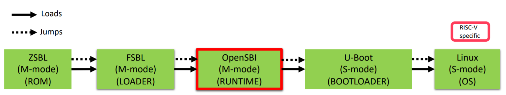

# OpenSBI

[TOC]

本文先介绍什么是OpenSBI, 再详解SBI的工作机制，最后对OpenSBI的代码框架进行分析。

## what is OpenSBI

OpenSBI是开源的RISC-V [Supervisor Binary Interface](https://github.com/riscv-non-isa/riscv-sbi-doc) 软件参考实现。它是一个运行在更高特权等级，用来初始化硬件，并且允许操作系统等低特权等级软件调用它来实现设备重启或CPU核管理等操作的固件。

下图展示了一般的多级启动模型。CPU上电执行ROM中的代码，ROM加载SPL到内部SRAM，SPL加载RUNTIME，RUNTIME再加载BOOTLOADER，最后由BOOTLOADER加载OS


下图展示了RISCV的多级启动模型。只是中间的RUNTIME变成了OpenSBI。



总结来看，它有点儿像ARM体系中的ATF(Arm Trusted Firmware),甚至像pc领域的BIOS/UEFI。

## SBI

> The SBI allows supervisor-mode (S-mode or VS-mode) software to be portable across all RISC-V implementations by defining an abstraction for platform (or hypervisor) specific functionality.

SBI能够提高S-mode软件的可移植性。

### 工作机制


对于非虚拟化的系统，用户空间代码运行在U-Mode，内核运行在S-Mode，SBI运行在M-Mode。他们都使用system call来实现调用[^1]。他们之间是怎样实现层层调用的呢？

RISCV架构中有如下规定：

>By default, all traps at any privilege level are handled in machine mode, though a machine-mode handler can redirect traps back to the appropriate level with the MRET instruction (Section 3.3.2). To increase performance, implementations can provide individual read/write bits within medeleg and mideleg to indicate that certain exceptions and interrupts should be processed directly by a lower privilege level. The machine exception delegation register (medeleg) and machine interrupt delegation register (mideleg) are MXLEN-bit read/write registers.

也就是说，默认情况下，无论CPU当前处于哪种特权等级，发生的异常都会进入到machine mode，即跳转到mtvec寄存器所指向的异常处理函数中。但是为了提高性能，在CPU实现过程中可以提供medeleg和mideleg寄存器来把特定的异常和中断重定向到低特权等级。当在这两个寄存器设置了委托，特定的异常和中断就会直接通过低特权等级的tvec进入特定等级的异常处理函数。

内核正是通过这一点来实现工作在S态，并提供系统调用，用户App才能够通过ECALL指令直接陷入到内核，走内核的异常处理，而不是跳到SBI中。

OpenSBI中lib/sbi/sbi_hart.c的代码说明了这一点,CAUSE_USER_ECALL(用户态的系统调用)，以及PAGE_FAULT(必然也要有缺页异常以创建新的页表)都会被委托给S-mode。

```c
static int delegate_traps(struct sbi_scratch *scratch, u32 hartid)
{
 const struct sbi_platform *plat = sbi_platform_ptr(scratch);
 unsigned long interrupts, exceptions;

 if (!misa_extension('S'))
  /* No delegation possible as mideleg does not exist */
  return 0;

 /* Send M-mode interrupts and most exceptions to S-mode */
 interrupts = MIP_SSIP | MIP_STIP | MIP_SEIP;
 exceptions = (1U << CAUSE_MISALIGNED_FETCH) | (1U << CAUSE_BREAKPOINT) |
       (1U << CAUSE_USER_ECALL);
 if (sbi_platform_has_mfaults_delegation(plat))
  exceptions |= (1U << CAUSE_FETCH_PAGE_FAULT) |
         (1U << CAUSE_LOAD_PAGE_FAULT) |
         (1U << CAUSE_STORE_PAGE_FAULT);

 /*
  * If hypervisor extension available then we only handle hypervisor
  * calls (i.e. ecalls from HS-mode) in M-mode.
  *
  * The HS-mode will additionally handle supervisor calls (i.e. ecalls
  * from VS-mode), Guest page faults and Virtual interrupts.
  */
 if (misa_extension('H')) {
  exceptions |= (1U << CAUSE_SUPERVISOR_ECALL);
  exceptions |= (1U << CAUSE_FETCH_GUEST_PAGE_FAULT);
  exceptions |= (1U << CAUSE_LOAD_GUEST_PAGE_FAULT);
  exceptions |= (1U << CAUSE_VIRTUAL_INST_FAULT);
  exceptions |= (1U << CAUSE_STORE_GUEST_PAGE_FAULT);
 }

 csr_write(CSR_MIDELEG, interrupts);
 csr_write(CSR_MEDELEG, exceptions);

 return 0;
}
```

在内核代码arch/riscv/kernel/entry.S中的异常处理函数中也能够看到对系统调用的处理，EXC_SYSCALL即为CAUSE_USER_ECALL， pagefault的处理被放在了excp_vect_table中

```c
1:
 la ra, ret_from_exception
 /* Handle syscalls */
 li t0, EXC_SYSCALL
 beq s4, t0, handle_syscall

 /* Handle other exceptions */
 slli t0, s4, RISCV_LGPTR
 la t1, excp_vect_table
 la t2, excp_vect_table_end
 move a0, sp /* pt_regs */
 add t0, t1, t0
 /* Check if exception code lies within bounds */
 bgeu t0, t2, 1f
 REG_L t0, 0(t0)
 jr t0
```

通过上面的描述，就理清楚了当内核工作在S模式，用户App为什么通过ECALL能够直接陷入到内核中进行系统调用的处理。

在内核中，可以通过SBI接口来享受SBI服务。内核中的sbi_ecall也是通过ECALL实现的。
SBI使用a7来传递SBI扩展ID(EID)，使用a6来传递SBI function ID(FID)。我们可以理解为EID是模块ID，每个模块下面有很多Function,通过FID来指定。
同时，使用a0, a1来返回错误码， ret.error 和 ret.value就是他们的值。

```c
struct sbiret sbi_ecall(int ext, int fid, unsigned long arg0,
   unsigned long arg1, unsigned long arg2,
   unsigned long arg3, unsigned long arg4,
   unsigned long arg5)
{
 struct sbiret ret;

 register uintptr_t a0 asm ("a0") = (uintptr_t)(arg0);
 register uintptr_t a1 asm ("a1") = (uintptr_t)(arg1);
 register uintptr_t a2 asm ("a2") = (uintptr_t)(arg2);
 register uintptr_t a3 asm ("a3") = (uintptr_t)(arg3);
 register uintptr_t a4 asm ("a4") = (uintptr_t)(arg4);
 register uintptr_t a5 asm ("a5") = (uintptr_t)(arg5);
 register uintptr_t a6 asm ("a6") = (uintptr_t)(fid);
 register uintptr_t a7 asm ("a7") = (uintptr_t)(ext);
 asm volatile ("ecall"
        : "+r" (a0), "+r" (a1)
        : "r" (a2), "r" (a3), "r" (a4), "r" (a5), "r" (a6), "r" (a7)
        : "memory");
 ret.error = a0;
 ret.value = a1;

 return ret;
}
EXPORT_SYMBOL(sbi_ecall);
```

下面列出这些EID

```c
#ifdef CONFIG_RISCV_SBI
enum sbi_ext_id {
#ifdef CONFIG_RISCV_SBI_V01
 SBI_EXT_0_1_SET_TIMER = 0x0,
 SBI_EXT_0_1_CONSOLE_PUTCHAR = 0x1,
 SBI_EXT_0_1_CONSOLE_GETCHAR = 0x2,
 SBI_EXT_0_1_CLEAR_IPI = 0x3,
 SBI_EXT_0_1_SEND_IPI = 0x4,
 SBI_EXT_0_1_REMOTE_FENCE_I = 0x5,
 SBI_EXT_0_1_REMOTE_SFENCE_VMA = 0x6,
 SBI_EXT_0_1_REMOTE_SFENCE_VMA_ASID = 0x7,
 SBI_EXT_0_1_SHUTDOWN = 0x8,
 #endif
 SBI_EXT_BASE = 0x10,
 SBI_EXT_TIME = 0x54494D45,
 SBI_EXT_IPI = 0x735049,
 SBI_EXT_RFENCE = 0x52464E43,
 SBI_EXT_HSM = 0x48534D,
};
```

比如SBI_EXT_BASE这个基础模块中，有如下Function

```c
enum sbi_ext_base_fid {
 SBI_EXT_BASE_GET_SPEC_VERSION = 0,
 SBI_EXT_BASE_GET_IMP_ID,
 SBI_EXT_BASE_GET_IMP_VERSION,
 SBI_EXT_BASE_PROBE_EXT,
 SBI_EXT_BASE_GET_MVENDORID,
 SBI_EXT_BASE_GET_MARCHID,
 SBI_EXT_BASE_GET_MIMPID,
};
```

上述定义的内核支持的sbi_ecall, 他们会像下面这样进行封装

```c
void sbi_console_putchar(int ch)
{
 sbi_ecall(SBI_EXT_0_1_CONSOLE_PUTCHAR, 0, ch, 0, 0, 0, 0, 0);
}
EXPORT_SYMBOL(sbi_console_putchar);
```

虽然都是ECALL，但是这个ECALL是从S-mode发出，会触发CAUSE_SUPERVISOR_ECALL，这会使CPU陷入M-mode,进入到SBI设置的异常处理函数中。便可以执行SBI中的代码。
OpenSBI的firmware/fw_base.S中实现了异常处理，其中通过如下代码进入sbi_trap_handler

```asm
  call sbi_trap_handler
```

在lib/sbi/sbi_trap.c的sbi_trap_handler中又通过确认CAUSE_SUPERVISOR_ECALL而进入sbi_ecall_handler

```c
void sbi_trap_handler(struct sbi_trap_regs *regs)
{
  ulong mcause = csr_read(CSR_MCAUSE);
  switch (mcause) {
  case CAUSE_SUPERVISOR_ECALL:
  case CAUSE_HYPERVISOR_ECALL:
    rc  = sbi_ecall_handler(regs);
    msg = "ecall handler failed";
    break;
  }
}
```

具体的协议在lib/sbi/sbi_ecall.c的sbi_ecall_handler中实现

```c
int sbi_ecall_handler(struct sbi_trap_regs *regs)
{
 int ret = 0;
 struct sbi_ecall_extension *ext;
 unsigned long extension_id = regs->a7;
 unsigned long func_id = regs->a6;
 struct sbi_trap_info trap = {0};
 unsigned long out_val = 0;
 bool is_0_1_spec = 0;
 unsigned long args[6];

 args[0] = regs->a0;
 args[1] = regs->a1;
 args[2] = regs->a2;
 args[3] = regs->a3;
 args[4] = regs->a4;
 args[5] = regs->a5;

 ext = sbi_ecall_find_extension(extension_id);
 if (ext && ext->handle) {
  ret = ext->handle(extension_id, func_id,
      args, &out_val, &trap);
  if (extension_id >= SBI_EXT_0_1_SET_TIMER &&
      extension_id <= SBI_EXT_0_1_SHUTDOWN)
   is_0_1_spec = 1;
 } else {
  ret = SBI_ENOTSUPP;
 }

 return 0;
}
```

如上就是整个SBI的工作机制。

### why it's needed

通过上述的分析，已经对SBI有了深入的了解。总结来看，因为又SBI的存在，内核不再需要关心SBI中涉及的这些底层的实现，只需要实现一套接口即可。
假如没有SBI,那么每一个厂家的CPU都需要在内核中对这些底层接口做不同的实现，显然，没有一个统一的厂商类型获取途径能够让内核来判断当前的设备应该匹配哪一套底层实现，这便只能要求我们编译不同的内核版本以匹配不同的CPU。这无疑会使得内核版本混乱，其实是让内核关心了它本不应该关心的东西。通过增加这一层，内核的可移植性便得到了提高。另一方面，从安全性上来讲，这种方式更加安全。

## OpenSBI的实现

> The goal of the OpenSBI project is to provide an open-source reference implementation of the RISC-V SBI specifications for platform-specific firmwares executing in M-mode (case 1 mentioned above). An OpenSBI implementation can be easily extended by RISC-V platform and system-on-chip vendors to fit a particular hardware configuration.

### 假如我们设计OpenSBI

在了解了what is SBI and why it's needed之后，我们再去分析一下OpenSBI是如何做到它描述中所讲的可扩展和定制性。这涉及到软件设计思想。在分析OpenSBI代码之前，思考一个问题，假如我们去设计OpenSBI，我们大致会怎么做？

大致罗列如下几点：

- 软件至少应该包含启动代码，接口管理主体，加载并执行下一级软件等功能
- 为了能够支持不同厂商，必然要为厂商们创建一个目录，专门存放他们定制的内容
- 为了能够让每一个厂商都比较容易的添加自己特有的实现，SBI中规定的每一个接口都应该有一个默认实现，并且每个厂商都能够重写这个实现。
- 应该能够有机制来识别厂商是否支持某接口
- Makefile应该要灵活可扩展，应该尽可能的不需要厂商修改Makefile主体

把上述几点实现，猜想应该大致能够实现一个满足扩展性和定制化的SBI框架。接下来就实际看一下OpenSBI的实现，他们的高明之处又在哪里。

### 实现


## 参考资料

[https://www.thegoodpenguin.co.uk/blog/an-overview-of-opensbi/]

[^1]: 官方SBI的spec文档的前两章对SBI做了比较详细的说明，剩下的几章为每一个接口的说明，可以粗略通读，然后作为工具书使用。
