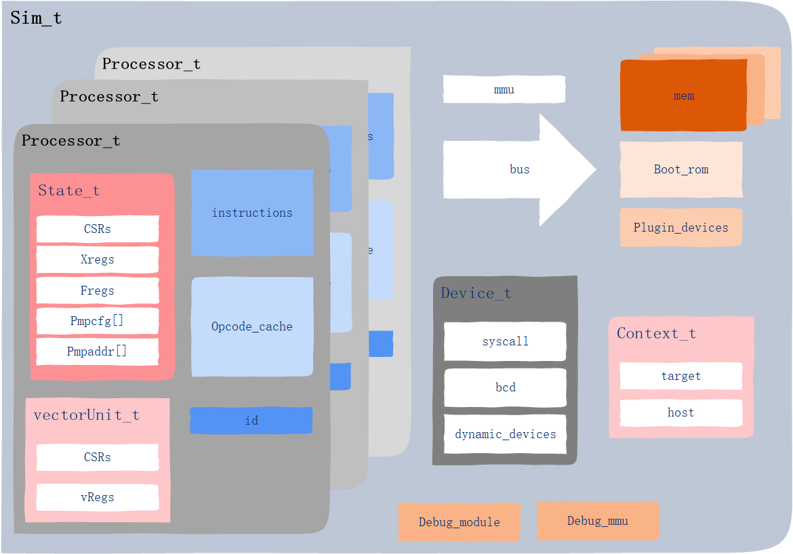

# 从spike分析一款模拟器的设计与实现

## 前言

目前在做RISCV模拟器的开发，其中功能（行为级）模拟器基于spike进行修改。在看spike代码的时候，发现有些部分的实现比我想象的要复杂，应该是我少考虑了很多情况。那么由此我产生了一个疑问，要做一款功能型的SOC模拟器，到底要考虑那些方面？或者说，让我从零到一去做一款功能型模拟器，应该怎么去做？

凭自我的感觉，从需求和设计出发，大致想到如下几点：

- 如何组织SOC各个模块的运行，最简单直接的应该就是处理器按照时钟运行，其他绝大多数单元都被动的接受处理器的访问即可。
- 如何组织指令集及译码，即找到一个比较简单的从指令码到指令实现的管理方式，并且指令集管理应该具有比较好的扩展性。
- 如何组织寄存器
- 如何管理地址，是否需要MMU及总线的抽象，如何使处理器发出的虚拟地址能够正确高效的访问到目的设备
- 应该有一定的调试功能，能够显示指令流，甚至单步调试，查看一些寄存器状态
- 怎样实现printf打印，这会对目标代码的调试非常有帮助
- 怎样让模拟器停下来

上面这些是假如我去做一款模拟器我会想到的，那么spike是怎样实现的呢？它的设计者是否也考虑过我的这些问题，他们又是如何处理的呢？下面就针对spike中的部分实现细节进行分析，并探讨上述问题。在分析时，主要会涉及两个问题，一是特定模块存在的意义，二是该模块是如何实现的。这就是这篇文章的目的。

## spike实现

spike版本为1.0.1-dev

### 目录结构

首先从目录结构来看spike大致实现了哪些东西

- disasm 从名称上来看是反汇编，实际内容是根据指令码组装反汇编字符串，应该是为了debug和显示指令流
- fdt 扁平设备树，猜测设备树是它用来实现SOC配置的方式，我很赞同这种方式，感觉比gem5的python方式要更好
- fesvr 这个命名不太好理解，是源于Frontend Server的缩写。它包含一些与riscv无关的构成模拟器的组件，SOC组件的一些基础抽象，以及模拟器的运行管理。它实现了一个模拟器的大框架。这样来看，它的命名似乎还挺合理。
- riscv 其中的insns目录中是riscv指令集的实现，剩下的是SOC的具体实现
- softfloat 浮点库，来自于IEEE Floating-Point Arithmetic Packag
- spike-main 模拟器程序入口

从目录结构上来看，结构比较简单，没有太多的分层，可以看出spike的目的并不是做一个功能性模拟器框架，而是完全针对riscv进行的设计。riscv目录是实现的核心，fesvr是模拟器基础，除此之外fdt可以作为一个单独的模块进行分析。它既然有fdt,那么它必然有模块化的设计，这些设计应该都是在riscv中实现的。

### sim构成

sim的核心是processor，processor中实现了对通用寄存器，指令集寄存器的管理，同时，将vector单元单独进行了管理。另外，也对指令进行了抽象和管理，它包含了整个指令处理的逻辑。
abstract_device_t 主要用来实现内存设备。而且这些内存设备的完全是被动响应的，需要cpu访问来带动。
bus_t 用来管理这些内存设备的地址。
device_t 用来实现一些用于交互的设备，用来处理一些tohost命令。
context 用来实现CPU和host两个用户线程的切换

### 实现细节

我曾尝试用一张图来概括spike的实现，或者说我习惯于大而全的思路。在绘制的过程中发现很难做到，不容易突出重点，也很难描述细致。这其实让我想到了另一个问题：当我们面对一个代码量比较大的工程的时候，如何更有效率的理清它的实现，这个打算单开一篇文章来总结。

接下来，我将按照功能和模块对spike的实现进行划分，分别阐述。

#### 总流程

当我们实现了整个模拟器的所有模块之后，我们仍然需要一小部分代码来触发模拟器的初始化，并让模拟器来运行。并且我们还需要做一些命令行参数处理等与模拟器业务逻辑无关但必要的工作。比如gem5是基于事件运行的，那么就要实现一个事件管理与调度机制。

spike将所有的业务逻辑封装在sim_t中，并提供了run接口，在解析完命令行参数和构造sim_t实例之后，就会调用run()接口让模拟器运行。

spike自己实现了一个名为option_parser_t的命令行解析器，它要比C库中的灵活一些，这里不再单独展开。

spike运行的主体是host与target这两个用户线程。target线程包含了CPU的运行，具体实现在processor_t的step()函数中。host线程包含了与用户的交互功能，主要是debug模式。

当CPU运行了INTERLEVEL个step之后，便会切换到host线程来响应tohost命令。当没有可执行的tohost命令时，便切换回target线程，继续执行指令。

接下来我们考虑这样实现的意义。假如让我去实现，我可能会实现成一个线程，大循环，每一个step都检查一下tohost命令，因为这样的实现最简单，工作量最小。spike采用的这种切换用户线程的方式，好处是能够大大减小轮询tohost命令的次数，看起来也更高级。或许因为采用了这种方式，模拟器运行效率会提高不少，但我也没有做具体的实验来比对性能。

总结一下，如果是前期开发，我觉得不必考虑这种细节，直接一个大循环搞定好了；后期做优，这是一种很值得参考的方式。

#### CPU运行流程

接下来就看一下，CPU是如何具体执行指令的，这是业务逻辑核心。

#### 内存访问

#### 指令管理
