# DDR and DRAMSim3

[TOC]

## 相关知识

### DSU

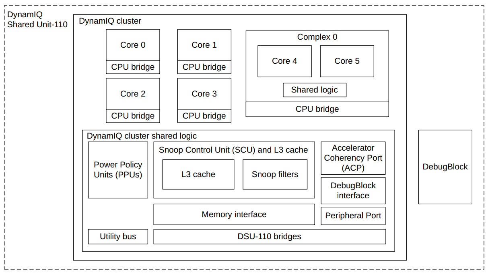

- A DSU-110 DynamIQ™ cluster consists of between one and 12 cores, with up to four different types of cores in the same cluster
- The DynamIQ Shared Unit (DSU) comprises the L3 memory system, control logic, and external interfaces to support a DynamIQ cluster
- Cores can be configured for various performance points during macrocell implementation and run at different frequencies and voltages
- supports complexes where typically two cores are linked together and share logic

### NI700

The CoreLink NI‑700 Network‑on‑Chip Interconnect is a highly configurable AMBA‑compliant systemlevel interconnect
NI‑700 supports the AMBA AXI5, ACE5‑Lite, AHB5, APB3, and APB4 protocols

### CI700

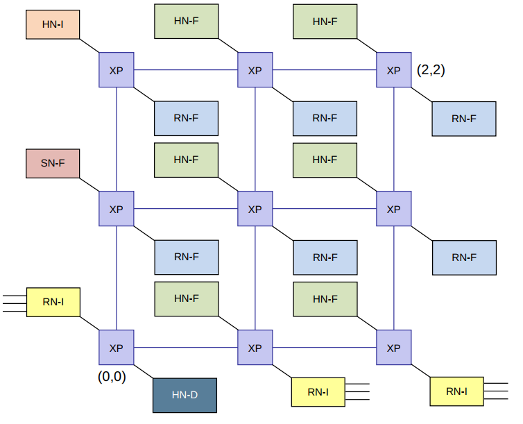

- AMBA® 5 CHI.E interconnect with a customizable mesh topology
- supports 1-8 processor compute clusters
- Custom interconnect size and device placement
- Optional System Level Cache (SLC)
- configurable up to a 12 crosspoint(XP) mesh

### AXI

The AMBA AXI protocol supports high-performance, high-frequency system designs for communication between Manager and Subordinate components

five channels:

- Channel handshake signals
- Write address channel
- Write data channel
- Write response channel
- Read address channel
- Read data channel

The AXI protocol requires the following relationships to be maintained:

- A write response must always follow the last write transfer in a write transaction.
- Read data must always follow the read address of the data.
- Channel handshakes must conform to the dependencies defined in Dependencies between channel handshake signals.
- The protocol does not define any other relationship between the channels

AXI has the following rules governing the use of bursts:

- For wrapping bursts, the burst length must be 2, 4, 8, or 16.
- A burst must not cross a 4KB address boundary.
- Early termination of bursts is not supported

AXI protocol provides response signaling for both read and write transactions:

- For read transactions, the response information from the Subordinate is signaled on the read
- For write transactions the response information is signaled on the write response channel

### ACE

AXI Coherency Extensions

### CHI

## DRAM结构

### storage Capacitor

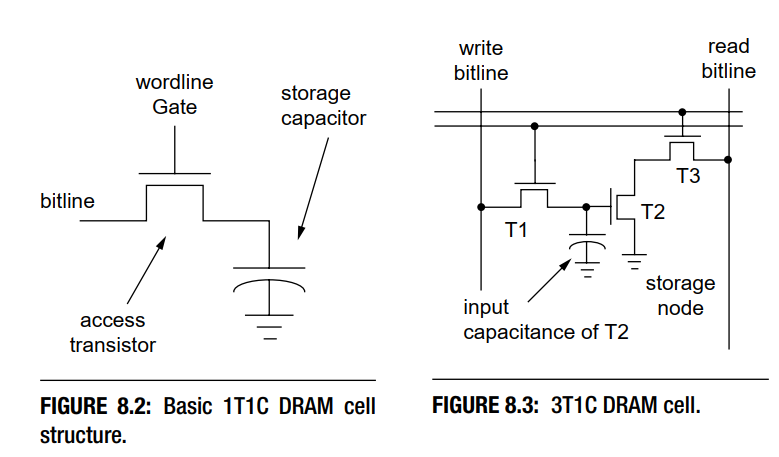

DRAM Storage Cell 使用 Storage Capacitor 来存储 Bit 信息。
figure8.3是3t1c的存储结构单元，它是比较早期的设计，有着独立的读写和存储晶体管，但很明显，它体积过大。
figure8.2是1t1c的最简单的存储结构单元，是比较现代的设计，由四部分组成：

- Storage Capacitor 存储电容，电容两端电压差的高和低，来表示逻辑上的 1 和 0。
- Access Transistor 通过导通和截止，决定了允许或禁止对 Storage Capacitor 所存储的信息的读取和改写。
- Wordline 决定了 Access Transistor 的导通或者截止。
- Bitline 外界访问 Storage Capacitor 的唯一通道

很明显，根据1T1C结构图能够自然想到，读数据时，Wordline置1，然后读取Bitline上的状态即可；写数据时，把要写入的电平状态设定到Bitline上，然后Wordline置1，电容就能充电了。但在具体实现上，会遇到以下的问题：

- 外界的逻辑电平与 Storage Capacitor 的电平不匹配。由于 Bitline 的电容值比 Storage Capacitor 要大的多（通常为 10 倍以上），当 Access Transistor 导通后，如果 Storage Capacitor 存储的信息为 1 时，Bitline 电压变化非常小。外界电路无法直接通过 Bitline 来读取 Storage Capacitor 所存储的信息。
- 进行一次读取操作后，Storage Capacitor 存储的电荷会变化。在进行一次读取操作的过程中，Access Transistor 导通后，由于 Bitline 和 Storage Capacitor 端的电压不一致，会导致 Storage Capacitor 中存储的电荷量被改变。最终可能会导致在下一次读取操作过程中，无法正确的判断 Storage Capacitor 内存储的信息。
- 由于 Capacitor 的物理特性，即使不进行读写操作，其所存储的电荷都会慢慢变少。这个特性要求 DRAM 在没有读写操作时，也要主动对 Storage Capacitor 进行电荷恢复的操作。

为解决上述的问题，DRAM 在设计上，引入了 Differential Sense Amplifier。

### 读取原理

通过读取原理，来介绍Differential Sense Amplifier.Differential Sense Amplifier 包含 Sensing Circuit 和 Voltage Equalization Circuit 两个主要部分。它主要的功能就是将 Storage Capacitor 存储的信息转换为逻辑 1 或者 0 所对应的电压，并且呈现到 Bitline 上。同时，在完成一次读取操作后，通过 Bitline 将 Storage Capacitor 中的电荷恢复到读取之前的状态。

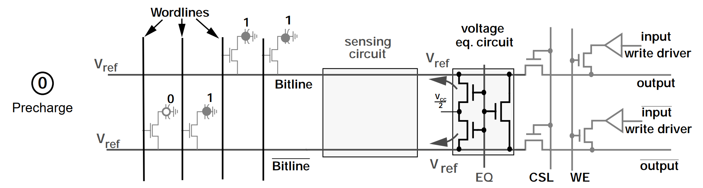
在这个阶段，首先会通过控制 EQ 信号，让 Te1、Te2、Te3 晶体管处于导通状态，将 Bitline 和 /Bitline 线上的电压稳定在 Vref 上, Vref = Vcc/2。然后进入到下一个阶段。

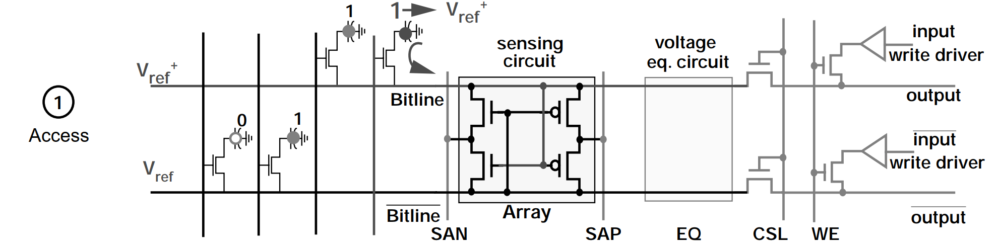
经过 Precharge 阶段， Bitline 和 /Bitline 线上的电压已经稳定在 Vref 上了，此时，通过控制 Wordline 信号，将 Ta 晶体管导通。Storage Capacitor 中存储正电荷会流向 Bitline，继而将 Bitline 的电压拉升到 Vref+。然后进入到下一个阶段。

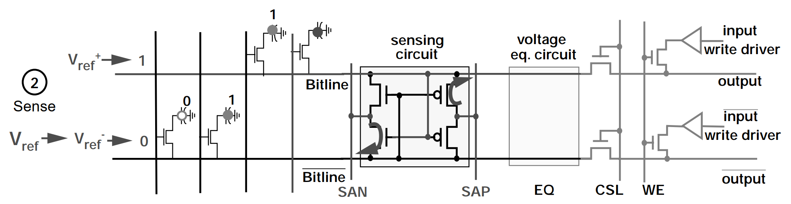
由于在 Access 阶段，Bitline 的电压被拉升到 Vref+，Tn2 会比 Tn1 更具导通性，Tp1 则会比 Tp2 更具导通性。
此时，SAN (Sense-Amplifier N-Fet Control) 会被设定为逻辑 0 的电压，SAP (Sense-Amplifier P-Fet Control) 则会被设定为逻辑 1 的电压，即 Vcc。由于 Tn2 会比 Tn1 更具导通性，/Bitline 上的电压会更快被 SAN 拉到逻辑 0 电压，同理，Bitline 上的电压也会更快被 SAP 拉到逻辑 1 电压。接着 Tp1 和 Tn2 进入导通状态，Tp2 和 Tn1 进入截止状态。
最后，Bitline 和 /Bitline 的电压都进入稳定状态，正确的呈现了 Storage Capacitor 所存储的信息 Bit。

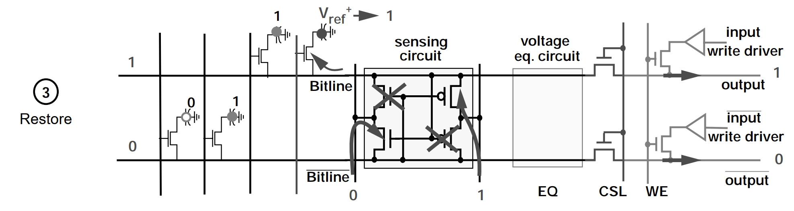
在完成 Sense 阶段的操作后，Bitline 线处于稳定的逻辑 1 电压 Vcc，此时 Bitline 会对 Storage Capacitor 进行充电。经过特定的时间后，Storage Capacitor 的电荷就可以恢复到读取操作前的状态。

最后，通过 CSL 信号，让 Tc1 和 Tc2 进入导通状态，外界就可以从 Bitline 上读取到具体的信息。

### 写入原理

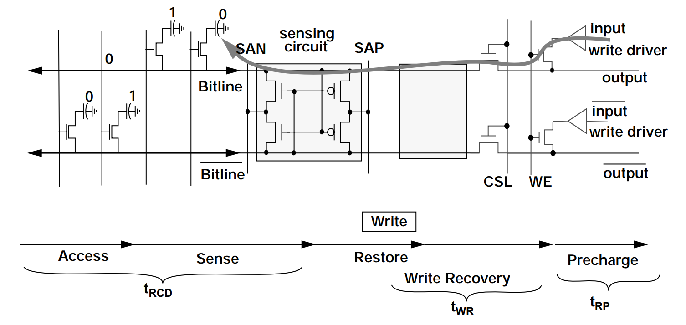
写操作的前期流程和读操作是一样的，执行 Precharge、Access、Sense 和 Restore 操作。差异在于，在 Restore 阶段后，还会进行 Write Recovery 操作。

在 Write Recovery 阶段时，通过控制 WE (Write Enable) 信号，让 Tw1 和 Tw2 进入导通状态。此时，Bitline 会被 input 拉到逻辑 0 电平，/Bitline 则会被 /input 拉到逻辑 1 电平。
经过特定的时间后，当 Storage Capacitor 的电荷被 Discharge 到 0 状态时，就可以通过控制 Wordline，将 Storage Capacitor 的 Access Transistor 截止，写入 0 的操作就完成了。

### 组织结构

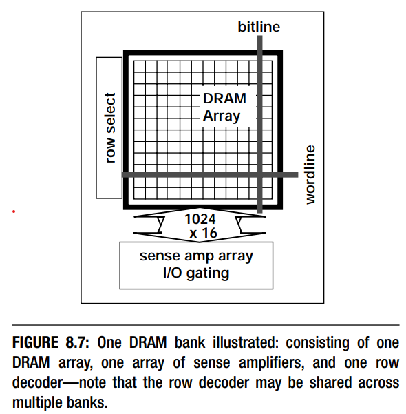
图8.7表示了一个bank的DRAM存储单元。行地址被送到行解码器，
cells where the row address is sent to a row decoder,
and the row decoder selects one row of cells. A row of
cells is formed from one or more wordlines that are
driven concurrently to activate one cell on each one
of thousands of bitlines. There may be hundreds of
cells connected to the same bitline, but only one cell
per bitline will share its stored charge with the bitline
at any given instance in time.

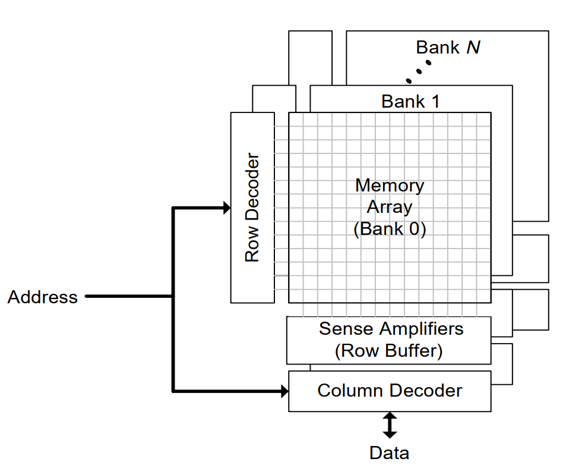

- Each bank operates independently of the other banks and contains an array of memory cells that are accessed an entire row at a time.
- When a row of this memory array is accessed (row activation) the entire row of the memory array is transferred into the bank’s row buffer.
- After completing the available column accesses, the cached row must be written back to the memory array by an explicit operation (bank precharge) which prepares the bank for a subsequent row activation.
- A bank cannot be accessed during the precharge/activate latency.
- A single cycle of high impedance is required on the data pins when switching between read and write column accesses.
- A single set of address lines is shared by all DRAM operations (bank precharge, row activation, and column access).

### 时序参数

DRAM访问协议(DRAM memory-access protocol)中抽象的将每一个命令的动作和每一个动作的时序要求区分开来。也就是说这种抽象使相同一组的DRAM命令交互能够应用到有不同的时序参数的不同DRAM内存系统中。通过将协议特定的时序参数进行抽象，可以在抽象层面描述DRAM命令。也就是说在分析时序参数的时候必须结合某一个抽象的命令

#### raw access cmd

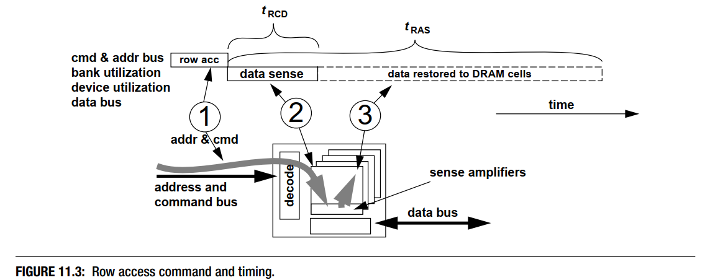
行访问命令也被称为行激活命令(row activation command).命令的目的是讲数据从DRAM arrays的单元中搬到感知放大器中，然后将数据restore回存储单元中。

tRCD是指行访问命令将DRAM存储单元中的数据移动到sense amplifiers中的过程的延迟

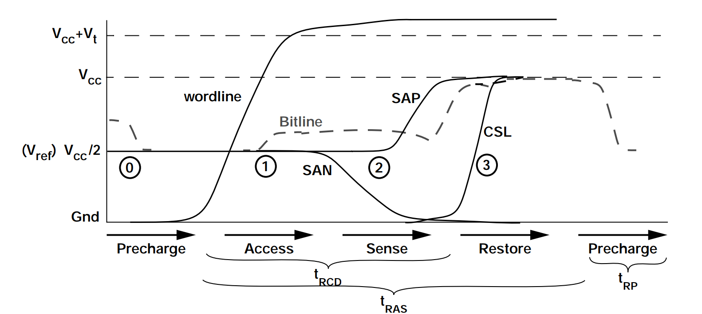

- tRP precharge
- tRCD access + sense
- tRAS access + sense + restore

- tWR write Recovery

AL = 0
Added Latency to column accesses, used in DDRx SDRAM devices for posted CAS
commands

tCCD_S = 4
tCCD_L = 6
Column-to-Column Delay. The minimum intra-device column-to-column command timing,
determined by internal prefetch length

tRRD_S = 8
tRRD_L = 8
Row activation to Row activation Delay. The minimum time interval between two row activation commands to the same DRAM device.

tRTP = 12
Read to Precharge. The time interval between a read and a precharge command. Can be
approximated by tCAS - tCMD

tWTR_S = 8
tWTR_L = 16
Write To Read delay time. The minimum time interval between the end of write data burst and the start of a column read command

tRFC = 392
tRFC2 = 268
tRFC4 = 172
Refresh Cycle Time. The time interval between Refresh and Activation commands. 

tCK = 0.83
CL = 17
CWL = 14
tREFI = 8660
tRPRE = 1
tWPRE = 1
tFAW = 32
tWR2 = 32
tCKE = 6
tCKESR = 7
tXS = 432
tXP = 6
tRTRS = 1
tPPD = 2

### 逻辑状态

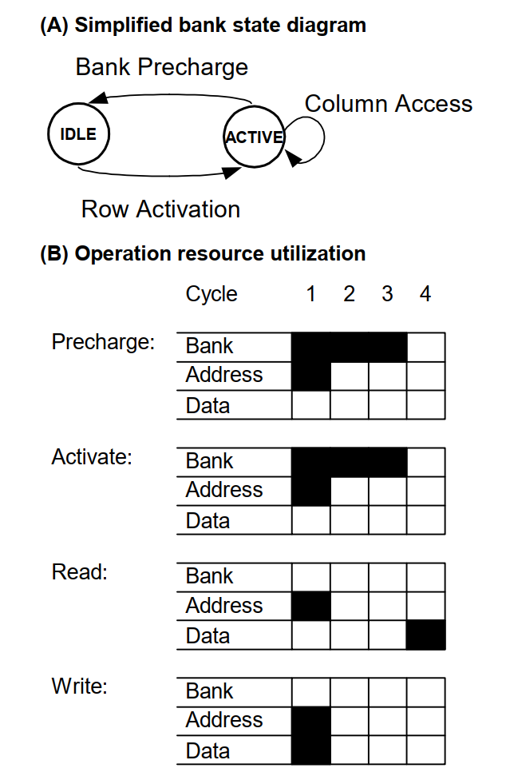

- Each DRAM bank has two stable states: IDLE and ACTIVE, as shown in Figure A
- In the IDLE state, the DRAM is precharged and ready for a row access.
- Row activation requires 3 cycles, during which no other operations may be issued to that bankDuring that time, however, operations may be issued to other banks of the DRAM.
- Once the DRAM’s row activation latency has passed, the bank enters the ACTIVE state.
- Any number of pipelined column accesses may be performed while the bank is in the ACTIVE state.
- The bank will remain in the ACTIVE state until a precharge operation is issued to return it to the IDLE state.
- Like row activation, the precharge operation utilizes the bank resource for 3 cycles, during which no new operations may be issued to that bank.

### Reorder

Sequential accesses to different rows within one bank have high latency and cannot be pipelined, while accesses to different banks or different words within a single row have low latency and can be pipelined.

Reorder memory operations to exploit the non-uniform access times of the DRAM is similar to how a superscalar processor schedules arithmetic operations out of order.

## DDR 类型

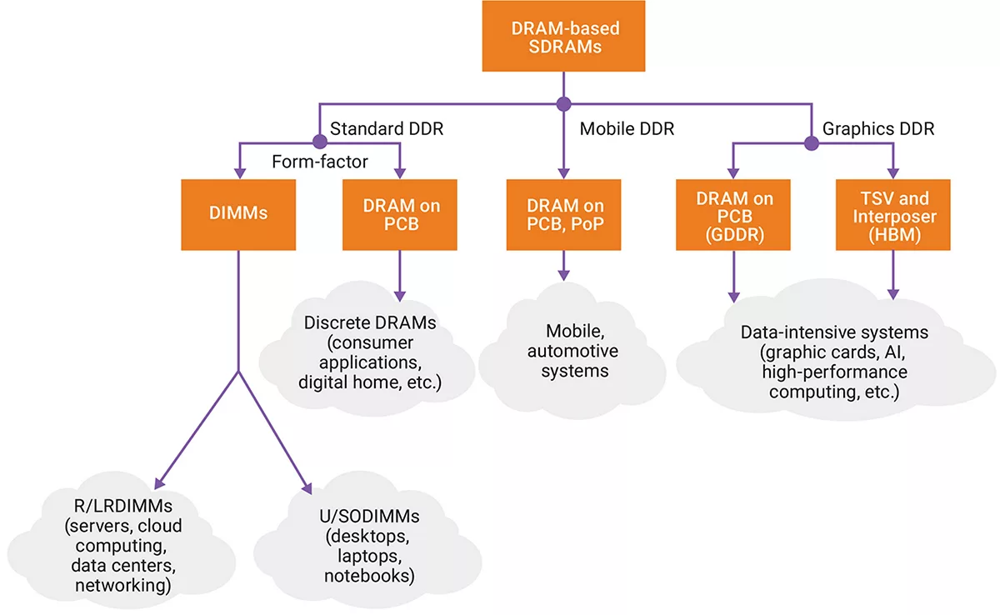

面向不同的应用，DDR可以分为标准DDR,用于手机等设备的LPDDR, 用于图形图像的GDDR,当然实际上还有HBM等等。

### LPDDR4 with LPDDR5

LPDDR5的数据速率达到了6400Mbps,有着更大的设备容量，更低的电压

| 区别 | LPDDR4 | LPDDR5 |
---|---|---|
device size | 2Gb to 32Gb (per channel); 4, 8, and 16 bank devices; 1k, 2k, and 4k page sizes | 2Gb to 16Gb (per channel); 8 bank devices; 2k page sizes|
speed | Up to 6400 Mbps | Up to 4266 Mbps |
voltage | 1.8V DRAM array; 1.05V / 0.9V core; 0.5V / 0.3 V I/O | 1.8V DRAM array; 1.1V core; 1.1V / 0.6V I/O |

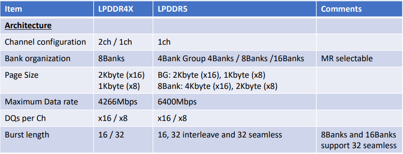

### LPDDR5

LPDDR5高速同步SDRAM,支持1个channel,可选的16或8DQ信号。bank架构是可以选择的，8bank模式，bank group模式(4banks, 4 bank-groups)，16bank模式。每一种bank结构支持不同的burst模式，可以通过模式寄存器来配置.容量支持2Gb~32Gb

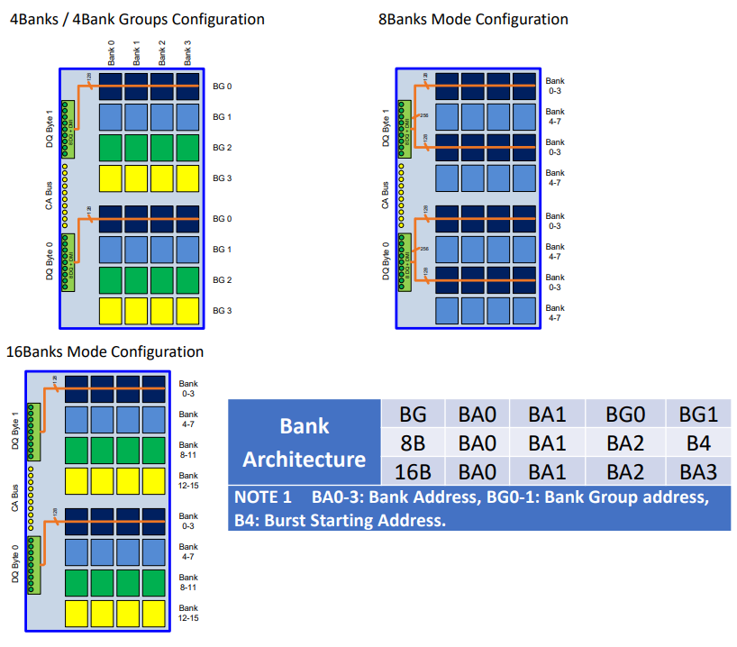

除了在频率和电压上的区别，在组织结构上LPDDR5和LPDDR4有着比较大的区别，LPDDR5支持灵活的bank结构，有不同的突发长度。

bank-group模式支持速度超过32Mbps,并且允许16或32的burst长度。8bank模式支持所有速度下的32 burst长度。16bank模式支持低于3200Mbps的速度，16或32的burst长度。

LPDDR5x不支持8bank模式，但LPDDR5支持

## DDR控制器

Example of cadence DDR controller

This Cadence DDR Controller contains an internal AXI port which communicates on the AXI bus. The AXI port uses an AXIController Core interface block to connect to the Controller core

### DDR SDRAM Address Mapping Options

The address map for this Cadence DDR Controller is ordered as follows:

Chip Index -- Chip Select -- Row -- Bank / Bank Group -- Column -- Datapath

- The address structure of DDR SDRAM memories contains 6 fields.
- Each of these fields can be individually addressed when accessing the DRAM.
- The chip select and chip index fields are always the most significant fields of the address.
- The column and datapath fields are always the least significant fields.
- The position of the row and bank/bank group fields are defined at configuration.

If the cs_lower_addr_en parameter is set to ’b1, the row field is moved to the higher bits of the address map relative to the
chip select field and chip index field. This alters the memory map from the original (Chip Index -- Chip Select -- Row -- Bank
/ Bank Group -- Column -- Datapath) to Row -- Chip Index -- Chip Select -- Bank / Bank Group -- Column -- Datapath

### Maximum Address Space

MaxMemBytes = Chip Selects x Chip Indexes x 2Address x NumBanks x DPWidthBytes
For this controller, the maximum values for these fields are as follows:

- Chip Indexes = 2
- Chip Selects = 2
- Memory Address = 18 + 12 (Row + Column)
- Number of Banks Per Chip Select = 16
- Memory Datapath Width in Bytes = 8 bytes

As a result, the maximum accessible memory area is 2 TB.

### MC Port Interface

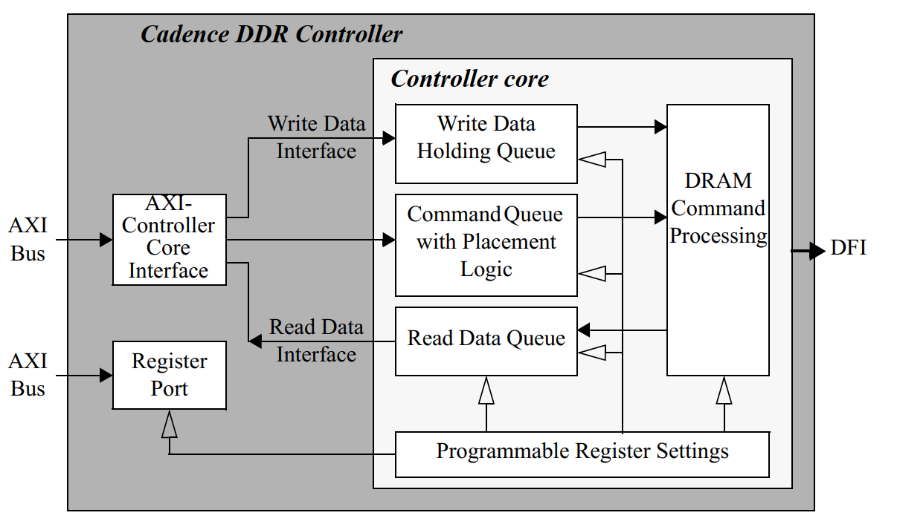

The interface block contains FIFOs and an array for commands, read and write data, and process any clock domain
crossings, if required.

- Commands are fed to the command queue of the Controller core.
- Write and read data is routed directly to the write and read data queues of the Controller core through the data interface.
- Write data is stored in the port write data array and only transmitted to the Controller core’s write data holding queue when the
command is selected for processing.

### AXI-Controller Core Interface

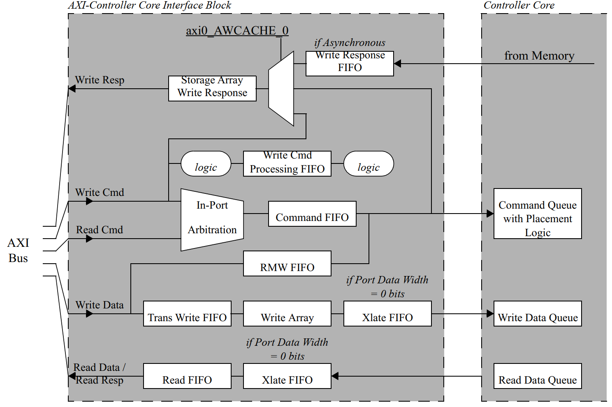

- Command FIFO prior to entering the port command FIFO, the AXI-Controller Core interface block converts the AXI transaction into a
Controller core transaction.
- In-Port Arbitration within the port, it is possible that both the read and write command channel of the AXI bus are active concurrently. If this
occurs, the port performs a simple arbitration to select the command to pass through to the Controller core. This arbitration
is based on the following factors, in order of importance:
  - Order of command acceptance into the port
  - Priority of read commands versus priority of write commands for this port
  - Default Read over Write preference
- The purpose of the write Array is to allow the AXI bus to off load its write data completely before the data is transferred to the Controller core buffers
- Write responses will be returned in the same order as the commands were received, regardless of the AXI ID or the type of response requested
- The register interface is an independent AXI port to the Cadence DDR Controller. This port converts the AXI register addresses to Controller core register addresses

### Placement Logic

#### Address Collision/Data Coherency Violation

- To avoid address collisions, reads or writes that access the same range of the same chip select, bank and row as a command already in the command queue will be inserted into the command queue after the original command, even if the new command is of a higher priority.
- This rule is ignored when comparing a new read command to an existing read.
- Controller utilizes micro page masking for address collision checking to provide a finer granularity for collision.
- Address collision checking may be enabled/disabled through the addr_cmp_en parameter.

#### Source ID Collision

- The port is assigned a specific source ID that is based on the thread ID information and identifies the source uniquely.
- In general, read commands from the same source ID will be placed in the command queue in order.
- Write command conflicts will be dependent on the programming of the wr_order_req parameter.
- The behavior of commands of different types from the same source ID is dependent on the user configuration.
- If there are no address conflicts, a read command could be executed ahead of a write command with the same source ID, and
likewise a write command could be executed ahead of a read command with the same source ID.
- Source ID collision checking will always be enabled.

#### Priority

- For the parameters, a value of 0 is the highest priority and a value of 15 is the lowest priority.
- For the signals, a value of 15 is the highest priority and a value of 0 is the lowest priority.
- Controller will invert this signal inside the Controller core and use 0 as the highest priority and 15 as the lowest priority.
- The placement algorithm will attempt to place higher priority commands ahead of lower priority commands, as long as they have no source ID or address collisions.
- Priority checking is enabled through the priority_en parameter.

#### Bank Splitting

如果一个新的命令访问的地址和命令队列中的命令落在同一个片选，同一个bank，但不同的行，这些命令就会被认为有bank冲突

- Before accesses can be made to two different rows within the same bank, the first active row must be closed (pre-charged) and the new row must be opened (activated)
- Bank splitting is enabled through the bank_split_en parameter.

#### Write-to-Read Splitting

- When a read command follows a write command to the same chip select, there is some timing overhead to switch command types.
- Write-to-read splitting is enabled through the w2r_split_en parameter.

#### Read/Write Grouping

The memory suffers a small timing overhead when switching from read to write mode.
Placement logic will attempt to place a new read command sequentially with other read commands in the command queue, or a new write command sequentially with other write commands in the command queue.
Read/write grouping is enabled through the rw_same_en parameter.

- Bank Conflicts and Read/Write Grouping
- Chip Select Grouping with Read/Write Grouping
- Page Grouping with Read/Write Grouping

### select logic

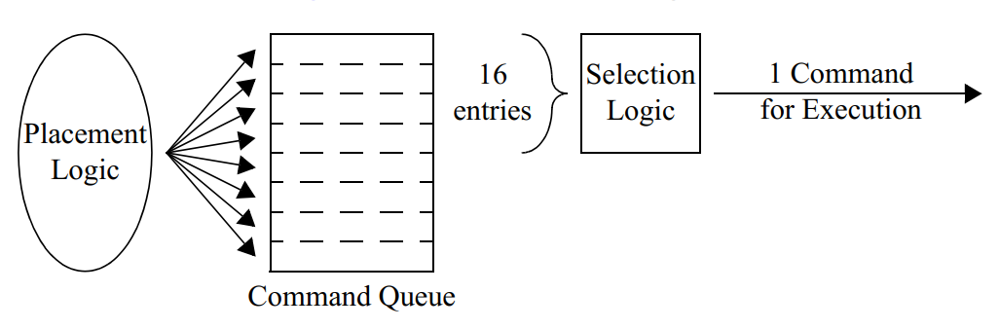

On each clock cycle, the selection logic will scan the top 16 entries of the command queue to determine which command to
execute.

#### High-Priority Command Swapping

- placement algorithm 在决定命令在queue中的顺序的时候已经考虑了优先级，但仍然会有高优先级的命令在commmand queue中等待一个低优先级的正在处理的命令。
- 高优先级转换特性允许新的高优先级的命令更快的执行。
- 如果选择的command queue中的命令有更高的优先级，并且跟当前正在执行的命令的ID不一样，也没有地址和source ID冲突，那么正在执行的指令将会被中断。
- 如果要中断当前执行的命令，它会在执行完当前的burst之后被挂起，然后保存在命令队列的顶部，然后新的命令将会被执行。

#### Command Aging

因为可以在已经存在的命令上面插入新的命令，所以可能发生一个低优先级的命令一直在command queue的底部的情况。为了避免这种lockout的情况，增加了age计数器。如果一个命令的age计数器达到了最大值，那么这个命令的优先级会被加1，但不会移动这个命令在command queue中的位置，它会影响新的命令的placing。这个功能无法关闭。

### 内存访问调度算法

《memory access scheduling》

## DDR功耗

[https://www.micron.com/support/tools-and-utilities/power-calc?login]

以镁光DDR举例，镁光提供了一些工具来对DDR的功耗进行评估，也有相关的文档描述他们的一些评估结果

## DRAMSim3

### 配置参数解析

### 统计信息解析

### 实现分析
