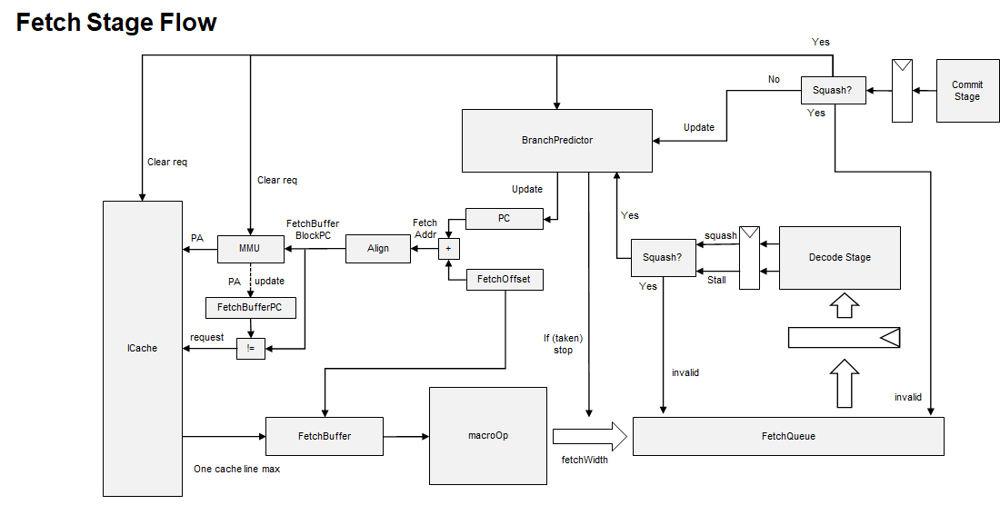
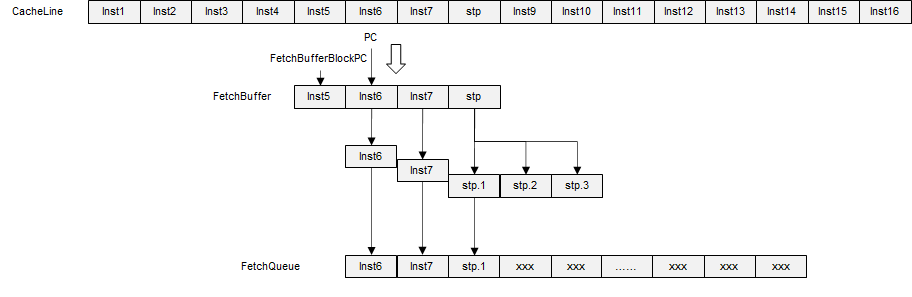
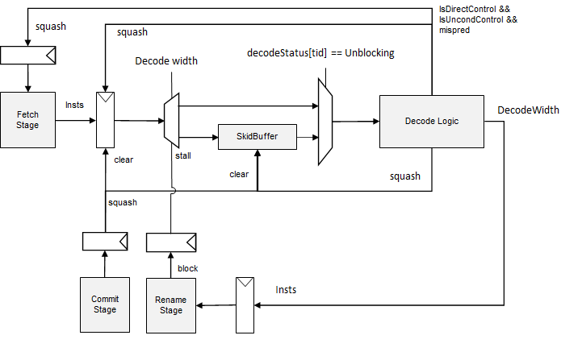
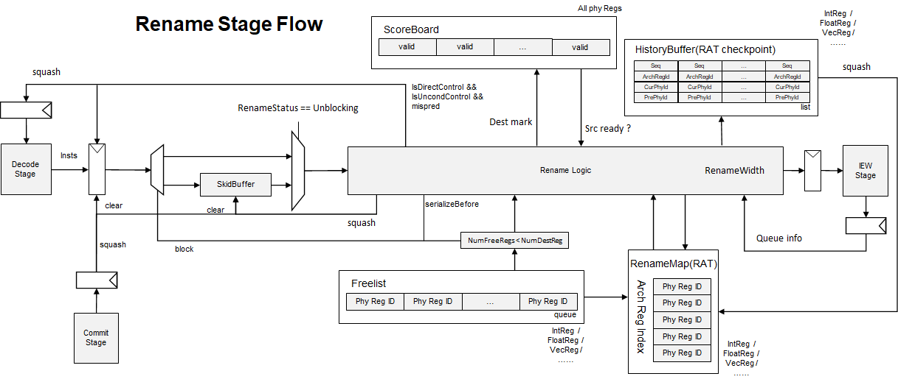
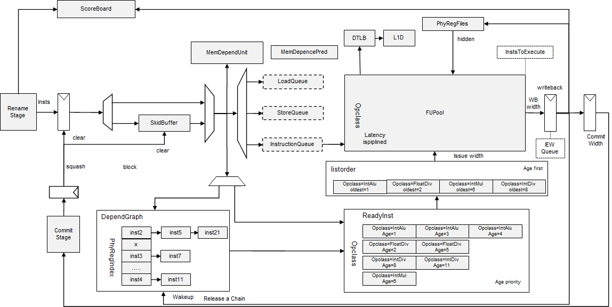
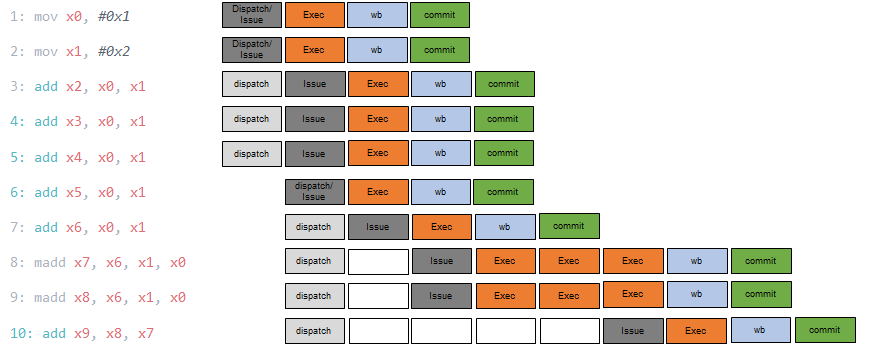
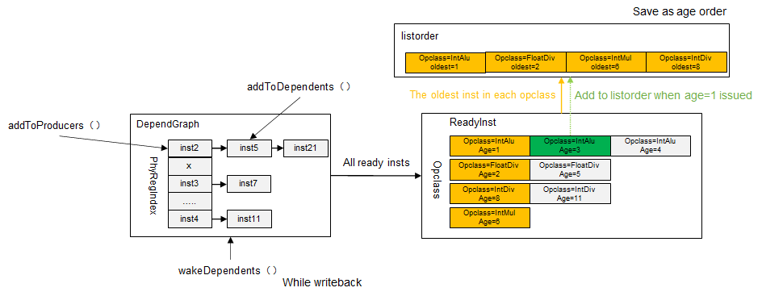
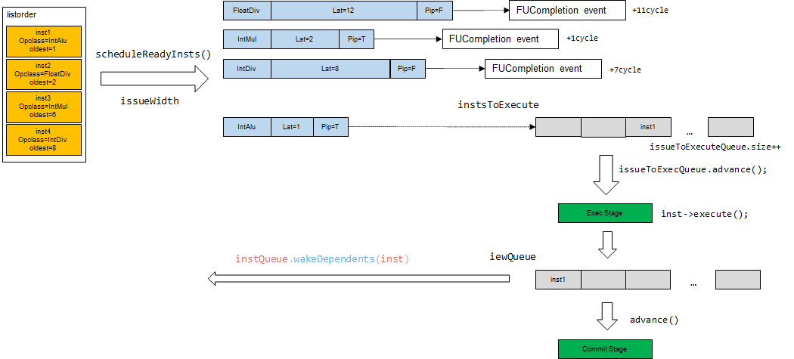
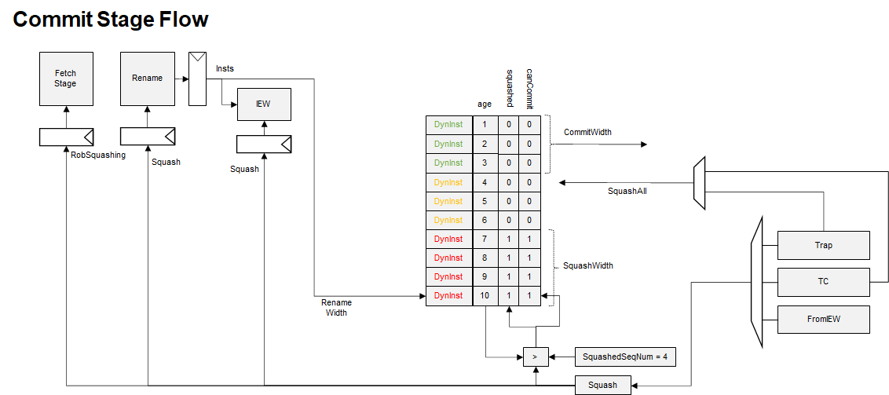

# O3CPU 代码分析

## 运行说明

### build Gem5

can use a **-j** param to enable compile in parallel

```shell
scons build/ARM/gem5.debug -j4
```

## run Gem5

```shell
chlxy@LAPTOP-SMLPH2RJ:~/workspace/gem5$ ./build/ARM/gem5.debug --debug-flags=Exec configs/example/fs.py --cpu-type=ArmO3CPU --caches --machine-type=VExpress_GEM5_V2 -n1 --bare-metal --kernel ../tests/aarch64/dhrystone/dhrystone.elf
```

## stop Gem5

dhrystone will write a **EOT** to inform system to stop at the end of the test

```c++
#define TUBE_ADDRESS ((volatile uint32_t *) 0x13000000u)

static void benchmark_finish()
{​​
  char  p[] = "** TEST PASSED OK **\n";
  char* c   = p;
  while (*c)
  {​​​​​​​​​
    *TUBE_ADDRESS = *c;
    c++;
  }​​​​​​​​​​​​​​​​​​​​​​​​​​​​​​​​​​​​​​​​​​​​​​​​​​​​​​​​​​​​​​​​​
  *TUBE_ADDRESS = 0x4;
}
```

so, we set **UART0.pio=0x13000000**, and enable EOT

```python
Pl011(pio_addr=0x13000000,
      interrupt=ArmSPI(num=37), end_on_eot=True)
```

we use **VExpress_GEM5_V2** platform for our soc structure, you can find memorymap and other information in file src/dev/arm/RealView.py

## fetch



### fetch a cache line and not hit

没有开启mmu，因此当拍就能得到物理地址，然后查cache是否命中

```text
1000: system.cpu.fetch: [tid:0] Attempting to translate and read instruction, starting at PC (0=>0x4).(0=>1).
1000: system.cpu.fetch: [tid:0] Fetching cache line 0 for addr 0
```

cache未命中，向下一级缓存取指令，在43000个tick，cache miss的数据回填，再过3个cycle,数据被直接放在fetchbuffer中。

```text
43000: system.cpu.icache: recvTimingResp: Handling response ReadResp [0:f] (s) IF UC
44500: system.cpu.icache_port: Fetch unit received timing
```

### macroOp

macroOp fetch过程有如下特点：

- 不支持跨cacheLine
- 不支持fetchbuffer拼接
- 当拍处理完fetchbuffer，可以直接发起新的cache请求
- 存在一个microOp的缓存



从指令流log中可以看到macro指令 stp被拆分成了三条micro指令

```text
2457000: system.cpu: A0 T0 : 0x6220 @_malloc_r+640    :   adrp   x1, #73728        : IntAlu :  D=0x0000000000018000  FetchSeq=1364  CPSeq=902  flags=(IsInteger)
2457000: system.cpu: A0 T0 : 0x6224 @_malloc_r+644    : stp                       
2457000: system.cpu: A0 T0 : 0x6224 @_malloc_r+644. 0 :   addxi_uop   ureg0, sp, #80 : IntAlu :  D=0x0000000000014f30  FetchSeq=1365  CPSeq=903  flags=(IsInteger|IsMicroop|IsDelayedCommit|IsFirstMicroop)
2457000: system.cpu: A0 T0 : 0x6224 @_malloc_r+644. 1 :   strxi_uop   x27, [ureg0] : MemWrite :  D=0x0000000000000000 A=0x14f30  FetchSeq=1366  CPSeq=904  flags=(IsInteger|IsStore|IsMicroop|IsDelayedCommit)
2457500: system.cpu: A0 T0 : 0x6224 @_malloc_r+644. 2 :   strxi_uop   x28, [ureg0, #8] : MemWrite :  D=0x0000000000000000 A=0x14f38  FetchSeq=1367  CPSeq=905  flags=(IsInteger|IsStore|IsMicroop|IsLastMicroop)
2457500: system.cpu: A0 T0 : 0x6228 @_malloc_r+648    :   adrp   x27, #61440       : IntAlu :  D=0x0000000000015000  FetchSeq=1368  CPSeq=906  flags=(IsInteger)
2457500: system.cpu: A0 T0 : 0x622c @_malloc_r+652    :   ldr   x1, [x1, #2432]    : MemRead :  D=0x0000000000000000 A=0x18980  FetchSeq=1369  CPSeq=907  flags=(IsInteger|IsLoad)
2458000: system.cpu: A0 T0 : 0x6230 @_malloc_r+656    :   movz   x3, #4127, #0     : IntAlu :  D=0x000000000000101f  FetchSeq=1370  CPSeq=908  flags=(IsInteger)
2458000: system.cpu: A0 T0 : 0x6234 @_malloc_r+660    :   ldr   x2, [x27, #3936]   : MemRead :  D=0xffffffffffffffff A=0x15f60  FetchSeq=1371  CPSeq=909  flags=(IsInteger|IsLoad)
```

执行log中,可以看到在2457000个tick时，fetch一共处理了三条指令，adrp和stp的前两条micro指令

```text
2457000: system.cpu.fetch: [tid:0] Instruction PC (0x6220=>0x6224).(0=>1) created [sn:1364].
2457000: system.cpu.fetch: [tid:0] Instruction is:   adrp   x1, #73728

2457000: system.cpu.decoder: Decode: Decoded stp instruction: 0x4a90573fb
2457000: system.cpu.fetch: [tid:0] Instruction PC (0x6224=>0x6228).(0=>1) created [sn:1365].
2457000: system.cpu.fetch: [tid:0] Instruction is:   addxi_uop   ureg0, sp, #80

2457000: system.cpu.fetch: [tid:0] Instruction PC (0x6224=>0x6228).(1=>2) created [sn:1366].
2457000: system.cpu.fetch: [tid:0] Instruction is:   strxi_uop   x27, [ureg0]

2457000: system.cpu.fetch: [tid:0] Done fetching, reached fetch bandwidth for this cycle.

2457000: system.cpu.fetch: [tid:0] [sn:1364] Sending instruction to decode from fetch queue. Fetch queue size: 3.
2457000: system.cpu.fetch: [tid:0] [sn:1365] Sending instruction to decode from fetch queue. Fetch queue size: 2.
2457000: system.cpu.fetch: [tid:0] [sn:1366] Sending instruction to decode from fetch queue. Fetch queue size: 1.
```

在下一个cycle,除了stp剩余的一条指令，还可以处理额外的两条指令

```text
2457500: system.cpu.fetch: [tid:0] Instruction PC (0x6224=>0x6228).(2=>3) created [sn:1367].
2457500: system.cpu.fetch: [tid:0] Instruction is:   strxi_uop   x28, [ureg0, #8]

2457500: system.cpu.fetch: [tid:0] Instruction PC (0x6228=>0x622c).(0=>1) created [sn:1368].
2457500: system.cpu.fetch: [tid:0] Instruction is:   adrp   x27, #61440

2457500: system.cpu.fetch: [tid:0] Instruction PC (0x622c=>0x6230).(0=>1) created [sn:1369].
2457500: system.cpu.fetch: [tid:0] Instruction is:   ldr   x1, [x1, #2432]

2457500: system.cpu.fetch: [tid:0] Done fetching, reached fetch bandwidth for this cycle.
```

### 分支预测

如果分支预测跳转，就会结束当前fetch操作，分支指令之前的指令可以继续进入fetchQueue。同时可以直接发起新的cache请求

```text
2600000: system.cpu.fetch: [tid:0] Instruction PC (0x1514=>0x1518).(0=>1) created [sn:1413].
2600000: system.cpu.fetch: [tid:0] Instruction is:   ret   

2600000: system.cpu.fetch: [tid:0] [sn:1413] Branch at PC 0x1514 predicted to be taken to (0x6260=>0x6264).(0=>1)

2600000: system.cpu.fetch: [tid:0] Done fetching, predicted branch instruction encountered.

2600000: system.cpu.fetch: [tid:0] Issuing a pipelined I-cache access, starting at PC (0x6260=>0x6264).(0=>1).
2600000: system.cpu.fetch: [tid:0] Fetching cache line 0x6260 for addr 0x6260

2600000: system.cpu.fetch: [tid:0] [sn:1412] Sending instruction to decode from fetch queue. Fetch queue size: 2.
2600000: system.cpu.fetch: [tid:0] [sn:1413] Sending instruction to decode from fetch queue. Fetch queue size: 1.
```

### quiesce 类指令的处理

quiesce类指令：

- wfe
- wfet(Gem5 不支持)
- wfi
- wfit(Gem5 不支持)

以wfi指令举例

```text
1376000: system.cpu.fetch: [tid:0] Instruction PC (0x1c4=>0x1c8).(0=>1) created [sn:119].
1376000: system.cpu.fetch: [tid:0] Instruction is:   wfi   

1376000: system.cpu.fetch: Quiesce instruction encountered, halting fetch!

// 下一拍，fetch 开始处于pending的状态
1376500: system.cpu.fetch: There are no more threads available to fetch from.
1376500: system.cpu.fetch: [tid:0] Fetch is waiting for a pending quiesce instruction!

// 在这个例子中，wfi指令处于分支错误的路径上，最终执行squash恢复了运行
1380000: system.cpu.commit: [tid:0] Squashing due to branch mispred PC:0x1c0 [sn:118]
1380000: system.cpu.commit: [tid:0] Redirecting to PC (0x1cc=>0x1d0).(0=>1)

1380500: system.cpu.fetch: [tid:0] Squashing instructions due to squash from commit.
1380500: system.cpu.fetch: [tid:0] Squash from commit.

1381000: system.cpu.fetch: [tid:0] Done squashing, switching to running.
1381000: system.cpu.fetch: Running stage.
```

### squash

squash 主要执行如下操作

- 将PC设置为Commit stage 返回的PC
- 复位与fetch buffer相关的reg
- 如果有进行中的icache请求，标记请求无效
- 如果有进行中的itlb请求，标记请求无效
- 如果有进行中的icache retry请求，标记请求无效
- 清空fetchQueue

### stall

来自于decode的stall不会影响fetch将指令存入fetchQueue，会stall从fetchQueue向decode发送指令。

---

## decode



### decode squash

#### 分支预测错误引起的squash

decode stage 会判断非条件跳转指令是否分支预测错误。

如果发现非条件跳转指令分支预测错误，那么会在当拍执行squash操作，假设decode宽度是4，跳转指令是第三条，那么前三条指令都能正常decode，并且发送到rename，此时decode转入squashing的状态，清除掉skidbuffer中的所有指令。

如果下一个cycle没有收到squash信号或者stall信号，decode将再次转为running状态。

当前cycle fetch到了 b 0x1570 指令，并且给通过分支预测器获取了不跳转的分支信息，下一条指令地址为 0x1d4

```text
668000: system.cpu.fetch: [tid:0] Instruction PC (0x1cc=>0x1d0).(0=>1) created [sn:126].
668000: system.cpu.fetch: [tid:0] Instruction is:   b   0x1570
668000: system.cpu.fetch: [tid:0] [sn:126] Branch at PC 0x1cc predicted to be not taken
668000: system.cpu.fetch: [tid:0] [sn:126] Branch at PC 0x1cc predicted to go to (0x1d0=>0x1d4).(0=>1)

// 126 ~ 133 的指令被传入到fetchqueue
668000: system.cpu.fetch: [tid:0] [sn:126] Sending instruction to decode from fetch queue. Fetch queue size: 8.
668000: system.cpu.fetch: [tid:0] [sn:127] Sending instruction to decode from fetch queue. Fetch queue size: 7.
668000: system.cpu.fetch: [tid:0] [sn:128] Sending instruction to decode from fetch queue. Fetch queue size: 6.
668000: system.cpu.fetch: [tid:0] [sn:129] Sending instruction to decode from fetch queue. Fetch queue size: 5.
668000: system.cpu.fetch: [tid:0] [sn:130] Sending instruction to decode from fetch queue. Fetch queue size: 4.
668000: system.cpu.fetch: [tid:0] [sn:131] Sending instruction to decode from fetch queue. Fetch queue size: 3.
668000: system.cpu.fetch: [tid:0] [sn:132] Sending instruction to decode from fetch queue. Fetch queue size: 2.
668000: system.cpu.fetch: [tid:0] [sn:133] Sending instruction to decode from fetch queue. Fetch queue size: 1.
```

下一个cycle， decode解析出来的指令跳转地址为0x1570，因此产生squash信号
由于是8条指令中的第一条指令出现了分支预测错误，因此没有任何指令能够传给rename

```text
668500: system.cpu.decode: [tid:0] Processing instruction [sn:126] with PC (0x1cc=>0x1d0).(0=>1)
668500: system.cpu.decode: [tid:0] [sn:126] Squashing due to incorrect branch prediction detected at decode.
668500: system.cpu.decode: [tid:0] [sn:126] Updating predictions: Wrong predicted target: (0x1d0=>0x1d4).(0=>1)    PredPC: (0x1570=>0x1574).(0=>1)

668500: system.cpu.rename: [tid:0] Not blocked, so attempting to run stage.
668500: system.cpu.rename: [tid:0] Nothing to do, breaking out early.
```

decode需要通知fetch进行squash操作,同时将fetch与decode之间锁存的指令也清除掉。同时，如果decode当前处于blocked或者unblocking状态，需要通知fetch此状态解除。

#### squash 代码逻辑

fetch.cc
添加指令到全局指令列表

```text
    // Add instruction to the CPU's list of instructions.
    instruction->setInstListIt(cpu->addInst(instruction));
```

decode.cc
在squash时，给要squash的指令添加 squashed 标记

```text
    // Squash instructions up until this one
    cpu->removeInstsUntil(squash_seq_num, tid);
```

在decode指令时，如果标记了squashed， 直接跳过

```text
if (inst->isSquashed()) {​​​​​​​​
            DPRINTF(Decode, "[tid:%i] Instruction %i with PC %s is "
                    "squashed, skipping.\n",
                    tid, inst->seqNum, inst->pcState());
            ++stats.squashedInsts;
            --insts_available;
            continue;
        }​​​​​​​​
```

所以，flash 中间过程的指令没有额外的耗费cycle

#### 来自于commit的squash

- 如果decode处于block或者unbloking状态，通知fetch该状态已解除。因为会刷掉skidbuffer
- 清除掉skidbuffer，和来自于fetch的指令

fetch 到 decode之间on the fly的指令在fetch的squash处理中完成

fetch.cc

```text
    // Tell the CPU to remove any instructions that are not in the ROB.
    cpu->removeInstsNotInROB(tid);
```

### decode stall

- 如果rename block, 会发送stall信号给decode, decode收到stall信号，转为block状态，当拍不执行任何decode操作。并且会将stall信号传递给fetch。
- rename解除block后，decode进入unblocking状态，从skidbuffer中取指令，skidbuffer空了之后，转入running状态

### unblocking

- 如果收到rename发送的解除stall信号，rename进入unblocking状态，从skidbuffer中取指令进行decode。
- 当skidbuffer中没有指令时，发送解除stall信号给fetch stage

---

## Rename



### rename squash

Rename stage 会响应来自于commit stage的squash信号，接收到squashing信号时，Rename进行如下操作

- 如果当前rename处于blocked或者unblocking的状态，发送unblock信号给decode stage
- 如果当前rename处于serializeStall状态，检查squash的指令是不是更older,如果是，清除掉serialize状态，发送unblock信号给decode；如果不是，保留serializeStall标记,下一拍恢复serializeStall
- 清除掉来自于decode的指令
- 清除掉skidbuffer中的指令
- 一次性恢复RAT(从时序行为上来看仍然是ROB walk的形式)

rename的squash过程与iew和commit有较大关联，具体行为可以结合commit stage的squash过程进行分析

### rename stall

rename stall 的源比较多，有如下几个

- REW stage block(dispatch)
- no free ROB entries
- no free LSU entries
- no free IQ entries
- no free Phy Regs in freelist
- serializeStall

当发生stall时，rename stage有如下行为

- 将decode传入的指令存入skidbuffer
- 如果当前不在blocked或unblocking状态，向decode发送stall信号
- 如果不处于serializeStall 状态，标记自己为blocked状态

### rename unblocking

如果收到了dispatch 发送的解除stall信号，rename可能进入unblocking状态，从skidbuffer中取指令进行rename操作。当skidbuffer中没有指令时，发送解除stall信号给decode stage

### serilizeBefore and serilizeAfter

> serializeBefore makes the instruction wait in rename until the ROB is empty.
> serializeAfter marks the next instruction as serializeBefore

serializeBefore类指令：

- mrs

fetch到mrs指令，分配id=52

```text
561000: system.cpu.fetch: [tid:0] Instruction PC (0xcc=>0xd0).(0=>1) created [sn:52].
561000: system.cpu.fetch: [tid:0] Instruction is:   mrs   x0, id_aa64pfr0_el1
```

因为 fetch -> decode 的延迟为3，decode -> rename 延迟为2， 所以5个cycle之后，rename收到mrs指令
判断指令携带IsSerializeBefore标记,进行如下操作

- 不对该指令进行rename操作。
- 状态机转为SerializeStall状态
- 该指令之前的指令发送给dispatch
- 剩余的指令存入skidbuffer
- 反压stall信号给decode

```text
563500: system.cpu.rename: [tid:0] Processing instruction [sn:52] with PC (0xcc=>0xd0).(0=>1).
563500: system.cpu.rename: Serialize before instruction encountered.
563500: system.cpu.rename: [tid:0] Blocking.
```

接下来，会一直等待ROB empty(实际上要no on the fly && ROB empty)

```text
 564500: system.cpu.rename: [tid:0] Stall: Serialize stall and ROB is not empty.
 564500: system.cpu.rename: [tid:0] Blocking.
```

一段时间之后，指令51提交了，意味着mrs指令之前的指令都提交了，因此ROB此时处于empty状态

```text
567000: system.cpu.commit: [tid:0] [sn:51] Committing instruction with PC (0xc8=>0xcc).(0=>1)
567000: system.cpu.rob: [tid:0] Retiring head instruction, instruction PC (0xc8=>0xcc).(0=>1), [sn:51]
```

所以下一个cycle,rename进入unblocking状态，继续进行rename

```text
567500: system.cpu.rename: [tid:0] Done with serialize stall, switching to unblocking.
567500: system.cpu.rename: [tid:0] Trying to unblock.
567500: system.cpu.rename: [tid:0] Processing instruction [52] with PC (0xcc=>0xd0).(0=>1).
```

serilizeAfter类指令：

- rfe(return from exception) only arch32 support?
- svc(supervisor call to EL1)
- hvc(supervisor call to EL2)
- smc(secure monitor call to EL3)
- hlt(halt)
- eret(exception return)
- msr(move to system registers)
- wfe(wait for exception)
- wfi(wait for interrupt)
- mcr( arch32 only?)
- setend(arch32 only?)
- dsb(Data Synchronization Barrier)
- cps(change pe status) arch32 only?
- brk(breakpoint)

msr指令举例，id=43,它的下一条是adr指令，id=44

```text
474500: system.cpu.fetch: [tid:0] Instruction PC (0xa8=>0xac).(0=>1) created [sn:43].
474500: system.cpu.fetch: [tid:0] Instruction is:   msr   vbar_el3, x1

475000: system.cpu.fetch: [tid:0] Instruction PC (0xac=>0xb0).(0=>1) created [sn:44].
475000: system.cpu.fetch: [tid:0] Instruction is:   adr   x1, #85840
```

若干cycle之后，rename处理msr指令，识别为serializeAfter指令,43号指令正常进行rename，并且发给IEW,
后面的44号指令

```text
480500: system.cpu.rename: [tid:0] Processing instruction [sn:43] with PC (0xa8=>0xac).(0=>1).
480500: system.cpu.rename: Serialize after instruction encountered.

480500: system.cpu.rename: [tid:0] [sn:43] Adding instruction to history buffer (size=3).
480500: system.cpu.rename: [tid:0] Sending instructions to IEW.
480500: system.cpu.rename: [tid:0] Removing [sn:44] PC:(0xac=>0xb0).(0=>1) from rename skidBuffer
480500: system.cpu.rename: [tid:0] Processing instruction [sn:44] with PC (0xac=>0xb0).(0=>1).
480500: system.cpu.rename: Serialize before instruction encountered.
480500: system.cpu.rename: [tid:0] Blocking.
```

43号指令提交了

```text
485500: system.cpu.commit: [tid:0] [sn:43] Committing instruction with PC (0xa8=>0xac).(0=>1)
485500: system.cpu.rob: [tid:0] Retiring head instruction, instruction PC (0xa8=>0xac).(0=>1), [sn:43]
```

下一个cycle,44号指令可以继续rename

```text
486000: system.cpu.rename: [tid:0] Done with serialize stall, switching to unblocking.
486000: system.cpu.rename: [tid:0] Trying to unblock.

486000: system.cpu.rename: [tid:0] Processing instruction [44] with PC (0xac=>0xb0).(0=>1).
486000: system.cpu.rename: [tid:0] Instruction must be processed by rename. Adding to front of list.

486000: system.cpu.rename: [tid:0] Sending instructions to IEW.
486000: system.cpu.rename: [tid:0] Processing instruction [sn:44] with PC (0xac=>0xb0).(0=>1).
```

---

## IEW



IEW stage 混合了dispatch,issue,execute,writeback的操作。它是多个stage合并在了一起。

dispath实现了将rename之后的指令放到issueQueue中的操作，O3CPU中，实现了InstQueue,LoadQueue,StoreQueue,三个数据结构，但这不意味着它所模拟的硬件只有三个队列，要从整体效果上分析。

### 一般流程



举例一段顺序指令，可以看出，对于执行周期为1的指令，指令可以背靠背执行。如果指令所有的源都ready,那么在dispath的同时就能进行仲裁。执行之后有一个可以认为是writeback的过程，实际上的唤醒操作在执行的最后一个cycle就进行了

### atomic类指令

#### 原子比较交换

- CAS,CASA,CASL,CASAL
- CASB,CASAB,CASLB,CASALB
- CASH,CASAH,CASLH,CASALH
- CASP,CASPA,CASPL,CASPAL

#### 原子交换

- SWP, SWPA, SWPAL, SWPL
- SWPB, SWPAB, SWPALB, SWPLB, SWPH, SWPAH, SWPALH, SWPLH

#### 原子累加

- LDADD,LDADDA,LDADDAL,LDADDL, LDADDH,LDADDAH,LDADDALH,LDADDLH, LDADDB,LDADDAB,LDADDALB,LDADDLB
- STADD, STADDL, STADDB, STADDLB, STADDH, STADDLH

#### 原子位操作

- LDCLR,LDCLRA,LDCLRAL,LDCLRL
- LDCLRB, LDCLRAB, LDCLRALB, LDCLRLB, LDCLRH, LDCLRAH, LDCLRALH, LDCLRLH
- STCLR, STCLRL, STCLRB, STCLRLB, STCLRH, STCLRLH

- LDEOR, LDEORA, LDEORAL, LDEORL
- LDEORB, LDEORAB, LDEORALB, LDEORLB, LDEORH, LDEORAH, LDEORALH, LDEORLH
- STEOR, STEORL, STEORB, STEORLB, STEORH, STEORLH

- LDSET, LDSETA, LDSETAL, LDSETL
- LDSETB, LDSETAB, LDSETALB, LDSETLB, LDSETH, LDSETAH, LDSETALH, LDSETLH
- STSET, STSETL, STSETB, STSETLB, STSETH, STSETLH

#### 原子比较

- LDSMAX, LDSMAXA, LDSMAXAL, LDSMAXL
- LDUMAX, LDUMAXA, LDUMAXAL, LDUMAXL
- LDSMAXB, LDSMAXAB, LDSMAXALB, LDSMAXLB
- LDUMAXB, LDUMAXAB, LDUMAXALB, LDUMAXLB
- LDSMAXH, LDSMAXAH, LDSMAXALH, LDSMAXLH
- LDUMAXH, LDUMAXAH, LDUMAXALH, LDUMAXLH
- STSMAX, STSMAXL, STSMAXB, STSMAXLB, STSMAXH, STSMAXLH
- STUMAX, STUMAXL, STUMAXB, STUMAXLB, STUMAXH, STUMAXLH

- LDSMIN, LDSMINA, LDSMINAL, LDSMINL
- LDUMIN, LDUMINA, LDUMINAL, LDUMINL
- LDSMINB, LDSMINAB, LDSMINALB, LDSMINLB
- LDUMINB, LDUMINAB, LDUMINALB, LDUMINLB
- LDSMINH, LDSMINAH, LDSMINALH, LDSMINLH
- LDUMINH, LDUMINAH, LDUMINALH, LDUMINLH
- STSMIN, STSMINL, STSMINB, STSMINLB, STSMINH, STSMINLH
- STUMIN, STUMINL, STUMINB, STUMINLB, STUMINH, STUMINLH

### iew squash

todo...

### 不能冒险执行的指令

对于不能冒险执行的指令，在Gem5的乱序CPU模型中，会将这类指令单独记录在一个表中，并且设置这类指令为CanCommit, 这样，在commit stage, 如果处理到这条指令，就会去尝试提交，但在提交的时候会发现，这条指令没有执行，缺少isExecuted标记，就能识别出这是不能冒险执行的指令，一直等到所有的store指令都已经写回，commit会传递可以执行信号给发射stage,这条指令才会去执行。

以下类别的指令都是不能冒险执行的指令

- atomic
- StoreConditional
  - stlxr, stlxrh, stlxrb, stxr, stxrb, stxrh, stlxp, stxp, strex, strexh, strexb, strexd, stlex, stlexb, stlexh, stlexd
- ReadBarrier
  - stlr, stlrb, stlrh, hlt, dmb, dsb, ...
- WriteBarrier
- NonSpeculative
  - sev, svc, hlt, smc, ...

这类指令的处理流程如下：

46号指令是ldadd指令，是一条atomic指令， 它前面的45号指令是一条store指令

```text
517500: system.cpu.fetch: [tid:0] Instruction PC (0xb0=>0xb4).(0=>1) created [sn:45].
517500: system.cpu.fetch: [tid:0] Instruction is:   str   x4, [x7]

517500: system.cpu.fetch: [tid:0] Instruction PC (0xb4=>0xb8).(0=>1) created [sn:46].
517500: system.cpu.fetch: [tid:0] Instruction is:   ldadd64   x8, x1, [x6]
```

在dispatch时，将这条指令额外的记录在了一个名为nonSpecInsts的结构中，并且atomic指令会存放在发射队列的StoreQueue中，并且这条指令也被记录在了ROB中，并且不是ROB的头

```text
520500: system.cpu.iew: [tid:0] Issue: Adding PC (0xb4=>0xb8).(0=>1) [sn:46] [tid:0] to IQ.
520500: system.cpu.iew: [tid:0] Issue: Memory instruction encountered, adding to LSQ.
520500: system.cpu.iew.lsq.thread0: Inserting store PC (0xb4=>0xb8).(0=>1), idx:3 [sn:46]
520500: system.cpu.iq: Adding non-speculative instruction [sn:46] PC (0xb4=>0xb8).(0=>1) to the IQ.
520500: memdepentry: Memory dependency entry created. memdep_count=2 (0xb4=>0xb8).(0=>1)
520500: system.cpu.memDep0: Inserting store/atomic PC (0xb4=>0xb8).(0=>1) [sn:46].

520500: system.cpu.commit: [tid:0] [sn:46] Inserting PC (0xb4=>0xb8).(0=>1) into ROB.
520500: system.cpu.rob: Adding inst PC (0xb4=>0xb8).(0=>1) to the ROB.
520500: system.cpu.rob: [tid:0] Now has 2 instructions.
```

45号指令能够提交，这时发现后面的46号指令是一条nonSpec指令，它要等到前面所有的指令都提交,并且所有的store指令都完成写回。因此commit会一直卡在这条指令

```text
522500: system.cpu.commit: Trying to commit head instruction, [tid:0] [sn:45]
522500: system.cpu.commit: [tid:0] [sn:45] Committing instruction with PC (0xb0=>0xb4).(0=>1)
522500: system.cpu.rob: [tid:0] Retiring head instruction, instruction PC (0xb0=>0xb4).(0=>1), [sn:45]
522500: system.cpu: Removing committed instruction [tid:0] PC (0xb0=>0xb4).(0=>1) [sn:45]

522500: system.cpu.commit: Trying to commit head instruction, [tid:0] [sn:46]
522500: system.cpu.commit: Encountered a barrier or non-speculative instruction [tid:0] [sn:46] at the head of the ROB, PC (0xb4=>0xb8).(0=>1).
522500: system.cpu.commit: [tid:0] [sn:46] Waiting for all stores to writeback.
522500: system.cpu.commit: Unable to commit head instruction PC:(0xb4=>0xb8).(0=>1) [tid:0] [sn:46].
```

过了很长时间，前面的store指令写回了，在下一个cycle,commit发送一组nonSpecSeqNum信号给发射队列仲裁逻辑

```text
567000: system.cpu.commit: Trying to commit instructions in the ROB.
567000: system.cpu.commit: Trying to commit head instruction, [tid:0] [sn:46]
567000: system.cpu.commit: Encountered a barrier or non-speculative instruction [tid:0] [sn:46] at the head of the ROB, PC (0xb4=>0xb8).(0=>1).
567000: system.cpu.commit: Unable to commit head instruction PC:(0xb4=>0xb8).(0=>1) [tid:0] [sn:46].
567000: system.cpu.commit: [tid:0] Can't commit, Instruction [sn:46] PC (0xb4=>0xb8).(0=>1) is head of ROB and not ready
```

下一个cycle, 发射队列的仲裁逻辑收到nonSpecSeqNum信号，标记46号指令ready

```text
567500: system.cpu.iq: Marking nonspeculative instruction [sn:46] as ready to execute.
567500: system.cpu.memDep0: Marking non speculative instruction PC (0xb4=>0xb8).(0=>1) as ready [sn:46].
567500: system.cpu.memDep0: Adding instruction [sn:46] to the ready list.
567500: system.cpu.iq: Instruction is ready to issue, putting it onto the ready list, PC (0xb4=>0xb8).(0=>1) opclass:48 [sn:46].
```

下一个cycle, 将46号指令发射出去

```text
568000: system.cpu.iq: Thread 0: Issuing instruction PC (0xb4=>0xb8).(0=>1) [sn:46]
568000: system.cpu.memDep0: Issuing instruction PC 0xb4 [sn:46].
```

两个cycle之后,指令真正的执行

```text
569000: system.cpu.iew: Execute: Processing PC (0xb4=>0xb8).(0=>1), [tid:0] [sn:46].
569000: system.cpu.iew: Execute: Calculating address for memory reference.
569000: system.cpu.iew.lsq.thread0: Executing store PC (0xb4=>0xb8).(0=>1) [sn:46]
569000: global: RegFile: Access to int register 78, has data 0x140
569000: global: RegFile: Access to int register 50, has data 0
569000: global: RegFile: Access to int register 77, has data 0x2
569000: system.cpu.iew.lsq.thread0: Doing write to store idx 3, addr 0x140 | storeHead:3 [sn:46]
569000: system.cpu: Activity: 6
569000: system.cpu.iq: Attempting to schedule ready instructions from the IQ.
569000: system.cpu.iq: Not able to schedule any instructions.
569000: system.cpu.iew.lsq: [tid:0] Writing back stores. 1 stores available for Writeback.
569000: system.cpu.iew.lsq.thread0: D-Cache: Writing back store idx:4 PC:(0xb4=>0xb8).(0=>1) to Addr:0x140, data:0 [sn:46]
569000: system.cpu.iew.lsq.thread0: Memory request (pkt: SwapReq [140:147] (s) UC) from inst [sn:46] was sent (cache is blocked: 0, cache_got_blocked: 0)
```

一段时间之后，指令执行完成,LSU标记指令完成

```text
613000: system.cpu.iew.lsq.thread0: Completing store [sn:46], idx:3, store head idx:4

613000: system.cpu.iew: Sending instructions to commit, [sn:46] PC (0xb4=>0xb8).(0=>1).
613000: system.cpu.iq: Waking dependents of completed instruction.
613000: system.cpu.memDep0: Completed mem instruction PC (0xb4=>0xb8).(0=>1) [sn:46].
613000: memdepentry: Memory dependency entry deleted. memdep_count=5 (0xb4=>0xb8).(0=>1)
613000: system.cpu.iq: Completing mem instruction PC: (0xb4=>0xb8).(0=>1) [sn:46]
```

下一个cycle,ROB标记指令可以提交

```text
613500: system.cpu.commit: [tid:0] Marking PC (0xb4=>0xb8).(0=>1), [sn:46] ready within ROB.
613500: system.cpu.commit: [tid:0] Instruction [sn:46] PC (0xb4=>0xb8).(0=>1) is head of ROB and ready to commit
```

下一个cycle, 指令retire

```text
614000: system.cpu.commit: Trying to commit head instruction, [tid:0] [sn:46]
614000: system.cpu.commit: [tid:0] [sn:46] Committing instruction with PC (0xb4=>0xb8).(0=>1)
614000: system.cpu.rob: [tid:0] Retiring head instruction, instruction PC (0xb4=>0xb8).(0=>1), [sn:46]
```

### 发射队列仲裁逻辑



从整体逻辑上看，Gem5实现的发射队列是完全的age优先的逻辑，而且似乎是非存储指令实现了一个大队列，这个队列支持issue_width的仲裁，能够优先挑选出oldest的多条指令

其中dependGraph处理非存储指令的寄存器依赖，以物理寄存器编号进行寻址，addToProducers()接口添加一个新的指令，地址为这个指令的目的寄存器编号。
addToDependents()添加一个新的指令，地址为这个指令的源物理寄存器编号，如果一条指令有多个源，那么会添加到多条依赖链上，同一条依赖链上的指令以链表的形式管理。

readyInst存放了目前所有的已经ready的指令，按照opclass编号进行寻址。每一个opclass中最老的指令被放在了一个名为listorder的按照age排序的有序队列中，发射指令时，从listorder中按照顺序进行发射，如果某一个opclass的指令被发射了，那么会从那个opclass的readylist中找到yonger的指令继续添加到listorder中

这样就实现了一个完全age优先的仲裁逻辑

### 执行过程的流水线



Gem5使用FU抽象来管理计算单元，对于一般的指令，执行时间都是确定的，通过注册FUCompletion事件来实现模拟指令在运算单元中花费的周期，事件完成会在下一拍释放占用的FU.

名为issueToExecQueue的队列存放了在下一拍就能执行完的指令，在下一个周期，exec stage处理队列中的指令，调用指令的执行函数，将处理完的指令放到iewQueue中，同时进行writeback操作.

### 执行过程中的分支预测错误


---

## LSU

todo...

---

## commit



### 分支预测引起的squash

sn:1639 是一条b.eq指令

```text
3021500: system.cpu.fetch: [tid:0] Instruction PC (0x6008=>0x600c).(0=>1) created [sn:1639].
3021500: system.cpu.fetch: [tid:0] Instruction is:   b.eq   0x61ec
3021500: system.cpu.fetch: [tid:0] Fetch queue entry created (3/32).
3021500: system.cpu.fetch: [tid:0] [sn:1639] Branch at PC 0x6008 predicted to be not taken
3021500: system.cpu.fetch: [tid:0] [sn:1639] Branch at PC 0x6008 predicted to go to (0x600c=>0x6010).(0=>1)
```

执行时发现分支预测错误(cycle0)

```text
3027500: system.cpu.iew: [tid:0] [sn:1639] Execute: Branch mispredict detected.
3027500: system.cpu.iew: [tid:0] [sn:1639] Predicted target was PC: (0x600c=>0x6010).(0=>1)
3027500: system.cpu.iew: [tid:0] [sn:1639] Execute: Redirecting fetch to PC: (0x6008=>0x61ec).(0=>1)
```

下一个cycle(cycle1)，commit响应分支预测错误，发起squash操作,squash宽度为8，因此只能squash到1641号指令

```text
3028000: system.cpu.commit: [tid:0] Squashing due to branch mispred PC:0x6008 [sn:1639]
3028000: system.cpu.commit: [tid:0] Redirecting to PC (0x61ec=>0x61f0).(0=>1)
3028000: system.cpu.rob: Starting to squash within the ROB.
3028000: system.cpu.rob: [tid:0] Squashing instructions until [sn:1639].
3028000: system.cpu.rob: [tid:0] Squashing instruction PC (0x6038=>0x603c).(0=>1), seq num 1653.
3028000: system.cpu.rob: [tid:0] Squashing instruction PC (0x6034=>0x6038).(0=>1), seq num 1652.
3028000: system.cpu.rob: [tid:0] Squashing instruction PC (0x6030=>0x6034).(0=>1), seq num 1651.
3028000: system.cpu.rob: [tid:0] Squashing instruction PC (0x602c=>0x6030).(0=>1), seq num 1650.
3028000: system.cpu.rob: [tid:0] Squashing instruction PC (0x6028=>0x602c).(0=>1), seq num 1649.
3028000: system.cpu.rob: [tid:0] Squashing instruction PC (0x6024=>0x6028).(0=>1), seq num 1648.
3028000: system.cpu.rob: [tid:0] Squashing instruction PC (0x6020=>0x6024).(2=>3), seq num 1647.
3028000: system.cpu.rob: [tid:0] Squashing instruction PC (0x6020=>0x6024).(1=>2), seq num 1646.
```

下一个cycle(cycle2)，rename stage收到squash信号，利用 history buffer 恢复 RAT, 一拍内完成恢复

```text
3028500: system.cpu.rename: [tid:0] Squashing instructions due to squash from commit.
3028500: system.cpu.rename: [tid:0] [squash sn:1639] Squashing instructions.
3028500: system.cpu.rename: [tid:0] Removing history entry with sequence number 1657 (archReg: 0, newPhysReg: 27, prevPhysReg: 14).
3028500: system.cpu.rename: [tid:0] Removing history entry with sequence number 1656 (archReg: 3, newPhysReg: 31, prevPhysReg: 80).
3028500: system.cpu.rename: [tid:0] Removing history entry with sequence number 1655 (archReg: 0, newPhysReg: 14, prevPhysReg: 112).
3028500: system.cpu.rename: [tid:0] Removing history entry with sequence number 1654 (archReg: 2, newPhysReg: 125, prevPhysReg: 118).
3028500: system.cpu.rename: [tid:0] Removing history entry with sequence number 1653 (archReg: 0, newPhysReg: 112, prevPhysReg: 107).
3028500: system.cpu.rename: [tid:0] Removing history entry with sequence number 1652 (archReg: 1, newPhysReg: 71, prevPhysReg: 108).
3028500: system.cpu.rename: [tid:0] Removing history entry with sequence number 1651 (archReg: 2, newPhysReg: 118, prevPhysReg: 122).
3028500: system.cpu.rename: [tid:0] Removing history entry with sequence number 1649 (archReg: 1, newPhysReg: 605, prevPhysReg: 602).
3028500: system.cpu.rename: [tid:0] Removing history entry with sequence number 1649 (archReg: 2, newPhysReg: 604, prevPhysReg: 601).
3028500: system.cpu.rename: [tid:0] Removing history entry with sequence number 1649 (archReg: 0, newPhysReg: 603, prevPhysReg: 600).
3028500: system.cpu.rename: [tid:0] Removing history entry with sequence number 1649 (archReg: 0, newPhysReg: 65535, prevPhysReg: 65535).
3028500: system.cpu.rename: [tid:0] Removing history entry with sequence number 1645 (archReg: 35, newPhysReg: 117, prevPhysReg: 46).
3028500: system.cpu.rename: [tid:0] Removing history entry with sequence number 1643 (archReg: 1, newPhysReg: 602, prevPhysReg: 599).
3028500: system.cpu.rename: [tid:0] Removing history entry with sequence number 1643 (archReg: 2, newPhysReg: 601, prevPhysReg: 598).
3028500: system.cpu.rename: [tid:0] Removing history entry with sequence number 1643 (archReg: 0, newPhysReg: 600, prevPhysReg: 597).
3028500: system.cpu.rename: [tid:0] Removing history entry with sequence number 1643 (archReg: 0, newPhysReg: 65535, prevPhysReg: 65535).
3028500: system.cpu.rename: [tid:0] Removing history entry with sequence number 1642 (archReg: 3, newPhysReg: 80, prevPhysReg: 127).
3028500: system.cpu.rename: [tid:0] Removing history entry with sequence number 1641 (archReg: 1, newPhysReg: 108, prevPhysReg: 11).
3028500: system.cpu.rename: [tid:0] Removing history entry with sequence number 1640 (archReg: 1, newPhysReg: 11, prevPhysReg: 64).
```

issue stage 收到commit发来的squash信号，进入squash状态，清除queue中需要squash的指令

```text
3028500: system.cpu.iew: [tid:0] Squashing all instructions.
3028500: system.cpu.iq: [tid:0] Starting to squash instructions in the IQ.
3028500: system.cpu.iq: [tid:0] Squashing until sequence number 1639!
3028500: system.cpu.iq: [tid:0] Instruction [sn:1654] PC (0x603c=>0x6040).(0=>1) squashed.
3028500: system.cpu.iq: [tid:0] Instruction [sn:1653] PC (0x6038=>0x603c).(0=>1) squashed.
3028500: system.cpu.iq: [tid:0] Instruction [sn:1651] PC (0x6030=>0x6034).(0=>1) squashed.
3028500: system.cpu.iq: [tid:0] Instruction [sn:1650] PC (0x602c=>0x6030).(0=>1) squashed.
3028500: system.cpu.iq: [tid:0] Instruction [sn:1649] PC (0x6028=>0x602c).(0=>1) squashed.
3028500: system.cpu.iq: [tid:0] Instruction [sn:1648] PC (0x6024=>0x6028).(0=>1) squashed.
3028500: system.cpu.iq: [tid:0] Instruction [sn:1647] PC (0x6020=>0x6024).(2=>3) squashed.
3028500: system.cpu.iq: [tid:0] Instruction [sn:1646] PC (0x6020=>0x6024).(1=>2) squashed.
3028500: system.cpu.iq: [tid:0] Instruction [sn:1644] PC (0x601c=>0x6020).(0=>1) squashed.
3028500: system.cpu.iq: [tid:0] Instruction [sn:1643] PC (0x6018=>0x601c).(0=>1) squashed.
3028500: system.cpu.iq: [tid:0] Instruction [sn:1642] PC (0x6014=>0x6018).(0=>1) squashed.
3028500: system.cpu.iq: [tid:0] Instruction [sn:1641] PC (0x6010=>0x6014).(0=>1) squashed.
3028500: system.cpu.iq: [tid:0] Instruction [sn:1640] PC (0x600c=>0x6010).(0=>1) squashed.
```

commit stage继续squash 指令，并且向issue 发送 robsquashing 信号

```text
3028500: system.cpu.commit: [tid:0] Still Squashing, cannot commit any insts this cycle.
3028500: system.cpu.rob: [tid:0] Squashing instructions until [sn:1639].
3028500: system.cpu.rob: [tid:0] Squashing instruction PC (0x6020=>0x6024).(0=>1), seq num 1645.
3028500: system.cpu.rob: [tid:0] Squashing instruction PC (0x601c=>0x6020).(0=>1), seq num 1644.
3028500: system.cpu.rob: [tid:0] Squashing instruction PC (0x6018=>0x601c).(0=>1), seq num 1643.
3028500: system.cpu.rob: [tid:0] Squashing instruction PC (0x6014=>0x6018).(0=>1), seq num 1642.
3028500: system.cpu.rob: [tid:0] Squashing instruction PC (0x6010=>0x6014).(0=>1), seq num 1641.
3028500: system.cpu.rob: [tid:0] Squashing instruction PC (0x600c=>0x6010).(0=>1), seq num 1640.
```

下一个cycle(cycle3)，commit继续开始提交指令

```text
3029000: system.cpu.commit: Trying to commit instructions in the ROB.
3029000: system.cpu.commit: Trying to commit head instruction, [tid:0] [sn:1635]
3029000: system.cpu.commit: [tid:0] [sn:1635] Committing instruction with PC (0x5ff8=>0x5ffc).(0=>1)
3029000: system.cpu.commit: [tid:0] [sn:1636] Committing instruction with PC (0x5ffc=>0x6000).(0=>1)
3029000: system.cpu.commit: [tid:0] [sn:1637] Committing instruction with PC (0x6000=>0x6004).(0=>1)
3029000: system.cpu.commit: [tid:0] [sn:1638] Committing instruction with PC (0x6004=>0x6008).(0=>1)
3029000: system.cpu.commit: [tid:0] [sn:1639] Committing instruction with PC (0x6008=>0x61ec).(0=>1)
```

dispatch 和 issue stage 因为收到commit的robsquashing信号，进入blocking(stall)状态,并且将自身的stall状态传递到rename stage

```text
3029000: system.cpu.iew: [tid:0] ROB is still squashing.
3029000: system.cpu.iew: [tid:0] Removing incoming rename instructions
3029000: system.cpu.iew: [tid:0] Stall from Commit stage detected.
3029000: system.cpu.iew: [tid:0] Blocking.
```

下一个cycle(cycle4), rename接收到dispatch发送的stall信号，进入blocking状态

```text
3029500: system.cpu.rename: [tid:0] Stall from IEW stage detected.
3029500: system.cpu.rename: [tid:0] Blocking.
```

dispatch 进入unblocking状态，发现skidbuffer中没有指令，转入running状态

```text
3029500: system.cpu.iew: [tid:0] Done blocking, switching to unblocking.
3029500: system.cpu.iew: [tid:0] Reading instructions out of the skid buffer 0.
3029500: system.cpu.iew: [tid:0] Done unblocking.
3029500: system.cpu.iew: [tid:0] Not blocked, so attempting to run dispatch.
3029500: system.cpu.iq: Attempting to schedule ready instructions from the IQ.
3029500: system.cpu.iq: Not able to schedule any instructions.
```

下一个cycle(cycle5), decode stage 因为rename stall 的反压进入blocking状态

```text
3030000: system.cpu.decode: [tid:0] Stall fom Rename stage detected.
3030000: system.cpu.decode: [tid:0] Blocking.
```

再下一个cycle(cycle6), fetch stage 收到decode的stall信号，不会从fetchqueue中将指令送给decode stage

汇总的各个stage状态如下表所示

stage |cycle0 | cycle1 | cycle2 | cycle3 | cycle4 | cycle5 | cycle6
---|---|---|---|---|---|---|---|
fetch | running | running | squashing | running | running | running |running
decode | running | running | squashing | running | running | block | unblocking
rename | running |running | squashing | running | block | unblocking | running
dispatch | running | running | squashing | block | unblocking | running | running
issue | running | running | squashing | block | unblocking | running  |running
E & W | branch | mispred | - | - | - | - | - | running
commit | running | squashing | squashing | running | running | running | running

从行为上，可以理解为分支预测错误的回滚是使用ROB walk的方式进行的，一拍能够回滚的指令个数可以由squshwidth指定
