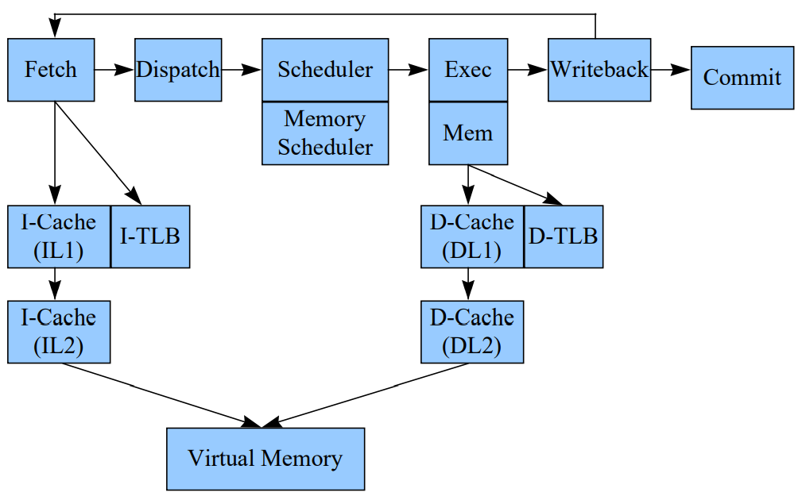

# simpleScalar解析


官方网站[http://www.simplescalar.com]

SimpleScalar simultor 是一款简约的模拟器框架,给人一种麻雀虽小五脏俱全的感觉。最后一版是2003年8月份release到3V0d版本,现在应该已经没人继续维护了。simplescalar的描述中提到了，它不是免费的，需要购买license,但实际上代码是能完整拿到的。

## 概述

simplesaclar中实现了两个arch，alpha和pisa，实现了7个CPU,总文件大小只有3.18MB, 用了4600行就实现了一个outorder CPU。所以simplescalar是一个很精简的CPU模拟器，它很适合做一些时间紧，任务重，微架构又不标准的CPU模拟器开发。

```text
        --------------------            ------------------             -------------------
        |   target-alpha   |            |   target-pisa  |             |   target ....   |
        --------------------            ------------------             |  custom define  |
                 |                              |                      -------------------
                 |                              |                              |
                 |----------------------------> | <----------------------------|
                                                | each arch must implement these interfaces
                                                V
                                 ----------------------------
                                 |         ecoff.h          |     define elf file fmt
                                 |         loader.c         |     for load elf file
                                 |         machine.c/.h     |     about arch
                                 |         machine.def      |     insts define
                                 |         symbol.c         |     for analyze symbol in elf file
                                 |         syscall.c        |     for system call
                                 ----------------------------
                                              |
       ---------------------------------------|-----------------------------------------------------------------------------
       |                  |                   |                 |                    |                  |                  |
       V                  V                   V                 V                    V                  V                  V
 --------------    --------------     -------------     ----------------     ----------------    ----------------     ------------
 | sim-bpred  |    | sim-cache  |     |  sim-eio  |     |   sim-fast   |     | sim-outorder |    |  sim-profile |     | sim-safe |
 --------------    --------------     -------------     ----------------     ----------------    ----------------     ------------

**********************************************************************************************************************************
important module

    =================       ==================       ===================        =================        =================
    |     Dlite     |       |     Memory     |       |      option     |        |   statistic   |        |    register   |
    =================       ==================       ===================        =================        =================
```

上面是SimpleScalar的简要框图， 关于它的文档，在代码包中也有《hack_guide.pdf》对整个代码架构做详细的描述。
simpleScalar几乎具备了上面列出的所有模拟器要点，虽然很多要点实现的没有gem5那么完善，但代码足够简单易懂，整个开发周期不会太长。
它没有实现一个统一的log系统，但实现了一系列的xxx_dump()函数来输出各个模块的状态log。总而言之，麻雀虽小，五脏俱全。

## 模块解析

一款成熟的模拟器框架，应该具备如下的功能点

- 指令集管理系统(解码，行为，反汇编， 异常)
- 寄存器管理系统
- 多指令集架构支持(应该要保持指令集架构与CPU的分离)
- 多种CPU实现
- 多种微结构实现(或微结构参数化)
- 单步和交互调试模式
- log及trace系统
- 模拟器参数解析管理系统
- 计数器管理系统
- 总线及内存管理系统
- 系统调用支持

### 指令集管理

```c
#define LDA_IMPL {SET_GPR(RA, GPR(RB) + SEXT(OFS));}
DEFINST(LDA, 0x08, "lda", "a,o(b)", IntALU, F_ICOMP, DGPR(RA), DNA, DNA, DGPR(RB), DNA)
```

如上简单的描述就定义了一条指令。包含了指令的行为，decode, 反汇编，运算单元的指定，指令flag，寄存器依赖。
回想一下，spike要添加一条指令，需要添加一个指令行为文件，添加指令编码到encoding文件，添加反汇编信息到反汇编文件，gem5添加一条指令，要符合模板，如果不符合模板工作量也会比较大。
相比之下，simpleScalar这种指令管理方式最为简单直接。

### 寄存器管理

simpleScalar在寄存器管理方面没有做太多工作，寄存器的使用也很直接。
同样一个General purpose register, 需要在不同的CPU实现里去对该寄存器的使用做一些封装

sim-outorder对GPR的封装

```c
#define GPR(N)    (BITMAP_SET_P(use_spec_R, R_BMAP_SZ, (N)) \
          ? spec_regs_R[N] \
          : regs.regs_R[N])
```

sim-safe对GPR的封装

```c
#define GPR(N)    (regs.regs_R[N])
```

### 多指令集架构支持

simpleScalar 支持alpha和pisa架构，支持其他架构需要自己添加和调试，这次使用时，添加了自定义的指令集架构，整个过程进度很快。
实现时基本只需要添加三个部分就能支持一套新的指令集架构

- 增加target-xxxx目录，并实现目录下的所有文件
- 在想要调试的CPU文件中添加寄存器和内存访问宏定义
- 在makefile中添加相应的编译规则

### 多种CPU实现

simpleScalar实现了7个CPU，其中sim-safe, sim-fast是功能模型，sim-outorder是乱序多发射CPU， 后续也会主要针对sim-outorder进行分析。


### 多种微架构实现

sim-outorder实现了主要微结构的参数化，这是基于其config子系统实现的。配置可以通过命令行或者配置文件的形式输入到模型中。得益于统一的配置参数
模块，所有注册的参数都能在命令行下看到。

### 单步和交互调试

单步和交互调试对于功能模型来讲是一个很好的功能，它能够有效的帮助调试指令流。就像spike也支持-d模式一样。

### log及trace系统

比如sim-outorder实现了一系列的xxx_dump()函数来输出各个模块的状态,能够通过pipeview.pl有一个比较直观的流水线简图。但目前我认为，通过解析log，生成
google trace能够识别的json文件是一种更加直观的方式。

### 模拟器参数管理系统

通过opt_reg_xxx()可以注册系统参数，这些函数都在options.c/h 中

### 计数器管理系统

log和计数器是模拟器的两大输出点，通过log可以分析流水线，通过计数器可以获得性能指标。stats.c/h中实现了注册计数器的函数

### 总线及内存管理

simpleScalar不支持总线，只有一个memory管理，其使用了基于一级页表的memory管理方式。这种方法也挺简洁高效，缺点是不支持外设。
并在同一个index，不同tag的情况下，使用链表来管理同一个index的页，并通过改变链表顺序来提高一些效率。

```text
         --------------------------------------------------------------------------
         |        tag                     |       index       |        PAGE       |
         --------------------------------------------------------------------------
         63                              26                   12                  0
```

---

## outorder CPU

重点分析一下乱序CPU模型



整个simplescalar的乱序模型都是围绕RUU(Register Update Unit)进行的，这也符合实际的乱序CPU设计核心: 只有控制住了寄存器依赖，才能保证最终结果的正确。
simpleScalar实现的乱序CPU，仍然是以计算节拍为主要手段的模拟器。像gem5的O3 CPU, 可以认为执行是真的在FU中进行执行的，但simplescalar是在dispatch阶段就完成了指令的执行。
simplescalar这种做法很显然降低了实现难度，精度也会差一些，也没法通过指令执行结果来推断乱序实现的方案是否可靠。

```text
                                                               ________________
                                                               |              |        由于采用了仅计算周期的方式，
                                                               |              | icache     因此icahce和itlb是无法在数据流上体现的
                                                               |______________|
            __________________________________________________________|_______________________________________________________
            ______ruu_fetch_issue_delay_______________________________|_______________________________________________________
                                                                      |
                                                           fetch_tail | inst 
                                                                      | get a global inst seq
                                    (fetch_num + 1) % ruu_ifq_size    V
                      _________________________________________________________________________
fetch:                |________|________|________|________|________|________|________|________| fetch_data[ruu_ifq_size]
                          | \                                        /
                          |  \___________ fetch_num ________________/ 
               fetch_head |
                          |            使用 RUU_num  LSQ_num 进行控制，反压到 fetch_num
                          --------------------------------- 
dispatch:                                                 | 对于load/store指令，需要拆分一个用于地址计算的op到ALU中，标记ea_comp
                             ___________                  |    并依赖这个op的计算结果    ____________
                             |_________|                  |                            |__________|
          RUU_head-----------|_________|                  | (LSQ_num + 1) % LSQ_size   |__________|          LSQ_head
                  |          |_________|                  |                            |__________|-----------------
                  |          |_________|  RUU_num         |           LSQ_tail         |__________|                |
                  |          |_________|                  |--------------------------> |__________| LSQ_num        |
                  |          |_________| <----------------|                            |__________|                |
                  |          |_________|  (RUU_tail + 1) % RUU_size                    |__________|                |
                  |          |_________|                                               |__________|                |
                  |          |_________|                                         LSQ[LSQ_size]  struct RUU_station |
                  |          |_________|                                 for load/store instsregisters depend      |
                  |      RUU[RUU_size]  struct RUU_station               set in_LSQ = TRUE for whether is a ld/st  |
                  |            for registers depend                                                                |
                  |                                                          ______________________________        |
                  |                    ------------------------------------- | created addr op write back | <------|
                  |                    |                      operands ready |____________________________|  store |
                  |--------------      |                                     ______________________________        |
        ctrl or longlat inst    |      |    -------------------------------- | no old store with same addr|        |
        push to the queue head  |      |    |               operands ready   |____________________________| <------|
                                |      |    |                                                                 load
                                |      |    |          if operands ready in dispatch stage, push to ready_queue directly.
                                |      |    |          store op push to ready_queue in writeback stage
                                |      |    |          load op push to ready_queue in lsq_refresh
      __________________________V______V____V__
     |_____|_____|_____|_____|_____|_____|_____| ready_queue(struct RS_link) 
       |                 |                          point to RUU_station
issue: |   issue_width   |
       |                 |
     __|_________________|_______________________________________________________
     __|_issue latency___|_______________________________________________________
       |                 | each fu has a issue_lat to control the busy of the fu
       |                 |------------------------------------
       |                                                     |
       |------------------------------------                 |
                                           |                 |
   ________________________________________V_________________V_
  |_____|_____|______|_____|_____|_____|_____|_____|_____|_____|  point to RUU_station
                                                                 event_queue(struct RS_link)

writeback:
     __________________________________________________________________________________________
     _____op latency___________________________________________________________________________
     
     each op in event_queue will complete in sim_cycle + op_lat
     if an op complete, update all op in idep_list, any op operands ready, dispatch to ready_queue

commit:
    free RUU for not ea_comp insts
    free RUU and send store to memory for store insts
```

### 寄存器依赖

寄存器依赖是sim-outorder实现的核心, 在实现时，抽象了register update unit来管理寄存器依赖，整个乱序的功能是靠
RUU来保证的。

RUU不仅承担了标记寄存器依赖的工作，还承担了ROB的工作。在dispatch阶段，fetch_data中的指令按照顺序绑定RUU,在commit阶段，
如果RUU_head中记录的指令没有complete，后面的指令都无法commit

### Load指令的处理

### store指令的处理

### control指令的处理
