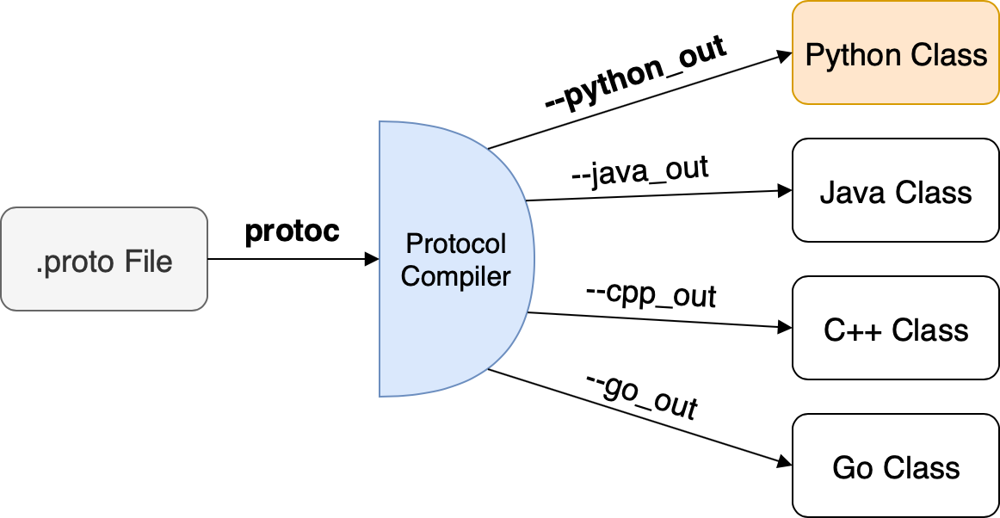

# protobuf

[TOC]

## 综述

> When people who speak different languages get together and talk, they try to use a language that everyone in the group understands.To achieve this, everyone has to translate their thoughts, which are usually in their native language, into the language of the group. This “encoding and decoding” of language, however, leads to a loss of efficiency, speed, and precision. Protocol buffers are Google's language-neutral, platform-neutral, extensible mechanism for serializing structured data – think XML, but smaller, faster, and simpler. You define how you want your data to be structured once …

[https://github.com/protocolbuffers/protobuf.git](https://github.com/protocolbuffers/protobuf.git)

protobuf有如下特点：

- 跨平台
- 易扩展
- 数据体积小

## 跨平台特性

在源码的example目录下有使用示例，我们从一些博客上看到的address_book示例就是出自这里。



protobuf实现了跨平台，数据格式通过定义.proto文件实现，定义的文件可以通过protoc编译器转换成各个平台的代码，只需要比较简单的对生成的代码进行封装，就能实现想要的功能。

## 使用示例


在python接口层面，主要通过SerializeToString和ParseFromString来进行序列化和反序列化。除此之外的操作都是非常灵活的。

### 使用gzip压缩数据

如下示例需要在protobuf的example目录下使用

c++版本的protobuf支持gzip_stream

add_person.cc

```c++
// See README.md for information and build instructions.

#include <ctime>
#include <fstream>
#include <google/protobuf/util/time_util.h>
#include <google/protobuf/io/coded_stream.h>
#include <google/protobuf/io/gzip_stream.h>
#include <google/protobuf/io/zero_copy_stream_impl.h>
#include <iostream>
#include <string>

#include "addressbook.pb.h"

using namespace std;

using google::protobuf::util::TimeUtil;
using namespace google::protobuf;

// This function fills in a Person message based on user input.
void PromptForAddress(tutorial::Person* person) {
  cout << "Enter person ID number: ";
  int id;
  cin >> id;
  person->set_id(id);
  cin.ignore(256, '\n');

  cout << "Enter name: ";
  getline(cin, *person->mutable_name());

  cout << "Enter email address (blank for none): ";
  string email;
  getline(cin, email);
  if (!email.empty()) {
    person->set_email(email);
  }

  while (true) {
    cout << "Enter a phone number (or leave blank to finish): ";
    string number;
    getline(cin, number);
    if (number.empty()) {
      break;
    }

    tutorial::Person::PhoneNumber* phone_number = person->add_phones();
    phone_number->set_number(number);

    cout << "Is this a mobile, home, or work phone? ";
    string type;
    getline(cin, type);
    if (type == "mobile") {
      phone_number->set_type(tutorial::Person::MOBILE);
    } else if (type == "home") {
      phone_number->set_type(tutorial::Person::HOME);
    } else if (type == "work") {
      phone_number->set_type(tutorial::Person::WORK);
    } else {
      cout << "Unknown phone type.  Using default." << endl;
    }
  }
  *person->mutable_last_updated() = TimeUtil::SecondsToTimestamp(time(NULL));
}

// Main function:  Reads the entire address book from a file,
//   adds one person based on user input, then writes it back out to the same
//   file.
int main(int argc, char* argv[]) {
  // Verify that the version of the library that we linked against is
  // compatible with the version of the headers we compiled against.
  GOOGLE_PROTOBUF_VERIFY_VERSION;

  if (argc != 2) {
    cerr << "Usage:  " << argv[0] << " ADDRESS_BOOK_FILE" << endl;
    return -1;
  }

  tutorial::AddressBook address_book;

  {
    io::IstreamInputStream* wrappedFileStream;
    io::GzipInputStream* gzipStream;
 
    // Read the existing address book.
    std::ifstream fileStream(argv[1], std::ios::in | std::ios::binary);
    if (!fileStream)
        cout << argv[1] << ": File not found.  Creating a new file." << endl;
    else {
        wrappedFileStream = new io::IstreamInputStream(&fileStream);
        gzipStream = new io::GzipInputStream(wrappedFileStream);
        io::CodedInputStream codedStream(gzipStream);
        address_book.ParseFromCodedStream(&codedStream);
    }
    delete gzipStream;
    delete wrappedFileStream;
    fileStream.close();
  }

  // Add an address.
  PromptForAddress(address_book.add_people());

  {
    io::OstreamOutputStream* wrappedFileStream;
    io::GzipOutputStream* gzipStream;

    std::ofstream fileStream(argv[1], std::ios::out | std::ios::binary | std::ios::trunc);
    wrappedFileStream = new io::OstreamOutputStream(&fileStream);
    gzipStream = new io::GzipOutputStream(wrappedFileStream);
    {
        io::CodedOutputStream codedStream(gzipStream);
        address_book.SerializeToCodedStream(&codedStream);
    }
    delete gzipStream;
    delete wrappedFileStream;
    fileStream.close();
  }

  // Optional:  Delete all global objects allocated by libprotobuf.
  google::protobuf::ShutdownProtobufLibrary();

  return 0;
}

```

在pyhon中可以直接使用gzip模块进行解压缩
list_person.py

```python
#! /usr/bin/env python

# See README.md for information and build instructions.

from __future__ import print_function
import addressbook_pb2
import sys
import gzip


# Iterates though all people in the AddressBook and prints info about them.
def ListPeople(address_book):
  for person in address_book.people:
    print("Person ID:", person.id)
    print("  Name:", person.name)
    if person.email != "":
      print("  E-mail address:", person.email)

    for phone_number in person.phones:
      if phone_number.type == addressbook_pb2.Person.MOBILE:
        print("  Mobile phone #:", end=" ")
      elif phone_number.type == addressbook_pb2.Person.HOME:
        print("  Home phone #:", end=" ")
      elif phone_number.type == addressbook_pb2.Person.WORK:
        print("  Work phone #:", end=" ")
      print(phone_number.number)


# Main procedure:  Reads the entire address book from a file and prints all
#   the information inside.
if len(sys.argv) != 2:
  print("Usage:", sys.argv[0], "ADDRESS_BOOK_FILE")
  sys.exit(-1)

address_book = addressbook_pb2.AddressBook()

# Read the existing address book.
with gzip.open(sys.argv[1], "rb") as f:
  address_book.ParseFromString(f.read())

ListPeople(address_book)
```
