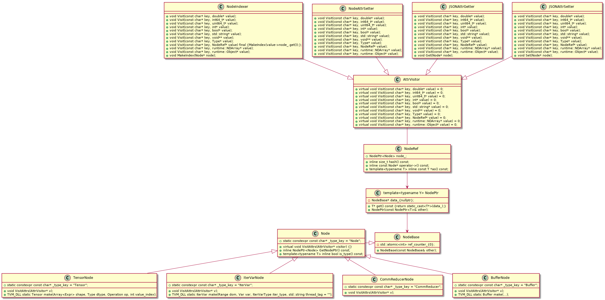

# Node-SubSystem

编译栈里面任何一个语言对象都是Node的子类

> We faced a constant changing of the compiler API for the need of research. We need a new language object or IR node whenever we want to test out new primitives. However, we don’t want to change our API from time to time. Besides that, we also want to

- be able to serialize any language object and IRs
- be able to explore, print, and manipulate the IR objects in front-end language to do quick prototyping.

Node 和 NodeRef 至关重要， 这两个base有很多subclass，每一个Node的subclass都对应一个NodeRef的subclass，用来返回对应的Node

## Class-Diagram

