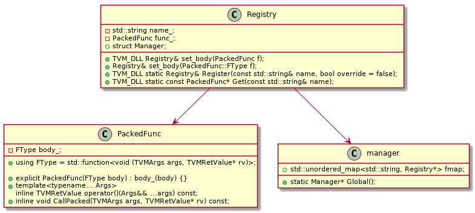

# tvm

[TOP]

## Concept

### Module

一个编译好的对象。可以通过Module以PackedFunc的形式来获取编译后的Func。runtime可以动态获取Func

### Pass

### Op

### Tensor

### Func

## PackedFunc

tvm使用c++实现了一堆接口，这些接口通过PackedFunc封装，使得python调用c++非常easy.



c++中实现了对c++函数的管理

python中，**get_global_func** 调用_LIB.TVMFuncGetGlobal来获取PackedFunc指针，然后将其作为handle实例化Function

```python
class Function(_FunctionBase):

class FunctionBase(object):
    def __init__(self, handle, is_global):
        self.handle = handle
        self.is_global = is_global

    def __call__(self, *args):
        temp_args = []
        values, tcodes, num_args = _make_tvm_args(args, temp_args)
        ret_val = TVMValue()
        ret_tcode = ctypes.c_int()
        if _LIB.TVMFuncCall(
                self.handle, values, tcodes, ctypes.c_int(num_args),
                ctypes.byref(ret_val), ctypes.byref(ret_tcode)) != 0:
            raise get_last_ffi_error()
        _ = temp_args
        _ = args
        return RETURN_SWITCH[ret_tcode.value](ret_val)
```

在python端调用Function的过程也就是调用其__call__方法，其中又调用了_LIB.TVMFuncCall来实现对PackedFunc的实际调用

调用过程实际上是调用了PackedFunc的**CallPacked**方法

```c++
inline void PackedFunc::CallPacked(TVMArgs args, TVMRetValue* rv) const {
  body_(args, rv);
}
```

**_LIB**是直接以CDLL的方式加载了libtvm.so动态链接库

python/tvm/_ffi/base.py

```python
def _load_lib():
    """Load libary by searching possible path."""
    lib_path = libinfo.find_lib_path()
    lib = ctypes.CDLL(lib_path[0], ctypes.RTLD_GLOBAL)
    # DMatrix functions
    lib.TVMGetLastError.restype = ctypes.c_char_p
    return lib, os.path.basename(lib_path[0])

# version number
__version__ = libinfo.__version__
# library instance of nnvm
_LIB, _LIB_NAME = _load_lib()
```

编译和部署都用到了PackedFunc

- All TVM’s compiler pass functions are exposed to frontend as PackedFunc, see here
- The compiled module also returns the compiled function as PackedFunc


## Node

[跳转到Node子系统介绍](./node.md)

## relay

### relay.build_module.build

**relay.build_module.build** returns three components:

- the execution graph in json format
- the TVM module library of compiled functions specifically for this graph on the target hardware
- the parameter blobs of the model

about optimization
> During the compilation, Relay does the graph-level optimization while TVM does the tensor-level optimization, resulting in an optimized runtime module for model serving.

about tvm schedule
> TVM asks the user to provide a description of the computation called a schedule. A schedule is a set of transformation of computation that transforms the loop of computations in the program

## 流程

tvm-input-output-flow

relay-build-flow

### build过程

创建module实例

```python
# tvm/tutorials/frontend/from_mxnet.py
def from_mxnet(symbol,
               shape=None,
               dtype="float32",
               arg_params=None,
               aux_params=None):
    mod = _module.Module()
```

Module是一个python类，通过register_relay_node注册到了一个python全局的node字典中。

```python
# python/tvm/relay/module.py
@register_relay_node
class Module(RelayNode):
    def __init__(self, functions=None, type_definitions=None):
        self.__init_handle_by_constructor__(_make.Module, functions, type_definitions)
```

_make.Module是获取了c++实现的一个Module构建方法。_init_api将c++中的global_func按照模块动态组成了python中各个模块的方法。_init_api 主要调用了_init_api_prefix来实现功能，其中get_global_func返回了一个Function实例，
Function继承于FunctionBase，其中实现了__call__方法，所以Python中module类的方法中可以通过类似_module.Module_ContainGlobalVar(self, var)的操作来实现对c++的调用

```python
# python/tvm/relay/_make.py
_init_api("relay._make", __name__)

# python/tvm/_ffi/function.py
def _init_api_prefix(module_name, prefix):
    for name in list_global_func_names():
        f = get_global_func(name)
        ff = _get_api(f)
        ff.__name__ = fname
        setattr(target_module, ff.__name__, ff)

def get_global_func(name, allow_missing=False):
    handle = FunctionHandle()
    check_call(_LIB.TVMFuncGetGlobal(c_str(name), ctypes.byref(handle)))
    if handle.value:
        return Function(handle, False)

class Function(_FunctionBase):

class FunctionBase(object):
    def __call__(self, *args):
        if _LIB.TVMFuncCall(
                self.handle, values, tcodes, ctypes.c_int(num_args),
                ctypes.byref(ret_val), ctypes.byref(ret_tcode)) != 0:
            raise get_last_ffi_error()
        return RETURN_SWITCH[ret_tcode.value](ret_val)
```

c++中的接口通过TVM_REGISTER_API进行注册,其中ModuleNode::make返回了Module实例

```c++
// src/relay/ir/module.cc
TVM_REGISTER_API("relay._make.Module")
.set_body_typed(ModuleNode::make);

Module ModuleNode::make(tvm::Map<GlobalVar, Function> global_funcs,
                        tvm::Map<GlobalTypeVar, TypeData> global_type_defs)
```

self.__init_handle_by_constructor__最终通过_LIB.TVMFuncCall完成真正的c++函数执行，这个调用是不是很熟悉？对的，在FunctionBase的__call__方法中也是这样实现的PackedFunc的由Python到c++的调用

```python
# python/tvm/_ffi/ctypes/function.py
def __init_handle_by_constructor__(fconstructor, args):
    if _LIB.TVMFuncCall(
            fconstructor.handle, values, tcodes, ctypes.c_int(num_args),
            ctypes.byref(ret_val), ctypes.byref(ret_tcode)) != 0:
```


## codebase-structure-overview

[跳转到软件目录结构](./codebase-struct.md)
