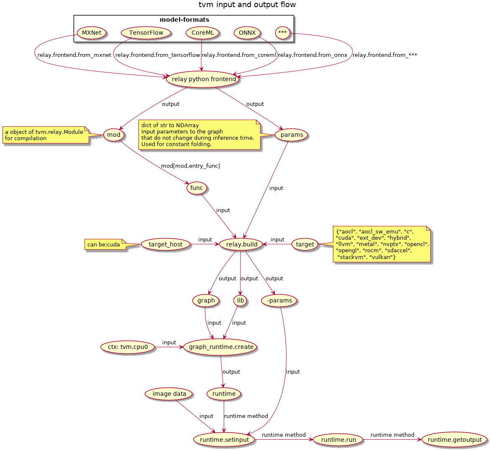
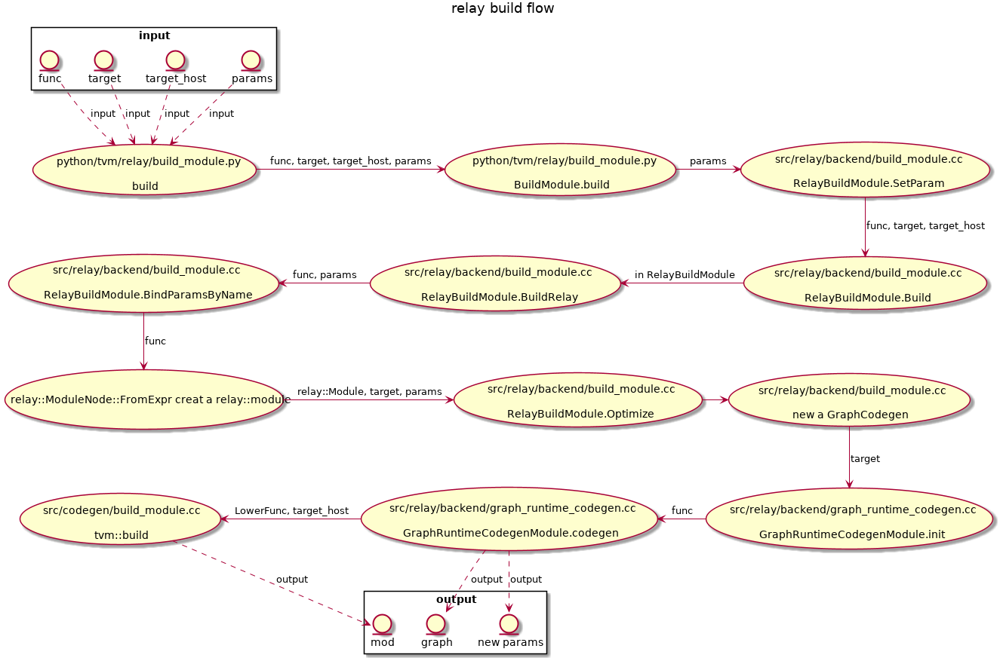

# tvm

[TOP]

## Concept

### Module

一个编译好的对象。可以通过Module以PackedFunc的形式来获取编译后的Func。runtime可以动态获取Func

### Pass

### Op

### Tensor

### Func

## PackedFunc

tvm使用c++实现了一堆接口，这些接口通过PackedFunc封装，使得python调用c++非常easy.

## Node

[跳转到Node子系统介绍](./node.md)

## relay

### relay.build_module.build

**relay.build_module.build** returns three components:

- the execution graph in json format
- the TVM module library of compiled functions specifically for this graph on the target hardware
- the parameter blobs of the model

about optimization
> During the compilation, Relay does the graph-level optimization while TVM does the tensor-level optimization, resulting in an optimized runtime module for model serving.

about tvm schedule
> TVM asks the user to provide a description of the computation called a schedule. A schedule is a set of transformation of computation that transforms the loop of computations in the program

## 流程

tvm-input-output-flow

relay-build-flow

## codebase-structure-overview

[跳转到软件目录结构](./codebase-struct.md)
